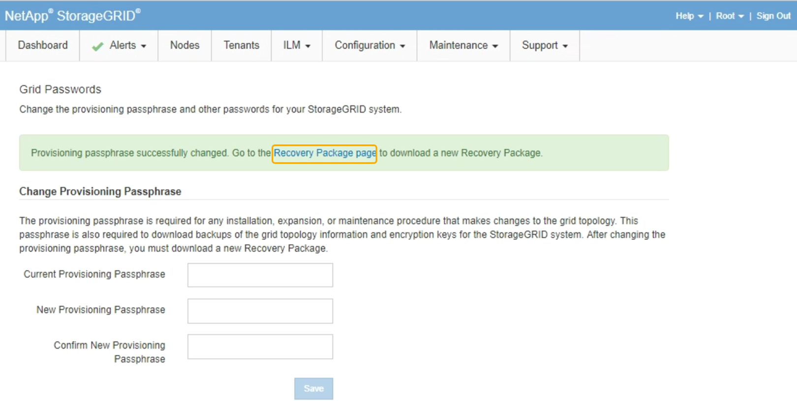

= プロビジョニングパスフレーズを変更しています
:allow-uri-read: 
:icons: font
:imagesdir: ../media/

[role="lead"]
この手順 を使用して、 StorageGRID プロビジョニングパスフレーズを変更します。パスフレーズは、リカバリ、拡張、およびメンテナンスの手順で必要になります。StorageGRID システムのグリッドトポロジ情報と暗号化キーを含むリカバリパッケージのバックアップをダウンロードする場合も、パスフレーズが必要です。

.必要なもの
* Grid Managerにはサポートされているブラウザを使用してサインインする必要があります。
* MaintenanceまたはRoot Access権限が必要です。
* 現在のプロビジョニングパスフレーズが必要です。

.このタスクについて
プロビジョニングパスフレーズは、インストールやメンテナンスの手順の多くや、リカバリパッケージのダウンロードで必要になります。プロビジョニングパスフレーズは、に表示されません `Passwords.txt` ファイル。プロビジョニングパスフレーズを記録して、安全な場所に保管してください。

.手順
. [*構成*（Configuration *）]>[*アクセス制御*（* Access Control *）]>[* Gridパスワード*（* Grid
+
image::../media/grid_password_change_provisioning_passphrase.png[Grid パスワードを変更するプロビジョニングパスフレーズ]

. 現在のプロビジョニングパスフレーズを入力します。
. 新しいリンフレーズを入力してください。パスフレーズには8文字以上32文字以下の文字列を含める必要があります。パスフレーズでは大文字と小文字が区別されます。
+

CAUTION: 新しいプロビジョニングパスフレーズを安全な場所に保存します。インストール、拡張、およびメンテナンスの手順を実行する必要があります。

. 新しいパスフレーズをもう一度入力し、*保存*をクリックします。
+
プロビジョニングパスフレーズの変更が完了すると、成功を示す緑のバナーが表示されます。変更には1分未満かかります。

+

. 成功バナー内の*リカバリパッケージページ*リンクを選択します。
. Grid Manager から新しいリカバリパッケージをダウンロードします。[* Maintenance *>]>[* Recovery Package]を選択し、新しいプロビジョニングパスフレーズを入力します。
+

CAUTION: プロビジョニングパスフレーズを変更したら、すぐに新しいリカバリパッケージをダウンロードする必要があります。リカバリパッケージファイルは、障害が発生した場合にシステムをリストアするために使用します。

