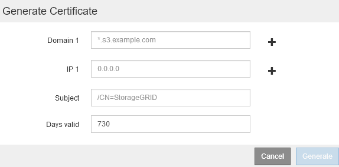
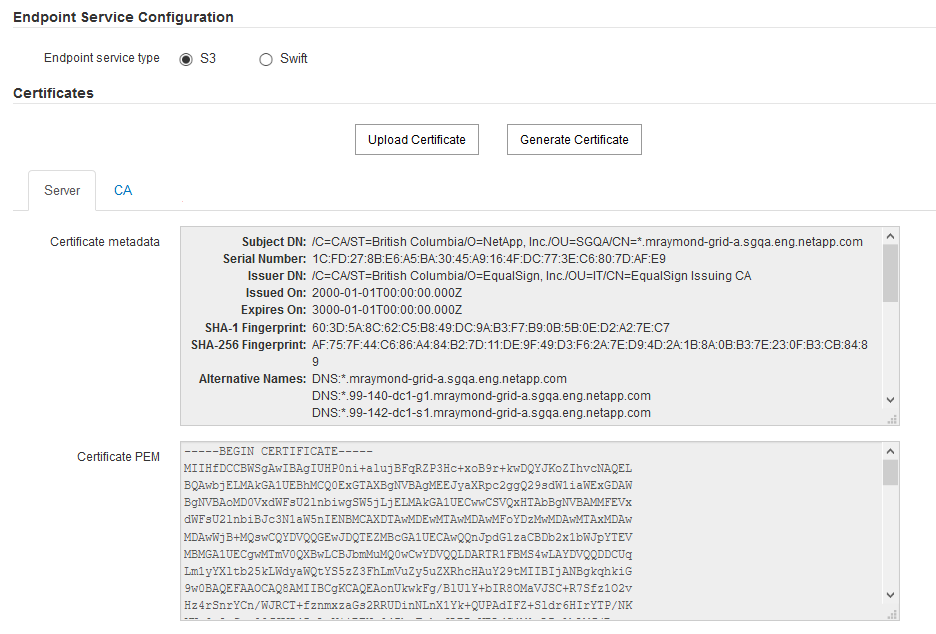
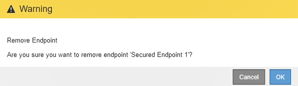

= ロードバランサエンドポイントの設定
:allow-uri-read: 
:icons: font
:imagesdir: ../media/

[role="lead"]
ロードバランサエンドポイントを作成、編集、および削除できます。

== ロードバランサエンドポイントの作成

各ロードバランサエンドポイントは、ポート、ネットワークプロトコル（HTTPまたはHTTPS）、およびサービスタイプ（S3またはSwift）を指定します。HTTPSエンドポイントを作成する場合は、サーバ証明書をアップロードまたは生成する必要があります。

.必要なもの
* Root Access 権限が必要です。
* Grid Managerにはサポートされているブラウザを使用してサインインする必要があります。
* ロードバランササービスに使用するポートをすでに再マッピングしている場合は、再マッピングを削除しておく必要があります。
+

IMPORTANT: ポートを再マッピングした場合、同じポートを使用してロードバランサエンドポイントを設定することはできません。再マッピングしたポートを使用してエンドポイントを作成できますが、これらのエンドポイントはロードバランササービスではなく、元の CLB ポートおよびサービスに再マッピングされます。ポートの再マッピングを削除するには、リカバリとメンテナンスの手順に従ってください。

+

NOTE: CLB サービスは廃止されました。

.手順
. [* Configuration *>* Network Settings *>* Load Balancer Endpoints *]を選択します。
+
Load Balancer Endpointsページが表示されます。

+
image::../media/load_balancer_endpoints.png[ロードバランサエンドポイント]

. [*エンドポイントの追加*]を選択します。
+
[Create Endpoint]ダイアログボックスが表示されます。

+
image::../media/load_balancer_endpoint_create_http.png[ロードバランサエンドポイントの作成]

. ロードバランサエンドポイントのページのリストに表示されるエンドポイントの表示名を入力します。
. ポート番号を入力するか、あらかじめ入力されているポート番号をそのまま使用します。
+
ポート番号80または443は管理ノードで予約されているため、これらのポートを入力すると、エンドポイントはゲートウェイノードにのみ設定されます。

+

NOTE: 他のグリッドサービスで使用されているポートは使用できません。内部および外部の通信に使用されるポートの一覧については、ネットワークのガイドラインを参照してください。

. このエンドポイントのネットワークプロトコルを指定するには、「* HTTP *」または「* HTTPS *」を選択します。
. エンドポイントバインディングモードを選択します。
+
** * Global *（デフォルト）：指定したポート番号のすべてのゲートウェイノードと管理ノードでエンドポイントにアクセスできます。
+
image::../media/load_balancer_endpoint_global_binding_mode.png[エンドポイントグローバルバインディングモード]

** * HA Group VIP *：エンドポイントには、選択したHAグループに定義された仮想IPアドレスからのみアクセスできます。このモードで定義されたエンドポイントは、エンドポイントによって定義されたHAグループが互いに重複しないかぎり、同じポート番号を再利用できます。
+
仮想IPアドレスが割り当てられたエンドポイントを表示するHAグループを選択します。

+
image::../media/load_balancer_endpoint_ha_group_vips_binding_mode.png[エンドポイント HA グループ VIP バインドモード]

** *ノードインターフェイス*：エンドポイントには、指定したノードとネットワークインターフェイスでのみアクセスできます。このモードで定義されたエンドポイントは、相互に重複しないかぎり、同じポート番号を再利用できます。
+
エンドポイントを表示するノードインターフェイスを選択します。

+
image::../media/load_balancer_endpoint_node_interfaces_binding_mode.png[エンドポイントノードインターフェイスのバインディングモード]

. [ 保存（ Save ） ] を選択します。
+
[Edit Endpoint]ダイアログボックスが表示されます。

. エンドポイントで処理するトラフィックのタイプを指定するには、「* S3 *」または「* Swift *」を選択します。
+
image::../media/load_balancer_endpoint_client_options.png[ロードバランサクライアント]

. *HTTP*を選択した場合は、*Save*を選択します。
+
セキュアでないエンドポイントが作成されます。ロードバランサエンドポイントのページのテーブルには、エンドポイントの表示名、ポート番号、プロトコル、およびエンドポイントIDが表示されます。

. [* HTTPS*]を選択し、証明書をアップロードする場合は、[*証明書のアップロード*]を選択します。
+
image::../media/load_balancer_endpoint_upload_cert.png[証明書のアップロード]

+
.. サーバ証明書と証明書の秘密鍵を参照します。
+
S3クライアントがS3 APIエンドポイントのドメイン名を使用して接続できるようにするには、クライアントがグリッドへの接続に使用する可能性のあるすべてのドメイン名に一致するマルチドメイン証明書またはワイルドカード証明書を使用します。たとえば、サーバ証明書でドメイン名を使用しているとします `*._example_.com`。

+
link:configuring-s3-api-endpoint-domain-names.html["S3 APIエンドポイントのドメイン名を設定しています"]

.. 必要に応じて、CAバンドルを参照します。
.. [ 保存（ Save ） ] を選択します。
+
エンドポイントのPEMでエンコードされた証明書データが表示されます。

. [* HTTPS*]を選択し、証明書を生成する場合は、[*証明書の生成*]を選択します。
+

+
.. ドメイン名またはIPアドレスを入力します。
+
ワイルドカードを使用して、ロードバランササービスを実行しているすべての管理ノードとゲートウェイノードの完全修飾ドメイン名を表すことができます。例： `*.sgws.foo.com` ワイルドカード*を使用して表します `gn1.sgws.foo.com` および `gn2.sgws.foo.com`。

+
link:configuring-s3-api-endpoint-domain-names.html["S3 APIエンドポイントのドメイン名を設定しています"]

.. 選択するオプション  をクリックして、他のドメイン名またはIPアドレスを追加します。
+
ハイアベイラビリティ（HA）グループを使用する場合は、HA仮想IPのドメイン名とIPアドレスを追加します。

.. 必要に応じて、証明書を所有するユーザを識別するために、[X.509 subject]（識別名（DN）とも呼ばれる）を入力します。
.. 必要に応じて、証明書の有効日数を選択します。デフォルトは730日です。
.. [*Generate （生成） ] を選択します
+
エンドポイントの証明書メタデータとPEMでエンコードされた証明書データが表示されます。

. [ 保存（ Save ） ] をクリックします。
+
エンドポイントが作成されます。ロードバランサエンドポイントのページのテーブルには、エンドポイントの表示名、ポート番号、プロトコル、およびエンドポイントIDが表示されます。

.関連情報
link:../maintain/index.html[""]

link:../network/index.html["ネットワークガイドライン"]

link:managing-high-availability-groups.html["ハイアベイラビリティグループの管理"]

link:managing-untrusted-client-networks.html["信頼されていないクライアントネットワークの管理"]

== ロードバランサエンドポイントの編集

セキュアでない（HTTP）エンドポイントの場合、エンドポイントのサービスタイプ（S3またはSwift）を変更できます。セキュアな（HTTPS）エンドポイントの場合、エンドポイントのサービスタイプを編集して、セキュリティ証明書を表示または変更できます。

.必要なもの
* Root Access 権限が必要です。
* Grid Managerにはサポートされているブラウザを使用してサインインする必要があります。

.手順
. [* Configuration *>* Network Settings *>* Load Balancer Endpoints *]を選択します。
+
Load Balancer Endpointsページが表示されます。既存のエンドポイントがテーブルに表示されます。

+
まもなく期限切れになる証明書を含むエンドポイントが表に示されます。

+
image::../media/load_balancer_endpoint_edit_or_remove.png[エンドポイントを編集します]

. 編集するエンドポイントを選択します。
. *エンドポイントの編集*をクリックします。
+
[Edit Endpoint]ダイアログボックスが表示されます。

+
セキュアでない（HTTP）エンドポイントの場合は、ダイアログボックスの[Endpoint Service Configuration]セクションだけが表示されます。セキュア（HTTPS）エンドポイントの場合、次の例に示すように、ダイアログボックスの[Endpoint Service Configuration]セクションと[Certificates]セクションが表示されます。

+

. エンドポイントに必要な変更を加えます。
+
セキュアでない（HTTP）エンドポイントの場合、次の操作を実行できます。

+
** エンドポイントのサービスタイプをS3またはSwiftに変更します。
** エンドポイントバインディングモードを変更します。セキュアな（HTTPS）エンドポイントの場合、次の操作を実行できます。
** エンドポイントのサービスタイプをS3またはSwiftに変更します。
** エンドポイントバインディングモードを変更します。
** セキュリティ証明書を表示します。
** 現在の証明書の有効期限が切れたとき、または有効期限が近づいたときに、新しいセキュリティ証明書をアップロードまたは生成します。
+
タブを選択して、デフォルトのStorageGRID サーバ証明書またはアップロードされたCA署名証明書に関する詳細情報を表示します。

+

NOTE: 既存のエンドポイントのプロトコルを変更する場合は、たとえばHTTPからHTTPSに変更する場合は、新しいエンドポイントを作成する必要があります。ロードバランサエンドポイントの作成手順に従って、必要なプロトコルを選択します。

. [ 保存（ Save ） ] をクリックします。

.関連情報
<<ロードバランサエンドポイントの作成>>

== ロードバランサエンドポイントの削除

不要になったロードバランサエンドポイントは削除できます。

.必要なもの
* Root Access 権限が必要です。
* Grid Managerにはサポートされているブラウザを使用してサインインする必要があります。

.手順
. [* Configuration *>* Network Settings *>* Load Balancer Endpoints *]を選択します。
+
Load Balancer Endpointsページが表示されます。既存のエンドポイントがテーブルに表示されます。

+
image::../media/load_balancer_endpoint_edit_or_remove.png[エンドポイントを編集します]

. 削除するエンドポイントの左側にあるオプションボタンを選択します。
. [エンドポイントの削除*]をクリックします。
+
確認のダイアログボックスが表示されます。

+

. [OK] をクリックします。
+
エンドポイントが削除されます。

