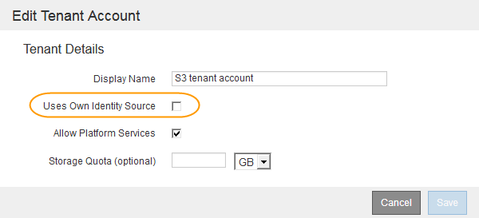

= フェデレーテッドユーザがサインインできることを確認しておき
:allow-uri-read: 
:icons: font
:imagesdir: ../media/

[role="lead"]
シングルサインオン（ SSO ）を有効にする前に、少なくとも 1 人のフェデレーテッドユーザが既存のテナントアカウント用に Grid Manager および Tenant Manager にサインインできることを確認する必要があります。

.必要なもの
* Grid Managerにはサポートされているブラウザを使用してサインインする必要があります。
* 特定のアクセス権限が必要です。
* Active Directoryをフェデレーテッドアイデンティティソースとして使用し、AD FSをアイデンティティプロバイダとして使用している。
+
link:requirements-for-sso.html["シングルサインオンの使用要件"]

.手順
. 既存のテナントアカウントがある場合は、テナントが独自のアイデンティティソースを使用していないことを確認します。
+

IMPORTANT: SSO を有効にすると、 Tenant Manager で設定されたアイデンティティソースが Grid Manager で設定されたアイデンティティソースによって上書きされます。テナントのアイデンティティソースに属するユーザは、 Grid Manager アイデンティティソースのアカウントがないかぎり、サインインできなくなります。

+
.. 各テナントアカウントの Tenant Manager にサインインします。
.. アクセス制御*>*アイデンティティフェデレーション*を選択します。
.. ［*アイデンティティフェデレーションを有効にする*］チェックボックスがオフになっていることを確認します。
.. その場合は、このテナントアカウントに使用されている可能性のあるフェデレーテッドグループが不要になっていることを確認し、チェックボックスをオフにして*保存*をクリックします。

. フェデレーテッドユーザが Grid Manager にアクセスできることを確認します。
+
.. Grid Managerから* Configuration *>* Access Control *>* Admin Groups *を選択します。
.. Active Directoryアイデンティティソースから少なくとも1つのフェデレーテッドグループがインポートされていて、そのグループにRoot Access権限が割り当てられていることを確認します。
.. サインアウトします。
.. フェデレーテッドグループ内のユーザとして Grid Manager に再度サインインできることを確認します。

. 既存のテナントアカウントがある場合は、Root Access権限を持つフェデレーテッドユーザがサインインできることを確認します。
+
.. Grid Managerから* tenants *を選択します。
.. テナントアカウントを選択し、*アカウントの編集*をクリックします。
.. [独自のアイデンティティソースを使用する*]チェックボックスがオンになっている場合は、チェックボックスをオフにして、[保存*]をクリックします。
+

+
Tenant Accountsページが表示されます。

.. テナントアカウントを選択し、*サインイン*をクリックして、ローカルのrootユーザとしてテナントアカウントにサインインします。
.. Tenant Managerで、* Access Control *>* Groups *をクリックします。
.. Grid Managerから少なくとも1つのフェデレーテッドグループにこのテナント用のRoot Access権限が割り当てられていることを確認します。
.. サインアウトします。
.. フェデレーテッドグループ内のユーザとしてテナントに再度サインインできることを確認します。

.関連情報
link:requirements-for-sso.html["シングルサインオンの使用要件"]

link:managing-admin-groups.html["管理者グループの管理"]

link:../tenant/index.html["テナントアカウントを使用する"]
