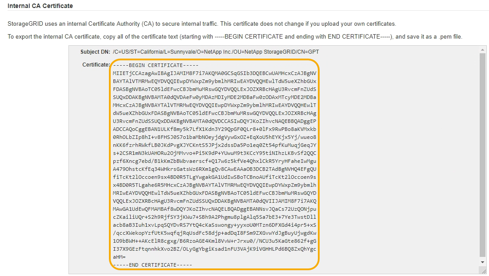

= StorageGRID システムのCA証明書をコピーしています
:allow-uri-read: 
:icons: font
:imagesdir: ../media/

[role="lead"]
StorageGRID は、内部の認証局（CA）を使用して内部トラフィックを保護します。独自の証明書をアップロードしても、この証明書は変更されません。

.必要なもの
* Grid Managerにはサポートされているブラウザを使用してサインインする必要があります。
* 特定のアクセス権限が必要です。

.このタスクについて
カスタムサーバ証明書が設定されている場合、クライアントアプリケーションはカスタムサーバ証明書を使用してサーバを検証する必要があります。StorageGRID システムから CA 証明書をコピーしない。

.手順
. [* Configuration *]>[* Network Settings *]>[* Server Certificates*]を選択します。
. [*内部CA証明書*（* Internal CA Certificate *）]セクションで、すべての証明書テキストを選択します。
+
を含める必要があります `-----BEGIN CERTIFICATE-----` および `-----END CERTIFICATE-----` を選択します。

+

. 選択したテキストを右クリックし、*コピー*を選択します。
. コピーした証明書をテキストエディタに貼り付けます。
. 拡張子を付けてファイルを保存します `.pem`。
+
例： `storagegrid_certificate.pem`

