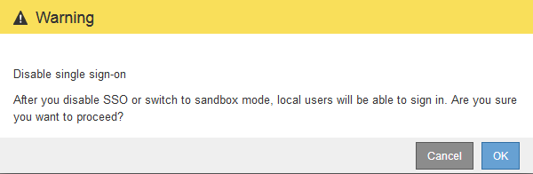

= シングルサインオンを無効にしています
:allow-uri-read: 
:icons: font
:imagesdir: ../media/

[role="lead"]
不要になった場合はシングルサインオン（ SSO ）を無効にすることができます。アイデンティティフェデレーションを無効にする場合は、事前にシングルサインオンを無効にする必要があります。

.必要なもの
* Grid Managerにはサポートされているブラウザを使用してサインインする必要があります。
* 特定のアクセス権限が必要です。

.手順
. 「* Configuration * Access Control * Single Sign-On *」を選択します。
+
[Single Sign-On] ページが表示されます。

. [* Disabled * （無効 * ） ] オプションを選択します。
. [ 保存（ Save ） ] をクリックします。
+
ローカルユーザがサインインできるようになったことを示す警告メッセージが表示されます。

+

. [OK] をクリックします。
+
次回 StorageGRID にサインインすると、 StorageGRID のサインインページが表示され、ローカルユーザまたはフェデレーテッド StorageGRID ユーザのユーザ名とパスワードを入力する必要があります。

