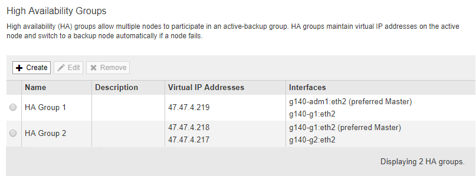

= ハイアベイラビリティグループの編集
:allow-uri-read: 
:icons: font
:imagesdir: ../media/

[role="lead"]
ハイアベイラビリティ（HA）グループを編集して、グループ名や概要 を変更したり、インターフェイスを追加または削除したり、仮想IPアドレスを追加または更新したりできます。

.必要なもの
* Grid Managerにはサポートされているブラウザを使用してサインインする必要があります。
* Root Access 権限が必要です。

.このタスクについて
HAグループを編集する理由には、次のようなものがあります。

* 既存のグループにインターフェイスを追加しています。すでにグループに割り当てられている他のインターフェイスと同じサブネット内のインターフェイスのIPアドレスを指定する必要があります。
* HAグループからのインターフェイスの削除たとえば、グリッドネットワークまたはクライアントネットワークのノードのインターフェイスがHAグループで使用されている場合、サイトの開始や手順 のノードの運用停止はできません。

.手順
. * Configuration *>* Network Settings *>* High Availability Groups *を選択します。
+
[High Availability Groups]ページが表示されます。

+

. 編集するHAグループを選択し、* Edit *をクリックします。
+
Edit High Availability Groupダイアログボックスが表示されます。

. 必要に応じて、グループの名前または概要 を更新します。
. 必要に応じて、* Select interfaces *をクリックして、HAグループのインターフェイスを変更します。
+
Add Interfaces to High Availability Groupダイアログボックスが表示されます。

+
image::../media/ha_group_add_interfaces.png[HA グループ：インターフェイスを追加します]

+
IPアドレスがDHCPによって割り当てられている場合、インターフェイスはリストに表示されません。

. チェックボックスをオンまたはオフにして、インターフェイスを追加または削除します。
+
インターフェイスの選択に関する次のガイドラインに注意してください。

+
** インターフェイスを少なくとも 1 つ選択してください。
** 複数のインターフェイスを選択する場合は、すべてのインターフェイスがグリッドネットワーク（eth0）またはクライアントネットワーク（eth2）上に存在する必要があります。
** すべてのインターフェイスは、同じサブネット内または共通のプレフィックスを持つサブネット内に存在する必要があります。
+
IPアドレスは最小のサブネット（最大のプレフィックスを持つサブネット）に制限されます。

** 異なるタイプのノード上のインターフェイスを選択した場合、フェイルオーバーが発生すると、選択したノードに共通するサービスのみが仮想IPで使用可能になります。
+
*** Grid ManagerまたはTenant ManagerのHA保護用に2つ以上の管理ノードを選択します。
*** ロードバランササービスのHA保護を利用する場合は、管理ノード、ゲートウェイノード、またはその両方を2つ以上選択します。
*** CLBサービスのHA保護を行うゲートウェイノードを2つ以上選択します。
+

NOTE: CLB サービスは廃止されました。

. [ 適用（ Apply ） ] をクリックします。
+
選択したインターフェイスがページのインターフェイスセクションに表示されます。デフォルトでは、リストの最初のインターフェイスが優先マスターとして選択されます。

+
image::../media/ha_group_edit_group.png[HAグループのグループを編集します]

. 別のインターフェイスを優先マスターにする場合は、[* Preferred Master*（優先マスター*）]列でそのインターフェイスを選択します。
+
優先マスターは、障害が発生してVIPアドレスがバックアップインターフェイスに再割り当てされない限り、アクティブインターフェイスです。

+

NOTE: HAグループがGrid Managerへのアクセスを提供する場合は、プライマリ管理ノード上のインターフェイスを優先マスターとして選択する必要があります。一部のメンテナンス手順は、プライマリ管理ノードでしか実行できません。

. 必要に応じて、HAグループの仮想IPアドレスを更新します。
+
IPv4 アドレスを少なくとも 1 つ指定する必要があります。必要に応じて、追加の IPv4 アドレスと IPv6 アドレスを指定できます。

+
IPv4アドレスは、すべてのメンバーインターフェイスで共有されるIPv4サブネット内にある必要があります。

. [ 保存（ Save ） ] をクリックします。
+
HAグループが更新されました。

