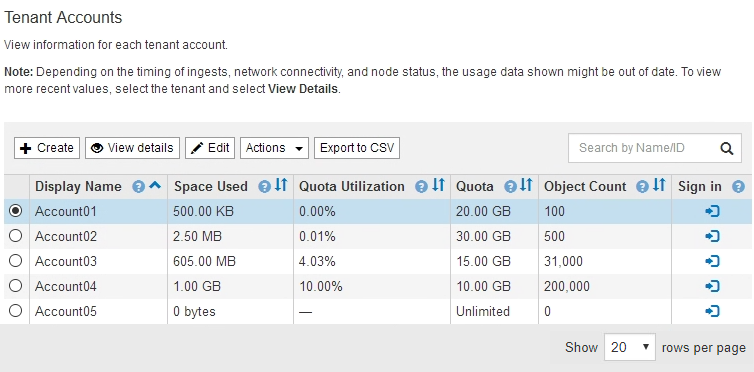

= テナントアカウントを編集する
:allow-uri-read: 
:icons: font
:imagesdir: ../media/

[role="lead"]
テナントアカウントを編集して、表示名の変更、アイデンティティソース設定の変更、プラットフォームサービスの許可または禁止、ストレージクォータの入力を行うことができます。

.必要なもの
* Grid Managerにはサポートされているブラウザを使用してサインインする必要があります。
* 特定のアクセス権限が必要です。

.手順
. 「* tenants *」を選択します
+
Tenant Accountsページが表示され、既存のテナントアカウントがすべてリストされます。

+

. 編集するテナントアカウントを選択します。
+
システムに20個を超えるアイテムが含まれている場合は、各ページに一度に表示する行数を指定できます。検索ボックスを使用して、表示名またはテナントIDでテナントアカウントを検索します。

. 「 * 編集 * 」を選択します。
+
Edit Tenant Accountページが表示されます。この例は、シングルサインオン（ SSO ）を使用しないグリッドを対象としています。このテナントアカウントには、独自のアイデンティティソースが設定されていません。

+
image::../media/edit_tenant_account.png[テナントアカウントを編集します]

. 必要に応じて、フィールドの値を変更します。
+
.. このテナントアカウントの表示名を変更します。
.. テナントアカウントがS3バケットにプラットフォームサービスを使用できるかどうかを確認するには、プラットフォームサービスを許可する*チェックボックスの設定を変更します。
+

IMPORTANT: プラットフォームサービスをすでに使用しているテナントに対してこのオプションを無効にすると、テナントがS3バケット用に設定しているサービスが停止します。エラーメッセージはテナントに送信されません。たとえば、テナントで S3 バケットに CloudMirror レプリケーションが設定されている場合は、引き続きバケットにオブジェクトを格納できますが、エンドポイントとして設定された外部の S3 バケットにはこれらのオブジェクトのコピーが作成されなくなります。

.. ストレージクォータ*の場合、このテナントのオブジェクトで使用可能な最大ギガバイト数、テラバイト数、またはペタバイト数を変更します。このテナントのクォータを無制限にする場合は、このフィールドを空白のままにします。
+
テナントのストレージクォータは、物理容量（ディスクのサイズ）ではなく、論理容量（オブジェクトのサイズ）を表します。ILMのコピーおよびイレイジャーコーディングは、クォータの使用量にはカウントされません。

+

NOTE: 各テナントアカウントのストレージ使用状況を監視するには、「*使用状況*」を選択します。テナントアカウントは、Tenant Managerのダッシュボードまたはテナント管理APIを使用して自分の使用状況を監視することもできます。ノードがグリッド内の他のノードから切断されていると、テナントのストレージ使用状況の値が最新ではなくなる場合があります。合計はネットワーク接続が回復すると更新されます。

.. テナントアカウントで独自のアイデンティティソースを使用するか、Grid Manager用に設定されたアイデンティティソースを使用するかを決定するには、* Use own Identity Source *チェックボックスの設定を変更します。
+

NOTE: [*独自のアイデンティティソースを使用する*]チェックボックスが次の場合：

+
*** 無効にしてオンにした場合、テナントでは独自のアイデンティティソースがすでに有効になっています。Grid Manager 用に設定されたアイデンティティソースを使用するには、テナント側で独自のアイデンティティソースを無効にする必要があります。
*** StorageGRID システムで SSO が有効になっている場合は、無効にしてオフにします。テナントは、 Grid Manager 用に設定されたアイデンティティソースを使用する必要があります。

. [ 保存（ Save ） ] を選択します。

.関連情報
link:managing-platform-services-for-s3-tenant-accounts.html["S3テナントアカウント用のプラットフォームサービスの管理"]

link:../tenant/index.html["テナントアカウントを使用する"]
