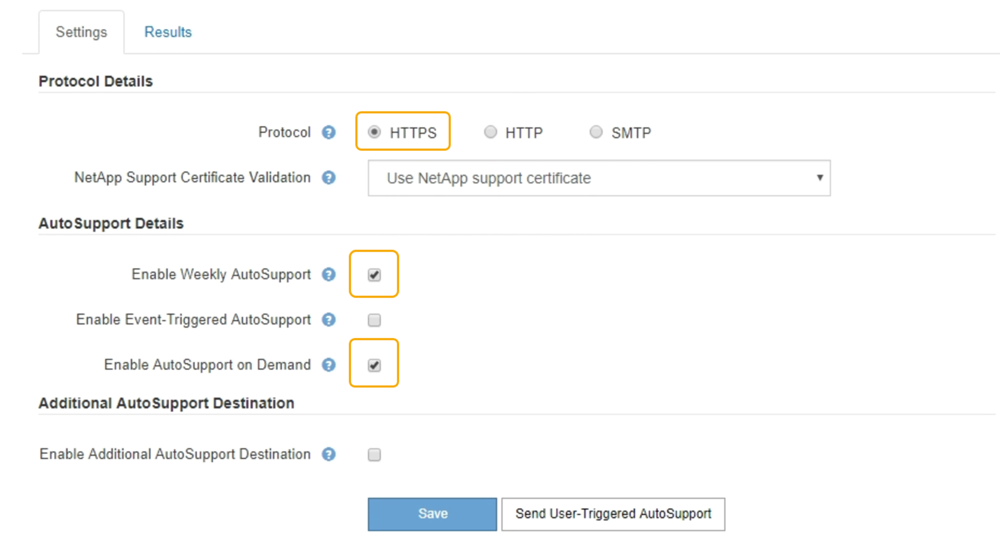

= AutoSupport On Demandの有効化
:allow-uri-read: 
:icons: font
:imagesdir: ../media/

[role="lead"]
AutoSupport On Demand は、テクニカルサポートが問題解決に積極的に取り組んでいる場合に役立ちます。AutoSupport On Demandを有効にすると、テクニカルサポートはユーザの介入を必要とせずにAutoSupport メッセージの送信を要求できます。

.必要なもの
* Grid Managerにはサポートされているブラウザを使用してサインインする必要があります。
* Root Access 権限または Other Grid Configuration 権限が必要です。
* 週次AutoSupport メッセージを有効にしておく必要があります。
* 転送プロトコルをHTTPSに設定しておく必要があります。

.このタスクについて
この機能を有効にすると、テクニカルサポートは、StorageGRID システムに対してAutoSupport メッセージを自動的に送信するよう要求できます。テクニカルサポートは、 AutoSupport On Demand クエリのポーリング間隔も設定できます。

テクニカルサポートは、 AutoSupport On Demand を有効または無効にすることはできません。

.手順
. [*サポート*（Support *）]>[*ツール*（* Tools *）]>[* AutoSupport *（**）]
+
AutoSupport ページが表示され、 * 設定 * タブが選択されます。

. ページの「* Protocol Details *」セクションで、「HTTPS」ラジオボタンを選択します。
+

. [ 週次 AutoSupport を有効にする *] チェックボックスをオンにします。
. [ オンデマンド AutoSupport を有効にする *] チェックボックスをオンにします。
. [ 保存（ Save ） ] を選択します。
+
AutoSupport On Demand は有効になっており、テクニカルサポートは AutoSupport On Demand 要求を StorageGRID に送信できます。

