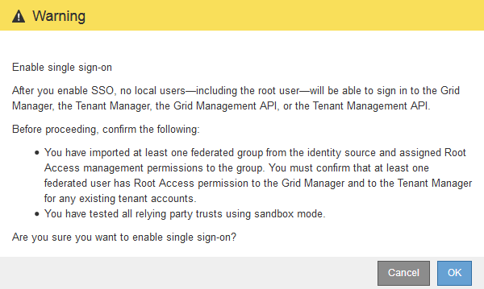

= シングルサインオンの有効化
:allow-uri-read: 
:icons: font
:imagesdir: ../media/

[role="lead"]
サンドボックスモードを使用してすべてのStorageGRID 証明書利用者信頼をテストしたら、シングルサインオン（SSO）を有効にすることができます。

.必要なもの
* アイデンティティソースから少なくとも1つのフェデレーテッドグループをインポートして、そのグループにRoot Access管理権限を割り当てておく必要があります。既存のテナントアカウントに対して、少なくとも1人のフェデレーテッドユーザがGrid ManagerとTenant ManagerへのRoot Access権限を持っていることを確認する必要があります。
* サンドボックスモードを使用して、すべての証明書利用者信頼をテストしておく必要があります。

.手順
. 「* Configuration * Access Control * Single Sign-On *」を選択します。
+
[シングルサインオン]ページが開き、[*サンドボックスモード*]が選択されます。

. SSO ステータスを * Enabled * に変更します。
. [ 保存（ Save ） ] をクリックします。
+
警告メッセージが表示されます。

+

. 警告を確認し、* OK *をクリックします。
+
シングルサインオンが有効になりました。

+

IMPORTANT: すべてのユーザがSSOを使用してGrid Manager、テナントマネージャ、グリッド管理API、およびテナント管理APIにアクセスする必要があります。ローカルユーザは StorageGRID にアクセスできなくなります。

