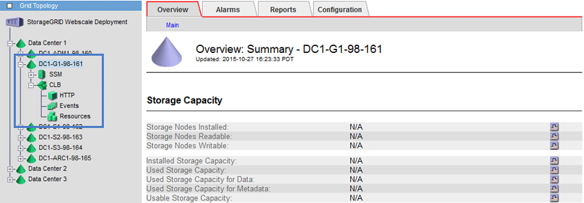

= ロードバランシングの仕組み - CLB サービス
:allow-uri-read: 
:icons: font
:imagesdir: ../media/

[role="lead"]
ゲートウェイノード上の Connection Load Balancer （ CLB ）サービスは廃止されました。ロードバランササービスが推奨されるロードバランシングメカニズムになりました。

CLB サービスはレイヤ 4 ロードバランシングを使用して、可用性、システムの負荷、および管理者が設定したリンクコストに基づいて、クライアントアプリケーションからの受信 TCP ネットワーク接続を最適なストレージノードに分散します。最適なストレージノードが選択されると、 CLB サービスは双方向のネットワーク接続を確立し、選択されたノードとの間でトラフィックを転送します。CLB は、受信ネットワーク接続を転送するときにグリッドネットワーク設定を考慮しません。

CLBサービスに関する情報を表示するには、* Support *>* Tools *>* Grid Topology *を選択し、* CLB *とその下のオプションを選択できるようになるまでゲートウェイノードを拡張します。

CLB サービスを使用する場合は、 StorageGRID システムのリンクコストを設定することを検討してください。

.関連情報
link:what-link-costs-are.html["リンクコストとは"]

link:updating-link-costs.html["リンクコストを更新しています"]
