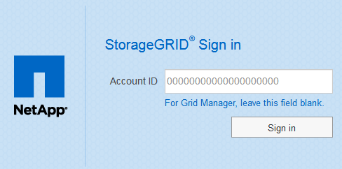

= シングルサインオンの仕組み
:allow-uri-read: 
:icons: font
:imagesdir: ../media/

[role="lead"]
シングルサインオン（ SSO ）を有効にする前に、 SSO が有効になった場合に StorageGRID のサインインとサインアウトのプロセスにどのような影響があるかを確認してください。

== SSOが有効な場合はサインインします

SSO が有効な場合に StorageGRID にサインインすると、組織の SSO ページにリダイレクトされてクレデンシャルが検証されます。

.手順
. Web ブラウザで、 StorageGRID 管理ノードの完全修飾ドメイン名または IP アドレスを入力します。
+
StorageGRID のサインインページが表示されます。

+
** このブラウザで初めて URL にアクセスした場合は、アカウント ID の入力を求められます。
+

** Grid Manager または Tenant Manager に以前にアクセスしていた場合は、最近のアカウントを選択するか、アカウント ID を入力するように求められます。
+
image::../media/sign_in_sso.gif[SSO が有効な場合は、 StorageGRID のサインインページが表示されます]

+

NOTE: テナントアカウントの完全なURL（完全修飾ドメイン名またはIPアドレスのあとにを追加したもの）を入力すると、StorageGRID のサインインページは表示されません `/?accountId=_20-digit-account-id_`）。代わりに、組織の SSO サインインページがすぐに表示されます。このページでは、を実行できます <<signin_sso,SSO クレデンシャルを使用してサインインします>>。

. Grid Manager と Tenant Manager のどちらにアクセスするかを指定します。
+
** Grid Managerにアクセスするには、[** Account ID**（アカウントID **）]フィールドを空白のままにします。アカウントIDとして「* 0 *」を入力するか、最近のアカウントのリストに「* Grid Manager *」が表示されている場合はそれを選択します。
** Tenant Manager にアクセスするには、 20 桁のテナントアカウント ID を入力するか、最近のアカウントのリストにテナントが表示されている場合は名前でテナントを選択します。

. [*サインイン*]をクリックします
+
StorageGRID は、組織の SSO サインインページにリダイレクトします。例：

+
image::../media/sso_organization_page.gif[組織の SSO サインインページの例]

. [[signin_soS] SSO クレデンシャルを使用してサインインします。
+
SSO クレデンシャルが正しい場合：

+
.. アイデンティティプロバイダ（ IdP ）が StorageGRID に認証応答を返します。
.. StorageGRID が認証応答を検証します。
.. 応答が有効で、ユーザが適切なアクセス権限のあるフェデレーテッドグループに属している場合は、選択したアカウントに応じてGrid Managerまたはテナントマネージャにサインインされます。

. 必要に応じて、他の管理ノードにアクセスします。または、適切な権限がある場合は Grid Manager またはテナントマネージャにアクセスします。
+
SSO クレデンシャルを再入力する必要はありません。

== SSOが有効な場合はサインアウトします

StorageGRID で SSO が有効になっている場合にサインアウトするとどうなるかは、サインイン先とサインアウト元によって異なります。

.手順
. ユーザインターフェイスの右上隅にある [*Sign Out*] リンクを探します。
. [サインアウト]をクリックします。
+
StorageGRID のサインインページが表示されます。[Recent Accounts] * ドロップダウンが更新されて、 * Grid Manager * またはテナント名が表示されるようになり、これらのユーザインターフェイスにあとからすばやくアクセスできるようになります。

+
[cols="1a,1a,1a"]
|===
| サインイン先 | サインアウト元 | サインアウトされる対象 

 a| 
1 つ以上の管理ノードでグリッドマネージャを使用します
 a| 
任意の管理ノード上の Grid Manager
 a| 
すべての管理ノード上の Grid Manager

 a| 
1 つ以上の管理ノード上の Tenant Manager
 a| 
任意の管理ノード上の Tenant Manager
 a| 
すべての管理ノード上の Tenant Manager

 a| 
Grid Manager と Tenant Manager の両方
 a| 
Grid Manager の略
 a| 
Grid Manager のみ。SSO からサインアウトするには、 Tenant Manager からもサインアウトする必要があります。

 a| 
Tenant Manager の略
 a| 
Tenant Manager のみ。SSO からサインアウトするには、 Grid Manager からもサインアウトする必要があります。

|===

NOTE: 次の表は、単一のブラウザセッションを使用している場合にサインアウトしたときの動作をまとめたものです。複数のブラウザセッションで StorageGRID にサインインしている場合は、すべてのブラウザセッションから個別にサインアウトする必要があります。
