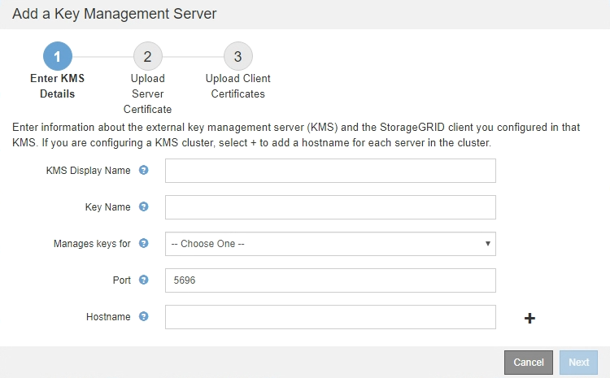

= 手順 1 ： KMS の詳細を入力します
:allow-uri-read: 
:icons: font
:imagesdir: ../media/

[role="lead"]
キー管理サーバの追加ウィザードの手順 1 （ KMS の詳細を入力）で、 KMS または KMS クラスタの詳細を指定します。

.手順
. 「* Configuration * System Settings ** Key Management Server *」を選択します。
+
[Key Management Server] ページが表示され、 [Configuration] [Details] タブが選択されます。

+
image::../media/kms_configuration_details_no_kms.png[KMS の設定の詳細 KMS は不要です]

. 「 * Create * 」を選択します。
+
Add a Key Management Server （キー管理サーバの追加）ウィザードの手順 1 （ KMS の詳細を入力）が表示されます。

+

. KMS および設定した StorageGRID クライアントの情報を KMS で入力します。
+
[cols="1a,1a"]
|===
| フィールド | 説明 

 a| 
KMS 表示名
 a| 
この KMS を特定するのに役立つわかりやすい名前。1~64 文字で指定します。

 a| 
キー名
 a| 
KMS 内の StorageGRID クライアントの正確なキーエイリアス。1~255 文字で指定する必要があります。

 a| 
のキーを管理します
 a| 
この KMS に関連する StorageGRID サイトを参照してください。可能であれば、サイト固有のキー管理サーバを設定してから、環境 で他の KMS で管理されていないすべてのサイトをデフォルトの KMS で設定する必要があります。

** 特定のサイトのアプライアンスノードの暗号化キーをこの KMS で管理する場合は、サイトを選択します。
** 「 * Sites not managed by another KMS （デフォルト KMS ） * 」を選択して、専用の KMS とその後の拡張で追加したサイトに適用されるデフォルトの KMS を設定します。
+
* 注： * 以前にデフォルト KMS で暗号化されていたサイトを選択しても、新しい KMS に元の暗号化キーの現在のバージョンを提供しなかった場合、 KMS の設定を保存すると、検証エラーが発生します。

 a| 
ポート
 a| 
KMS サーバが Key Management Interoperability Protocol （ KMIP ）の通信に使用するポート。デフォルトでは、 KMIP 標準ポートである 5696 が使用されます。

 a| 
ホスト名
 a| 
KMS の完全修飾ドメイン名または IP アドレス。

* 注： * サーバ証明書の SAN フィールドには、ここに入力する FQDN または IP アドレスを含める必要があります。そうしないと、 StorageGRID は KMS クラスタ内のすべてのサーバに接続できなくなります。

|===
. KMS クラスタを使用している場合は、プラス記号を選択します image:../media/icon_plus_sign_black_on_white_old.png["アイコンプラス記号"] クラスタ内の各サーバのホスト名を追加します。
. 「 * 次へ * 」を選択します。
+
キー管理サーバの追加ウィザードの手順2（サーバ証明書をアップロード）が表示されます。

