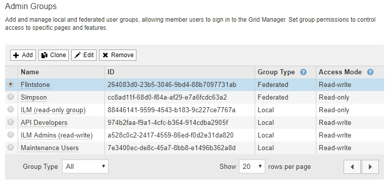

= 管理者グループの管理
:allow-uri-read: 
:icons: font
:imagesdir: ../media/

[role="lead"]
管理者グループを作成して、 1 人以上の管理者ユーザのセキュリティ権限を管理できます。StorageGRID システムへのアクセスを許可するには、ユーザがグループに属している必要があります。

== 管理者グループの作成

管理者グループを使用すると、 Grid Manager およびグリッド管理 API のどのユーザがどの機能や処理にアクセスできるかを決定できます。

.必要なもの
* Grid Managerにはサポートされているブラウザを使用してサインインする必要があります。
* 特定のアクセス権限が必要です。
* フェデレーテッドグループをインポートする場合は、アイデンティティフェデレーションを設定済みで、インポートするフェデレーテッドグループが設定済みのアイデンティティソースにあらかじめ存在している必要があります。

.手順
. [構成**アクセス制御**管理者グループ*]を選択します。
+
Admin Groupsページが表示され、既存の管理者グループが一覧表示されます。

+
ページ]

. 「 * 追加」を選択します。
+
[Add Group]ダイアログボックスが表示されます。

+
image::../media/add_group.png[グループを追加します]

. [グループタイプ]で、StorageGRID 内でのみ使用されるグループを作成する場合は[ローカル*]を、アイデンティティソースからグループをインポートする場合は[フェデレーション*]を選択します。
. 「*ローカル*」を選択した場合は、グループの表示名を入力します。表示名は、Grid Managerに表示される名前です。たとえば、「 Maintenance Users 」または「 ILM Administrators 」のようになります。
. グループの一意の名前を入力します。
+
** *ローカル*：任意の一意の名前を入力します。たとえば'ILM Administrators.`と入力します
** * Federated *：設定されているアイデンティティソースに表示されるとおりにグループの名前を入力します。

. *アクセスモード*では、グループ内のユーザがGrid ManagerおよびGrid管理APIで設定の変更や操作を実行できるかどうか、あるいは設定や機能のみを表示できるかどうかを選択します。
+
** * 読み取り / 書き込み * （デフォルト）：ユーザは設定を変更し、管理権限で許可されている操作を実行できます。
** * 読み取り専用 * ：ユーザーは設定と機能のみを表示できます。Grid Manager API や Grid 管理 API で変更や処理を行うことはできません。ローカルの読み取り専用ユーザは自分のパスワードを変更できます。
+

NOTE: ユーザーが複数のグループに属していて、いずれかのグループが * 読み取り専用 * に設定されている場合、ユーザーは選択したすべての設定と機能に読み取り専用でアクセスできます。

. 管理権限を1つ以上選択します。
+
各グループに 1 つ以上の権限を割り当てる必要があります。そうしないと、グループに属するユーザは StorageGRID にサインインできません。

. [ 保存（ Save ） ] を選択します。
+
新しいグループが作成されます。ローカルグループの場合は、ユーザを追加できます。フェデレーテッドグループの場合は、どのユーザがグループに属するかはアイデンティティソースが管理します。

.関連情報
link:managing-local-users.html["ローカルユーザの管理"]

== 管理者グループの権限

管理者ユーザグループを作成する場合は、 Grid Manager の特定の機能へのアクセスを制御する権限を 1 つ以上選択します。その後、作成した 1 つ以上の管理者グループに各ユーザを割り当てて、ユーザが実行できるタスクを決定できます。

各グループに1つ以上の権限を割り当てる必要があります。そうしないと、そのグループに属するユーザはGrid Managerにサインインできません。

デフォルトでは、少なくとも 1 つの権限が割り当てられたグループに属するユーザは次のタスクを実行できます。

* Grid Manager にサインインします
* ダッシュボードを表示します
* ノードページを表示します
* グリッドトポロジを監視する
* 現在のアラートと解決済みのアラートを表示します
* 現在のアラームと履歴アラームの表示（従来のシステム）
* 自分のパスワードを変更する（ローカルユーザのみ）
* Configuration ページと Maintenance ページで特定の情報を表示します

以降のセクションでは、管理者グループの作成時または編集時に割り当てることができる権限について説明します。明示的に言及されていない機能には、Root Access権限が必要です。

=== ルートアクセス（ Root Access ）

この権限は、すべてのグリッド管理機能へのアクセスを許可します。

=== アラートの管理

この権限では、アラートを管理するためのオプションにアクセスできます。サイレンス、アラート通知、アラートルールを管理するには、この権限が必要です。

=== アラームの確認（レガシーシステム）

アラームの確認と応答を許可します（従来型システム）。サインインしたすべてのユーザが現在のアラームと履歴アラームを表示できます。

ユーザにグリッドトポロジの監視とアラームへの確認応答だけを許可するには、この権限を割り当てる必要があります。

=== Gridトポロジページの設定

この権限では、次のメニューオプションにアクセスできます。

* サポート*ツール*グリッドトポロジ*の各ページにある構成タブを参照してください。
* *イベントカウントのリセット*[ノード*イベント*]タブのリンク。

=== その他のGrid設定

この権限で、追加のグリッド設定オプションにアクセスできます。

IMPORTANT: これらの追加オプションを表示するには、ユーザにGrid Topology Page Configuration権限が付与されている必要もあります。

* *アラーム*（レガシー・システム）：
+
** グローバルアラーム
** 従来のEメール設定

* * ILM * ：
+
** ストレージプール
** ストレージグレード

* *構成*ネットワーク設定*
+
** リンクコスト

* *環境設定*システム設定*：
+
** 表示オプション（Display Options）
** グリッドオプション（Grid Options）
** ストレージオプション

* *コンフィグレーション*モニタリング*：
+
** イベント

* *サポート*：
+
** AutoSupport

=== テナントアカウント

この権限は、* tenants * Tenant Accounts *ページへのアクセスを許可します。

NOTE: Grid管理APIのバージョン1（すでに廃止）では、この権限を使用してテナントグループのポリシーの管理、Swift管理者パスワードのリセット、およびrootユーザのS3アクセスキーの管理を行います。

=== テナントのrootパスワードを変更

この権限は、テナントアカウントページの* rootパスワードの変更*オプションにアクセスして、テナントのローカルrootユーザのパスワードを変更できるユーザを制御することを可能にします。この権限を持たないユーザには、*Change Root Password *オプションは表示されません。

NOTE: この権限を割り当てるには、Tenant Accounts権限がグループに割り当てられている必要があります。

=== メンテナンス

この権限では、次のメニューオプションにアクセスできます。

* *環境設定*システム設定*：
+
** ドメイン名*
** サーバ証明書*

* *コンフィグレーション*モニタリング*：
+
** 監査*

* *設定*アクセス制御*：
+
** Gridのパスワード

* *メンテナンス*メンテナンスタスク*
+
** 運用停止
** 拡張
** リカバリ

* *メンテナンス**ネットワーク*：
+
** DNSサーバ*
** Gridネットワーク*
** NTPサーバ*

* *メンテナンス**システム*：
+
** ライセンス*
** リカバリパッケージ
** ソフトウェア・アップデート

* *サポート**ツール*：
+
** ログ

* Maintenance権限がないユーザは、アスタリスクの付いたページを表示できますが、編集することはできません。

=== 指標クエリ

この権限は、[*Support*Tools*Metrics *]ページへのアクセスを提供します。また、グリッド管理 API の「指標」セクションを使用して、カスタムの Prometheus 指標クエリにアクセスすることもできます。

=== ILM

この権限は、次の * ILM * メニュー・オプションへのアクセスを提供します。

* *イレイジャーコーディング*
* *ルール*
* * ポリシー *
* *リージョン*

NOTE: 「* ILM *ストレージ・プール*」および「ILM *ストレージ・グレード*」メニュー・オプションへのアクセスは、「その他のGrid設定」および「Gridトポロジ・ページの設定」権限によって制御されます。

=== オブジェクトメタデータの検索

この権限は、* ILM * Object Metadata Lookup *メニューオプションへのアクセスを提供します。

=== ストレージアプライアンス管理者

この権限は、グリッドマネージャを介してストレージアプライアンスの E シリーズ SANtricity システムマネージャにアクセスすることを許可します。

=== 権限とアクセスモードの相互作用

すべての権限について、グループのアクセスモード設定は、ユーザが設定を変更して処理を実行できるかどうか、またはユーザが関連する設定と機能のみを表示できるかどうかを決定します。ユーザーが複数のグループに属していて、いずれかのグループが * 読み取り専用 * に設定されている場合、ユーザーは選択したすべての設定と機能に読み取り専用でアクセスできます。

=== グリッド管理APIからの機能の非アクティブ化

グリッド管理 API を使用すると、 StorageGRID システムの特定の機能を完全に非アクティブ化できます。機能を非アクティブ化すると、その機能に関連するタスクを実行する権限をユーザに割り当てることができなくなります。

.このタスクについて
非活動化されたフィーチャーシステムを使用すると、 StorageGRID システムの特定のフィーチャーへのアクセスを禁止できます。機能の非アクティブ化は、rootユーザまたはRoot Access権限を持つ管理者グループに属しているユーザがその機能を使用できないようにする唯一の方法です。

この機能がどのように役立つかを理解するために、次のシナリオを検討してください。

_Company A は、テナントアカウントを作成して StorageGRID システムのストレージ容量をリースするサービスプロバイダです。容量をリースしている顧客のオブジェクトのセキュリティを保護するために、 A 社では、アカウントの導入後に自社の従業員がテナントアカウントにアクセスできないようにしたいと考えています。 _

_ 企業 A は、グリッド管理 API で Deactivate Features システムを使用することで、この目的を達成できます。Grid Manager（UIとAPIの両方）で* Change Tenant Root Password *機能を完全に非アクティブにすることで、A社はすべてのテナントアカウントのrootユーザのパスワードを変更できるようになります。_

==== 非アクティブ化した機能の再アクティブ

デフォルトでは、グリッド管理 API を使用して、非アクティブ化した機能を再アクティブ化できます。ただし、非アクティブ化された機能が再アクティブ化されないようにするには、 * activateFeatures * 機能自体を非アクティブ化します。

CAUTION: * activateFeatures * 機能を再アクティブ化できません。この機能を非アクティブ化すると、非アクティブ化した他の機能を永続的に再アクティブ化できなくなることに注意してください。失われた機能をリストアするには、テクニカルサポートにお問い合わせください。

詳細については、S3またはSwiftクライアントアプリケーションを実装する手順を参照してください。

.手順
. Swagger のグリッド管理 API のドキュメントにアクセスします。
. Deactivate Features エンドポイントを探します。
. * Change Tenant Root Password *などの機能を非アクティブ化するには、次のようにAPIに本文を送信します。
+
[listing]
----
{ "grid": {"changeTenantRootPassword": true} }
----
+
要求が完了すると、Change Tenant Root Password機能は無効になります。Change Tenant Root Password管理権限はユーザインターフェイスに表示されなくなり、テナントのrootパスワードを変更するAPI要求はすべて「403 Forbidden」エラーで失敗します。

. すべての機能を再アクティブ化するには、次のような本文を API に送信します。
+
[listing]
----
{ "grid": null }
----
+
この要求が完了すると、Change Tenant Root Password機能を含むすべての機能が再アクティブ化されます。ユーザにRoot Access権限またはChange Tenant Root Password管理権限が割り当てられている場合は、Change Tenant Root Password管理権限がユーザインターフェイスに表示され、テナントのrootパスワードを変更するAPI要求はすべて成功します。

+

NOTE: 前述の例は、 _all_deactivated 機能を再アクティブ化します。非アクティブ化したままにする必要がある他の機能が非アクティブ化されている場合は、 PUT 要求でそれらを明示的に指定する必要があります。たとえば、Change Tenant Root Password機能を再アクティブ化して、Alarm Acknowledgment機能を非アクティブなままにするには、次のPUT要求を送信します。

+
[listing]
----
{ "grid": { "alarmAcknowledgment": true } }
----

.関連情報
link:using-grid-management-api.html["グリッド管理APIを使用する"]

== 管理者グループの変更

管理者グループを変更して、グループに関連付けられている権限を変更できます。ローカル管理者グループについては、表示名を更新することもできます。

.必要なもの
* Grid Managerにはサポートされているブラウザを使用してサインインする必要があります。
* 特定のアクセス権限が必要です。

.手順
. [構成**アクセス制御**管理者グループ*]を選択します。
. グループを選択します。
+
システムに20個を超えるアイテムが含まれている場合は、各ページに一度に表示する行数を指定できます。その後、ブラウザの検索機能を使用して、現在表示されている行の特定の項目を検索できます。

. [ 編集（ Edit ） ] をクリックします。
. オプションで'ローカル・グループの場合は'たとえばMaintenance Usersのように'ユーザーに表示されるグループの名前を入力します
+
一意の名前は内部グループ名であるため、変更できません。

. 必要に応じて、グループのアクセスモードを変更します。
+
** * 読み取り / 書き込み * （デフォルト）：ユーザは設定を変更し、管理権限で許可されている操作を実行できます。
** * 読み取り専用 * ：ユーザーは設定と機能のみを表示できます。Grid Manager API や Grid 管理 API で変更や処理を行うことはできません。ローカルの読み取り専用ユーザは自分のパスワードを変更できます。
+

NOTE: ユーザーが複数のグループに属していて、いずれかのグループが * 読み取り専用 * に設定されている場合、ユーザーは選択したすべての設定と機能に読み取り専用でアクセスできます。

. 必要に応じて、グループ権限を追加または削除します。
+
管理者グループの権限に関する情報を参照してください。

. [ 保存（ Save ） ] を選択します。

.関連情報
<<管理者グループの権限>>

== 管理者グループを削除しています

管理者グループを削除すると、システムからそのグループを削除し、グループに関連付けられているすべての権限を削除できます。管理者グループを削除すると、そのグループからすべての管理者ユーザが削除されますが、管理者ユーザは削除されません。

.必要なもの
* Grid Managerにはサポートされているブラウザを使用してサインインする必要があります。
* 特定のアクセス権限が必要です。

.このタスクについて
グループを削除すると、そのグループに割り当てられているユーザは、別のグループから権限が付与されていないかぎり、Grid Managerへのすべてのアクセス権限を失います。

.手順
. [構成**アクセス制御**管理者グループ*]を選択します。
. グループの名前を選択します。
+
システムに20個を超えるアイテムが含まれている場合は、各ページに一度に表示する行数を指定できます。その後、ブラウザの検索機能を使用して、現在表示されている行の特定の項目を検索できます。

. 「 * 削除」を選択します。
. 「 * OK 」を選択します。

