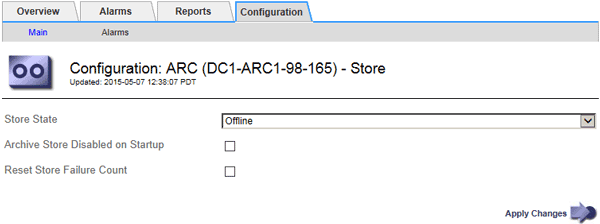

= TSMサーバの容量が上限に達した場合のアーカイブノードの管理
:allow-uri-read: 
:icons: font
:imagesdir: ../media/

[role="lead"]
TSM サーバには、管理対象の TSM データベースまたはアーカイブメディアストレージの容量が上限に近づいている場合にアーカイブノードに通知する手段がありません。アーカイブノードは、 TSM サーバが新しいコンテンツの受け入れを停止したあとも引き続き TSM サーバに転送するオブジェクトデータを受け入れますが、TSM サーバが管理するメディアにこのコンテンツを書き込むことはできません。アラームがトリガーされます。この状況を回避するには、 TSM サーバをプロアクティブに監視します。

.必要なもの
* Grid Managerにはサポートされているブラウザを使用してサインインする必要があります。
* 特定のアクセス権限が必要です。

.このタスクについて
ARCサービスからTSMサーバにさらにコンテンツが送信されないようにするには、* ARC * Store *コンポーネントをオフラインにします。この手順 は、 TSM サーバがメンテナンスに使用できないときにアラームを生成しない場合にも役立ちます。

.手順
. Support *>* Tools *>* Grid Topology *を選択します。
. 「*_アーカイブノード_** ARC ** Store *」を選択します。
. * Configuration * > * Main * を選択します。
+

. 「Store State」を「」に変更します `Offline`。
. 「 Archive Store Disabled on Startup * 」を選択します。
. [ 変更の適用 *] をクリックします。

