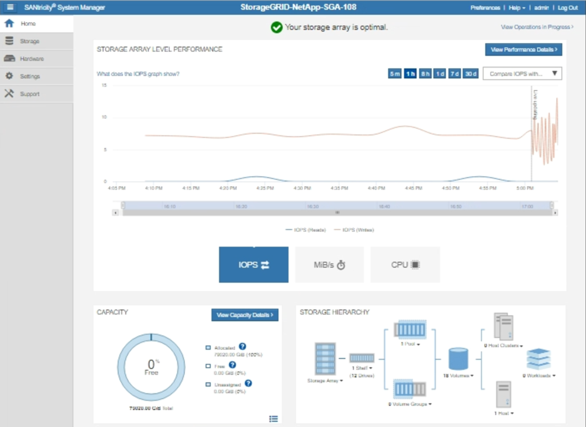

= StorageGRID 経由でのEシリーズAutoSupport メッセージの送信
:allow-uri-read: 
:icons: font
:imagesdir: ../media/

[role="lead"]
EシリーズSANtricity System ManagerのAutoSupport メッセージは、ストレージアプライアンスの管理ポートではなくStorageGRID 管理ノードからテクニカルサポートに送信できます。

.必要なもの
* Grid ManagerにはサポートされているWebブラウザを使用してサインインします。
* Storage Appliance Administrator権限またはRoot Access権限が必要です。

NOTE: Grid Manager を使用して SANtricity System Manager にアクセスするには、 SANtricity ファームウェア 8.70 以降が必要です。

.このタスクについて
E シリーズ AutoSupport メッセージには、ストレージハードウェアの詳細が記載されており、 StorageGRID システムから送信される他の AutoSupport メッセージよりも具体的です。

SANtricity System Manager で特殊なプロキシサーバアドレスを設定して、アプライアンスの管理ポートを使用せずに StorageGRID 管理ノード経由で送信される AutoSupport メッセージを原因 に設定します。この方法で送信される AutoSupport メッセージは、 Grid Manager で設定されている可能性がある優先送信者と管理者のプロキシ設定に基づいています。

Grid Managerで管理プロキシサーバを設定する場合は、管理プロキシの設定手順を参照してください。

link:configuring-admin-proxy-settings.html["管理プロキシの設定"]

[NOTE]
====
この手順 は、 E シリーズ AutoSupport メッセージ用に StorageGRID プロキシサーバを設定するためだけに使用します。EシリーズAutoSupport の設定情報の詳細については、Eシリーズのドキュメントセンターを参照してください。

http://mysupport.netapp.com/info/web/ECMP1658252.html["NetApp Eシリーズシステムのドキュメントセンター"^]

====
.手順
. Grid Managerで、* Nodes *を選択します。
. 左側のノードのリストから、設定するストレージアプライアンスノードを選択します。
. SANtricity System Manager* を選択します。
+
SANtricity の System Manager ホームページが表示されます。

+

. [* Support*>]>[* Support center*]>[* AutoSupport *]を選択します。
+
AutoSupport operations ページが表示されます。

+
image:../media/autosupport_santricity_operations.png["AutoSupport SANtricity AutoSupport 処理"]

. AutoSupport 配信方法の設定 * を選択します。
+
AutoSupport 配信方法の設定ページが表示されます。

+
image::../media/autosupport_configure_delivery_santricity.png[AutoSupport は AutoSupport 配信方法 SANtricity を設定します]

. 配信方法として「 * HTTPS * 」を選択します。
+

NOTE: HTTPS プロトコルを有効にする証明書が事前にインストールされています。

. プロキシサーバー経由 * を選択します。
. 入力するコマンド `tunnel-host` を入力します。
+
`tunnel-host` は、管理ノードを使用してEシリーズAutoSupport メッセージを送信する特別なアドレスです。

. 入力するコマンド `10225` をクリックします。
+
`10225` は、アプライアンスのEシリーズコントローラからAutoSupport メッセージを受信するStorageGRID プロキシサーバのポート番号です。

. AutoSupport プロキシサーバーのルーティングと設定をテストするには、 * テスト構成 * を選択します。
+
正しい場合は、緑色のバナーのメッセージ「 AutoSupport 設定が確認されました。」が表示されます。

+
テストに失敗した場合は、赤いバナーが表示されます。StorageGRID の DNS 設定とネットワークを確認し、優先送信者である管理ノードがNetApp Support Siteに接続できることを確認してから、もう一度テストを実行してください。

. [ 保存（ Save ） ] を選択します。
+
構成が保存され ' AutoSupport 配信方法が構成されましたという確認メッセージが表示されます

