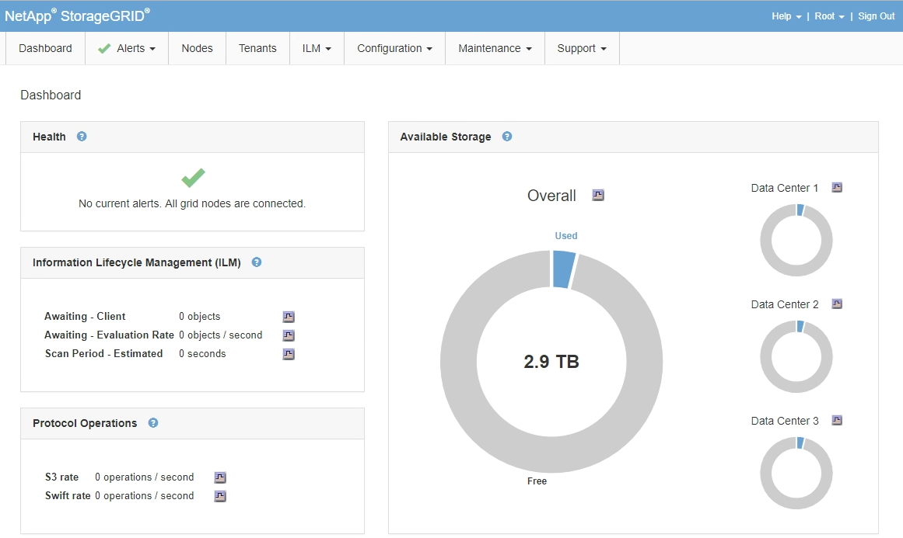

= Grid Managerにサインインします
:allow-uri-read: 
:icons: font
:imagesdir: ../media/

[role="lead"]
Grid Manager のサインインページにアクセスするには、サポートされている Web ブラウザのアドレスバーに管理ノードの完全修飾ドメイン名（ FQDN ）または IP アドレスを入力します。

.必要なもの
* ログインクレデンシャルが必要です。
* Grid ManagerのURLが必要です。
* サポートされているWebブラウザを使用する必要があります。
* Web ブラウザでクッキーが有効になっている必要があります。
* 特定のアクセス権限が必要です。

.このタスクについて
各 StorageGRID システムには、 1 つのプライマリ管理ノードと、任意の数のプライマリ以外の管理ノードが含まれています。任意の管理ノードでグリッドマネージャにサインインして、 StorageGRID システムを管理できます。ただし、管理ノードはまったく同じというわけではありません。

* ある管理ノードで実行されたアラームの確認応答（従来のシステム）は他の管理ノードにはコピーされません。そのため、各管理ノードでアラームについて異なる情報が表示される可能性があります。
* 一部のメンテナンス手順は、プライマリ管理ノードでしか実行できません。

管理ノードがハイアベイラビリティ（ HA ）グループに含まれている場合は、 HA グループの仮想 IP アドレスまたは仮想 IP アドレスにマッピングされる完全修飾ドメイン名を使用して接続します。プライマリ管理ノードが使用できない場合を除いてプライマリ管理ノード上のグリッドManagerにアクセスするよう、プライマリ管理ノードをグループの優先マスターとして選択してください。

.手順
. サポートされている Web ブラウザを起動します。
. ブラウザのアドレスバーに、 Grid Manager の URL を入力します。
+
`https://_FQDN_or_Admin_Node_IP_/`

+
ここで、 `_FQDN_or_Admin_Node_IP_` は、管理ノードの完全修飾ドメイン名またはIPアドレス、あるいは管理ノードのHAグループの仮想IPアドレスです。

+
HTTPS（443）の標準ポート以外のポートでGrid Managerにアクセスする必要がある場合は、次のように入力します `_FQDN_or_Admin_Node_IP_` は完全修飾ドメイン名またはIPアドレス、portはポート番号です。

+
`https://_FQDN_or_Admin_Node_IP:port_/`

. セキュリティアラートが表示された場合は、ブラウザのインストールウィザードを使用して証明書をインストールします。
. Grid Manager にサインインします。
+
** StorageGRID システムでシングルサインオン（ SSO ）が使用されていない場合は、次の手順を実行します。
+
... Grid Manager のユーザ名とパスワードを入力します。
... [ * サインイン * ] をクリックします。
+
image:../media/sign_in_grid_manager_no_sso.gif["サインインページ"]

** StorageGRID システムで SSO が有効になっており、このブラウザで初めて URL にアクセスした場合は、次の手順を実行します。
+
... [ * サインイン * ] をクリックします。[ アカウント ID] フィールドは空白のままにできます。
+
image::../media/sso_sign_in_first_time.gif[SSO が有効でクッキーがない場合は、サインイン画面にサインインします]

... 組織の SSO サインインページで標準の SSO クレデンシャルを入力します。例：
+
image::../media/sso_organization_page.gif[組織の SSO サインインページの例]

** StorageGRID システムで SSO が有効になっており、 Grid Manager またはテナントアカウントに以前にアクセスしたことがある場合は、次の手順を実行します。
+
... 次のいずれかを実行します。
+
**** 「* 0 *」（Grid ManagerのアカウントID）と入力し、*サインイン*をクリックします。
**** 最近のアカウントのリストに* Grid Manager *が表示されている場合は、*サインイン*をクリックします。
+
image:../media/sign_in_grid_manager_sso.gif["SSOが有効な場合は、最近のアカウントリストからGrid Managerを選択する"]

... 組織の SSO サインインページで通常使用している SSO クレデンシャルを使用してサインインします。サインインすると、ダッシュボードが含まれた Grid Manager のホームページが表示されます。表示される情報については、StorageGRID の監視とトラブルシューティングの手順の「ダッシュボードの表示」を参照してください。

+

. 別の管理ノードにサインインする場合は、次の手順を実行します。
+
[cols="1a,1a"]
|===
| オプション | 手順 

 a| 
SSO が有効になっていない
 a| 
.. ブラウザのアドレスバーに、他の管理ノードの完全修飾ドメイン名または IP アドレスを入力します。必要に応じてポート番号を追加します。
.. Grid Manager のユーザ名とパスワードを入力します。
.. [ * サインイン * ] をクリックします。

 a| 
SSO が有効です
 a| 
ブラウザのアドレスバーに、他の管理ノードの完全修飾ドメイン名または IP アドレスを入力します。

1 つの管理ノードにサインインしたら、再度サインインしなくても他の管理ノードにアクセスできます。ただし、 SSO セッションが期限切れになると、クレデンシャルの再入力を求められます。

* 注： SSO は制限された Grid Manager ポートでは使用できません。ユーザをシングルサインオンで認証する場合は、デフォルトの HTTPS ポート（ 443 ）を使用する必要があります。

|===

.関連情報
link:web-browser-requirements.html["Web ブラウザの要件"]

link:controlling-access-through-firewalls.html["ファイアウォールによるアクセス制御"]

link:configuring-server-certificates.html["サーバ証明書の設定"]

link:configuring-sso.html["シングルサインオンを設定しています"]

link:managing-admin-groups.html["管理者グループの管理"]

link:managing-high-availability-groups.html["ハイアベイラビリティグループの管理"]

link:../tenant/index.html["テナントアカウントを使用する"]

link:../monitor/index.html["トラブルシューティングを監視します"]
