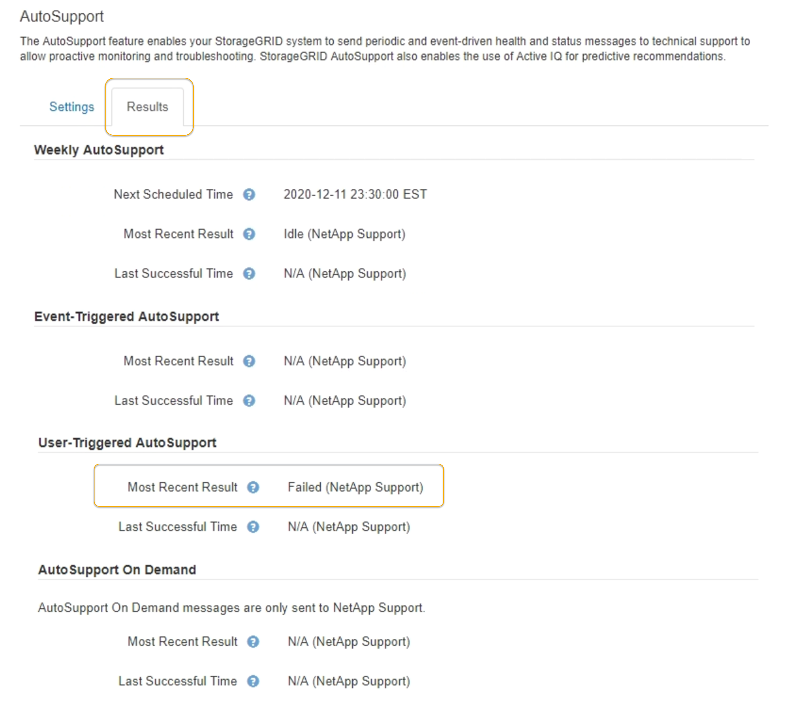

= AutoSupport メッセージのトラブルシューティング
:allow-uri-read: 
:icons: font
:imagesdir: ../media/

[role="lead"]
AutoSupport メッセージの送信が失敗すると、 StorageGRID システムは AutoSupport メッセージのタイプに応じて異なる処理を行います。AutoSupport メッセージのステータスを確認するには、*サポート*ツール* AutoSupport *結果*を選択します。

NOTE: E メール通知をシステム全体で停止した場合は、イベントトリガー型 AutoSupport メッセージが生成されなくなります。（「* Configuration ** System Settings * Display Options *」（設定*システム設定*表示オプション*）を選択します。次に、 [* 通知（ Notification ） ] [ すべてを抑制（ Suppress All ） ] を選択

AutoSupport メッセージの送信に失敗すると、 AutoSupport ページの * Results * タブに「 Failed 」と表示されます。

タブ]

== 週次 AutoSupport メッセージのエラーです

週単位の AutoSupport メッセージの送信に失敗した場合、 StorageGRID システムは次の処理を行います。

. 最新の結果属性を更新して再試行します。
. 4 分間隔で 15 回、 1 時間 AutoSupport メッセージの再送信を試みます。
. 送信エラーが 1 時間発生した後、最新の結果属性を失敗に更新します。
. AutoSupport メッセージの送信を、次にスケジュールされた時刻に再試行します。
. NMS サービスが利用できないことが原因でメッセージの送信が失敗した場合、および 7 日以内にメッセージが送信された場合は、 AutoSupport の定期送信スケジュールを維持します。
. 7 日以上メッセージが送信されていない場合は、 NMS サービスが使用可能な状態に戻った時点で AutoSupport メッセージが送信されます。

== ユーザトリガー型またはイベントトリガー型の AutoSupport メッセージのエラーです

ユーザトリガー型またはイベントトリガー型の AutoSupport メッセージの送信に失敗した場合、 StorageGRID システムは次の処理を行います。

. 既知のエラーの場合は、エラーメッセージが表示されます。たとえば、ユーザが正しいEメール設定を指定せずにSMTPプロトコルを選択した場合、次のエラーが表示されます。 `AutoSupport messages cannot be sent using SMTP protocol due to incorrect settings on the E-mail Server page.`
. メッセージの再送信は試行されません。
. にエラーを記録します `nms.log`。

プロトコルとしてSMTPが選択されている場合に問題が発生した場合は、StorageGRID システムのEメールサーバが正しく設定されていることと、Eメールサーバが実行されていることを確認します（* Support *アラーム（レガシー）* Legacy Email Setup *）。AutoSupport ページに次のエラーメッセージが表示される場合があります。 `AutoSupport messages cannot be sent using SMTP protocol due to incorrect settings on the E-mail Server page.`

E メールサーバの設定方法については、を参照してください link:../monitor/index.html["監視とトラブルシューティングの手順"]。

== AutoSupport メッセージのエラーの修正

プロトコルとして SMTP が選択されている状況で問題が発生した場合は、 StorageGRID システムの E メールサーバが正しく設定されていることと、 E メールサーバが実行されていることを確認します。AutoSupport ページに次のエラーメッセージが表示される場合があります。 `AutoSupport messages cannot be sent using SMTP protocol due to incorrect settings on the E-mail Server page.`

.関連情報
link:../monitor/index.html["トラブルシューティングを監視します"]
