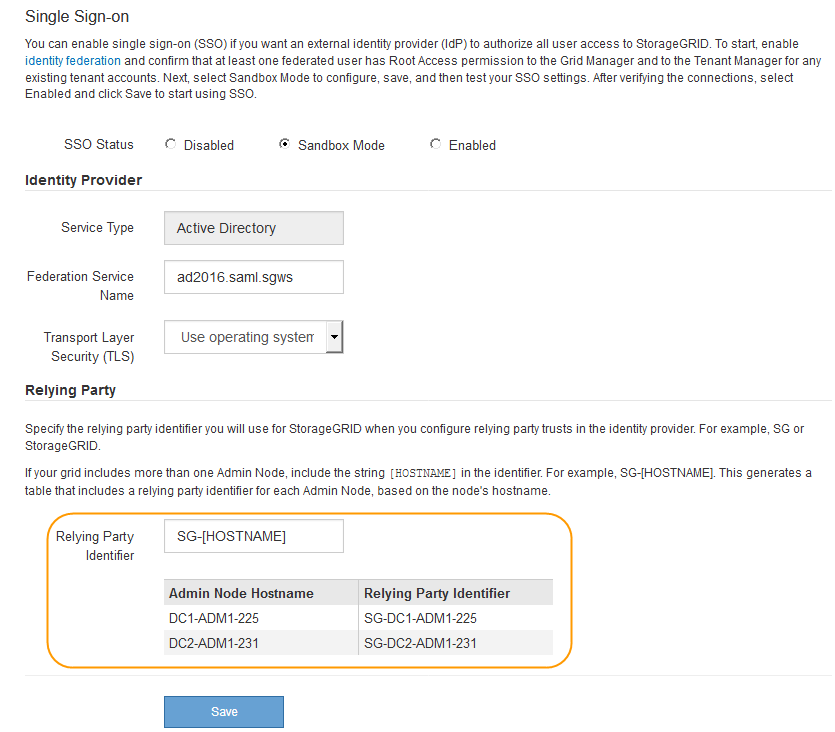

= サンドボックスモードの使用
:allow-uri-read: 
:icons: font
:imagesdir: ../media/

[role="lead"]
サンドボックスモードを使用すると、StorageGRID ユーザにシングルサインオン（SSO）を適用する前に、Active Directoryフェデレーションサービス（AD FS）の証明書利用者信頼を設定およびテストできます。SSOを有効にしたあとにサンドボックスモードを再度有効にすると、新規および既存の証明書利用者信頼を設定またはテストできます。サンドボックスモードを再度有効にすると、StorageGRID ユーザーのSSOは一時的に無効に

.必要なもの
* Grid Managerにはサポートされているブラウザを使用してサインインする必要があります。
* 特定のアクセス権限が必要です。

.このタスクについて
SSOが有効な場合、ユーザが管理ノードにサインインしようとすると、StorageGRID からAD FSに認証要求が送信されます。次に、AD FSは、認証要求が成功したかどうかを示す認証応答をStorageGRID に返します。要求が成功した場合、応答にはユーザのUniversally Unique Identifier（UUID）が含まれます。

StorageGRID （サービスプロバイダ）とAD FS（アイデンティティプロバイダ）がユーザの認証要求を安全にやり取りできるようにするには、StorageGRID で特定の設定を行う必要があります。次に、AD FSを使用して、管理ノードごとに証明書利用者信頼を作成します。最後に、 StorageGRID に戻って SSO を有効にする必要があります。

サンドボックスモードでは、 SSO を有効にする前に、この手順を簡単に実行し、すべての設定をテストできます。

NOTE: サンドボックスモードは使用することを推奨しますが、必須ではありません。StorageGRID でSSOを設定した直後にAD FSの証明書利用者信頼を作成する準備ができている場合は、また、管理ノードごとにSSOプロセスとシングルログアウト（SLO）プロセスをテストする必要はありません。* enabled *をクリックし、StorageGRID 設定を入力して、AD FS内の管理ノードごとに証明書利用者信頼を作成し、* Save *をクリックしてSSOを有効にします。

.手順
. 「* Configuration * Access Control * Single Sign-On *」を選択します。
+
[Single Sign-On] ページが表示され、 [*Disabled*] オプションが選択されます。

+
image::../media/sso_status_disabled.gif[SSO ステータスが無効になっているシングルサインオンページ]

+

NOTE: SSO Statusオプションが表示されない場合は、Active Directoryがフェデレーテッドアイデンティティソースとして設定されていることを確認します。「シングルサインオンの使用要件」を参照してください。

. [*サンドボックスモード*]オプションを選択します。
+
アイデンティティプロバイダと証明書利用者の設定が表示されます。［アイデンティティプロバイダ］セクションでは、［*サービスタイプ*］フィールドは読み取り専用です。ここには、使用しているアイデンティティフェデレーションサービスのタイプ（Active Directoryなど）が表示されます。

. アイデンティティプロバイダセクションで、次の手順を実行します。
+
.. フェデレーションサービス名をAD FSに表示されているとおりに入力します。
+

NOTE: フェデレーションサービス名を確認するには、Windows Server Managerに移動します。[ツール***AD FS管理*]を選択します。[ アクション ] メニューから、 [ * フェデレーションサービスのプロパティの編集 * ] を選択します。フェデレーションサービス名が 2 番目のフィールドに表示されます。

.. StorageGRID 要求への応答としてアイデンティティプロバイダがSSO設定情報を送信するときに、Transport Layer Security（TLS）を使用して接続を保護するかどうかを指定します。
+
*** * オペレーティング・システムの CA 証明書を使用 * ：オペレーティング・システムにインストールされているデフォルトの CA 証明書を使用して、接続を保護します。
*** * カスタム CA 証明書を使用 * ：カスタム CA 証明書を使用して接続を保護します。
+
この設定を選択した場合は、証明書を* CA証明書*テキストボックスにコピーして貼り付けます。

*** * Do not use TLS* ： TLS 証明書を使用して接続を保護しないでください。

. 証明書利用者セクションで、StorageGRID 管理ノードに使用する証明書利用者信頼を設定するときに使用する証明書利用者IDを指定します。
+
** たとえば、グリッドに管理ノードが1つしかなく、今後管理ノードを追加する予定がない場合は、と入力します `SG` または `StorageGRID`。
** グリッドに複数の管理ノードがある場合は、という文字列を含めます `[HOSTNAME]` を入力します。例： `SG-[HOSTNAME]`。これにより、管理ノードのホスト名に基づいて、各管理ノードの証明書利用者IDを含むテーブルが生成されます。+注：証明書利用者信頼はStorageGRID システム内の管理ノードごとに作成する必要があります。管理ノードごとに証明書利用者信頼を作成することで、ユーザは管理ノードに対して安全にサインイン / サインアウトすることができます。

+

. [ 保存（ Save ） ] をクリックします。
+
** 数秒間、 * Save * （保存）ボタンに緑色のチェックマークが表示されます。
+
image::../media/save_button_green_checkmark.gif[緑色のチェックマークが付いた [ 保存 ] ボタン]

** サンドボックスモードの確認メッセージが表示され、サンドボックスモードが有効になっていることが確認されます。AD FSの使用時にもこのモードを使用して、管理ノードごとに証明書利用者信頼を設定し、シングルサインイン（SSO）プロセスとシングルログアウト（SLO）プロセスをテストできます。
+
image::../media/sso_sandbox_mode_enabled.gif[SSOサンドボックスモードが有効です]

.関連情報
link:requirements-for-sso.html["シングルサインオンの使用要件"]
