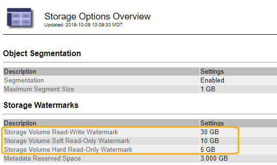

= ストレージボリュームのウォーターマークとは
:allow-uri-read: 
:icons: font
:imagesdir: ../media/

[role="lead"]
StorageGRID では、ストレージボリュームのウォーターマークを使用して、ストレージノードで使用可能なスペースの量を監視できます。ノードで使用可能なスペース量が設定されたウォーターマークよりも少なくなると、Storage Status（SSTS）アラームがトリガーされて、ストレージノードを追加する必要があるかどうかを判断できます。

ストレージ・ボリューム・ウォーターマークの現在の設定を表示するには'[*構成**ストレージ・オプション*概要*]を選択します

次の図は、ボリュームを3つ含むストレージノードでの、3つのストレージボリュームウォーターマークの相対的な位置を示しています。各ストレージノード内で、StorageGRID がオブジェクトメタデータ用にボリューム0のスペースをリザーブし、そのボリュームの残りのスペースはオブジェクトデータに使用されます。他のすべてのボリュームはオブジェクトデータ専用のボリュームです。オブジェクトデータにはレプリケートコピーとイレイジャーコーディングフラグメントがあります。

image::../media/storage_volume_watermarks.png[ウォーターマークの図]

ストレージボリュームウォーターマークは、ストレージノード内の各ボリュームに必要な最小空きスペースを示すシステム全体のデフォルト値で、この値を超えると、StorageGRID によってノードの読み取り/書き込み動作が変更されたり、アラームがトリガーされたりします。StorageGRID が処理を実行するには、すべてのボリュームがウォーターマークに達する必要があります。一部のボリュームに必要な最小空きスペース量を超えると、アラームはトリガーされず、ノードの読み取り/書き込み動作も変更されません。

== Storage Volume Soft Read-Only Watermark（Vhwm）

Storage Volume Soft Read-Only Watermarkは、オブジェクトデータに使用可能なノードのスペースがフルに近づいていることを示す最初のウォーターマークです。このウォーターマークは'ノードがソフト読み取り専用モードにならないようにするために'ストレージ・ノード内の各ボリュームに必要な空きスペースの量を表しますソフト読み取り専用モードでは、ストレージノードはStorageGRID システムの他の要素にサービスが読み取り専用であることをアドバタイズしますが、保留中の書き込み要求はすべて実行します。

各ボリュームの空きスペース量がこのウォーターマークを下回ると、Storage Status（SSTS）アラームがNoticeレベルでトリガーされ、ストレージノードはソフト読み取り専用モードに移行します。

たとえば、 Storage Volume Soft Read-Only Watermark がデフォルト値の 10GB に設定されているとします。ストレージノード内の各ボリュームの空きスペースが10GB未満になると、SSTSアラームがNoticeレベルでトリガーされ、ストレージノードはソフト読み取り専用モードに移行します。

== Storage Volume Hard Read-Only Watermark（VROM）

Storage Volume Hard Read-Only Watermarkは、オブジェクトデータに使用可能なノードのスペースがフルに近づいていることを示す2つ目のウォーターマークです。このウォーターマークは'ノードがハード読み取り専用モードにならないようにするために'ストレージ・ノード内の各ボリュームに必要な空きスペースの量を表しますハード読み取り専用モードでは、ストレージノードは読み取り専用となり、書き込み要求を受け付けません。

ストレージノード内のすべてのボリュームの空きスペース量がこのウォーターマークを下回ると、Storage Status（SSTS）アラームがMajorレベルでトリガーされ、ストレージノードはハード読み取り専用モードに移行します。

たとえば、Storage Volume Hard Read-Only Watermarkがデフォルト値の5GBに設定されているとします。ストレージノード内の各ストレージボリュームの空きスペースが5GB未満になると、SSTSアラームがMajorレベルでトリガーされ、ストレージノードはハード読み取り専用モードに移行します。

Storage Volume Hard Read-Only Watermarkの値は、Storage Volume Soft Read-Only Watermarkの値より小さくする必要があります。

== Storage Volume Read-Write Watermark（VLWM）

読み取り専用モードに移行したストレージボリューム読み取り/書き込みウォーターマークのみの環境 ストレージノード。このウォーターマークは、ストレージノードが再度読み取り/書き込み可能になるタイミングを決定します。

たとえば、あるストレージノードがハード読み取り専用モードに移行したとします。Storage Volume Read-Write Watermarkが30GB（デフォルト）に設定されている場合、ノードが再度読み取り/書き込み可能になるためには、ストレージノード内の各ストレージボリュームの空きスペースが5GBから30GBに増える必要があります。

Storage Volume Read-Write Watermarkの値は、Storage Volume Soft Read-Only Watermarkの値より大きくする必要があります。

.関連情報
link:managing-full-storage-nodes.html["容量が上限に達したストレージノードの管理"]
