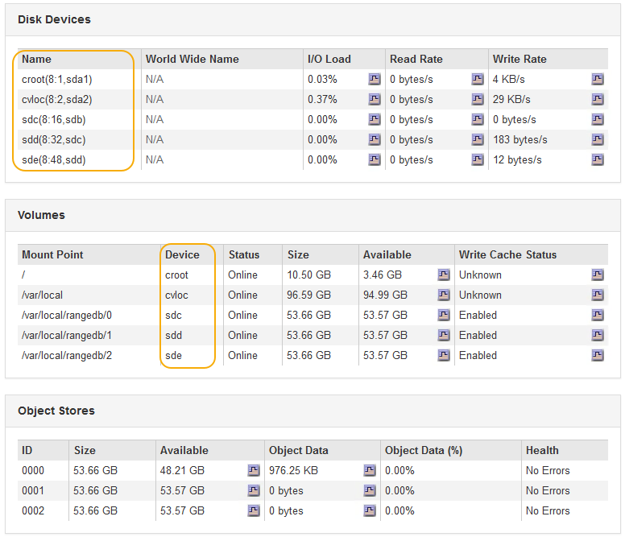

= ストレージノードへのストレージボリュームの追加
:allow-uri-read: 
:icons: font
:imagesdir: ../media/

[role="lead"]
ストレージボリュームを 16 個以下にすることでストレージノードのストレージ容量を拡張できます。ILM のレプリケートコピーまたはイレイジャーコーディングコピーの要件を満たすために、複数のストレージノードへのストレージボリュームの追加が必要になる場合があります。

.必要なもの
ストレージボリュームを追加する前に、ストレージ容量を追加する際のガイドラインを確認し、ILMポリシーの要件を満たすボリュームの追加先を確認してください。

link:adding-storage-capacity.html["ストレージ容量を追加しています"]

[NOTE]
====
この手順はソフトウェアベースのストレージノードにのみ該当します。拡張シェルフを設置してSG6060にストレージボリュームを追加する方法については、SG6060アプライアンスの設置とメンテナンスの手順を参照してください。それ以外のアプライアンスストレージノードは拡張できません。

link:../sg6000/index.html["SG6000 ストレージアプライアンス"]

====
.このタスクについて
ストレージノードの基盤となるストレージは、複数のストレージボリュームに分割されます。ストレージボリュームは、 StorageGRID システムでフォーマットされてオブジェクトの格納用にマウントされたブロックベースのストレージデバイスです。各ストレージノードでサポートされるストレージボリュームは、 Grid Manager では _ オブジェクトストア _ と呼ばれ、最大 16 個です。

NOTE: オブジェクトメタデータは常にオブジェクトストア 0 に格納されます。

各オブジェクトストアは、 ID に対応するボリュームにマウントされます。つまり、IDが0000のオブジェクトストアはに対応しています `/var/local/rangedb/0` マウントポイント：

新しいストレージボリュームを追加する前に、 Grid Manager を使用して、各ストレージノードの現在のオブジェクトストアと対応するマウントポイントを表示します。この情報は、ストレージボリュームを追加するときに役立ちます。

.手順
. ノード*>*_site *>*_ストレージノード_*>*ストレージ*を選択します。
. 下にスクロールして、各ボリュームとオブジェクトストアに使用可能なストレージ容量を表示します。
+
アプライアンスストレージノードの場合、各ディスクの Worldwide Name は、 SANtricity ソフトウェア（アプライアンスのストレージコントローラに接続される管理ソフトウェア）で標準のボリュームプロパティとして表示される、ボリュームの World-Wide Identifier （ WWID ）と同じです。

+
ボリュームマウントポイントに関連するディスクの読み取りと書き込みの統計情報を解釈できるように、 Disk Devices テーブルの * Name * 列に表示される名前の最初の部分（つまり、 _sdc_sd_,_sde_ ）が Volumes テーブルの * Device * 列に表示される値と一致していることを確認します。

+

. プラットフォームに応じた手順に従って、ストレージノードに新しいストレージボリュームを追加します。
+
** link:vmware-adding-storage-volumes-to-storage-node.html["VMware：ストレージノードへのストレージボリュームの追加"]
** link:linux-adding-direct-attached-or-san-volumes-to-storage-node.html["Linux：ストレージノードへの直接接続型ボリュームまたはSANボリュームの追加"]

