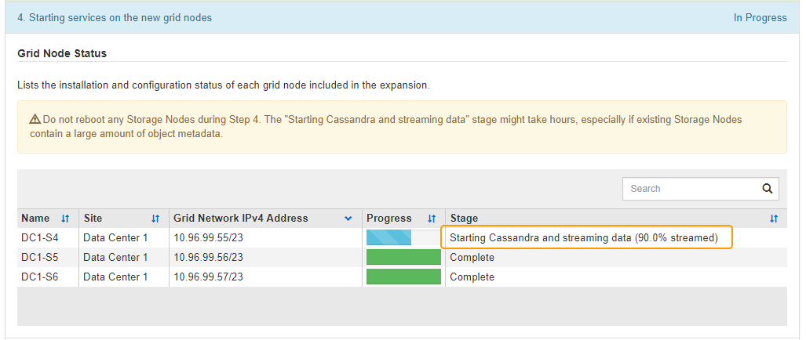

= 拡張の実施
:allow-uri-read: 
:icons: font
:imagesdir: ../media/

[role="lead"]
拡張を行うと、新しいグリッドノードが既存の StorageGRID 環境に追加されます。

.必要なもの
* Grid Managerにはサポートされているブラウザを使用してサインインする必要があります。
* Maintenance または Root Access 権限が必要です。
* プロビジョニングパスフレーズが必要です。
* この拡張で追加するすべてのグリッドノードの導入が完了している必要があります。
* ストレージノードを追加する場合は、リカバリの一環として実行されるデータ修復処理がすべて完了したことを確認しておく必要があります。リカバリとメンテナンスの手順のデータ修復ジョブを確認する手順を参照してください。
* 新しいサイトを追加する場合は、拡張手順 を開始する前に ILM ルールを確認して更新し、拡張が完了するまでオブジェクトコピーが新しいサイトに格納されないようにする必要があります。たとえば、デフォルトのストレージプール（すべてのストレージノード）を使用するルールの場合は、既存のストレージノードのみを含む新しいストレージプールを作成し、その新しいストレージプールを使用するように ILM ルールを更新する必要があります。そうしないと、そのサイトの最初のノードがアクティブになるとすぐに新しいサイトにオブジェクトがコピーされます。情報ライフサイクル管理を使用してオブジェクトを管理する手順を参照してください。

.このタスクについて
拡張は次のフェーズで行います。

. 拡張を設定するには、新しいグリッドノードと新しいサイトのどちらを追加するかを指定し、追加するグリッドノードを承認します。
. 拡張を開始します。
. 拡張プロセスの実行中に、新しいリカバリパッケージファイルをダウンロードします。
. グリッド設定タスクのステータスを監視します。このタスクは自動的に実行されます。タスクのセットは、追加するグリッドノードのタイプおよび新しいサイトが追加されるかどうかによって異なります。
+

IMPORTANT: 大規模なグリッドにおいては、一部のタスクの実行にかなりの時間がかかることがあります。たとえば、新しいストレージノードへのCassandraのストリーミングは、Cassandraデータベースが空に近い状態であれば数分程度で完了します。ただし、 Cassandra データベースに大量のオブジェクトメタデータが含まれている場合は、数時間以上かかることがあります。「Starting Cassandra and streaming data」ステージで表示される「streamed」の割合を見ると、Cassandraストリーミング処理の完了状況を判断できます。

.手順
. [* Maintenance（メンテナンス）*>* Maintenance Tasks（メンテナンスタスク）*>* Expansion（拡張）*]を選択します。
+
Grid Expansion ページが表示されます。Pending Nodes セクションには、追加する準備ができているすべてのノードが表示されます。

+
image::../media/grid_expansion_page.png[グリッドの拡張ページを示すスクリーンショット]

. [拡張の構成*]をクリックします。
+
[ サイトの選択 ] ダイアログボックスが表示されます。

+
image::../media/configure_expansion_dialog.gif[[ サイトの選択 ] ダイアログ]

. 開始する拡張のタイプを選択します。
+
** 新しいサイトを追加する場合は、「 * 新規」を選択し、新しいサイトの名前を入力します。
** 既存のサイトにグリッドノードを追加する場合は、「 * existing * 」を選択します。

. [ 保存（ Save ） ] をクリックします。
. 「 * Pending Nodes * 」のリストを確認し、導入したすべてのグリッドノードが表示されていることを確認します。
+
必要に応じて、ノードの * グリッドネットワークの MAC アドレス * にカーソルを合わせると、そのノードに関する詳細を確認できます。

+
image::../media/grid_node_details.gif[Grid ノードの詳細のスクリーンショット]

+

NOTE: 見つからないグリッドノードがある場合は、正常に導入されたことを確認します。

. 保留中のノードのリストで、この拡張用のグリッドノードを承認します。
+
.. 承認する最初の保留中のグリッドノードの横にあるラジオボタンを選択します。
.. [ 承認（ Approve ） ] をクリックします
+
グリッドノードの設定フォームが表示されます。

+

.. 必要に応じて、一般設定を変更します。
+
*** * サイト * ：グリッドノードが関連付けられるサイトの名前。複数のノードを追加する場合は、各ノードに適したサイトを選択してください。新しいサイトを追加する場合は、すべてのノードが新しいサイトに追加されます。
*** * 名前 * ：ノードに割り当てられるホスト名と Grid Manager に表示される名前。
*** * NTP Role * ：グリッドノードのネットワークタイムプロトコル（ NTP ）ロール。オプションは * Automatic * 、 * Primary * 、 * Client * です。「 * 自動」を選択すると、管理ノード、 ADC サービスを採用するストレージノード、ゲートウェイノード、および静的な IP アドレスでないグリッドノードにプライマリロールが割り当てられます。他のすべてのグリッドノードにはクライアントロールが割り当てられます。
+

NOTE: Primary NTP ロールは、各サイトで少なくとも 2 つのノードに割り当ててください。これにより、外部タイミングソースへのシステムアクセスが冗長化されます。

*** * ADC Service * （ストレージノードのみ）：このストレージノードで Administrative Domain Controller （ ADC ）サービスを実行するかどうかを指定します。ADC サービスは、グリッドサービスの場所と可用性を追跡します。各サイトで少なくとも 3 つのストレージノードに ADC サービスが含まれている必要があります。導入後のノードに ADC サービスを追加することはできません。
+
**** このノードを追加してストレージノードを交換する場合は、交換するノードに ADC サービスが含まれている場合は「 * Yes 」を選択します。残りの ADC サービスの数が少なすぎるとストレージノードの運用を停止できないため、古いサービスが削除される前に新しい ADC サービスが利用可能になります。
**** それ以外の場合は、 * Automatic * を選択して、このノードに ADC サービスが必要かどうかをシステムに確認させます。リカバリとメンテナンスの手順のADCクォーラムに関する情報を参照してください。

.. 必要に応じて、グリッドネットワーク、管理ネットワーク、およびクライアントネットワークの設定を変更します。
+
*** * IPv4 Address （ CIDR ） * ：ネットワークインターフェイスの CIDR ネットワークアドレス。たとえば、 172.16.10.100/24 のようになります
*** * Gateway * ：グリッドノードのデフォルトゲートウェイ。たとえば、 172.16.10.1 と入力します
*** * Subnets （ CIDR ） * ：管理ネットワーク用の 1 つ以上のサブネットワーク。

.. [ 保存（ Save ） ] をクリックします。
+
承認済みグリッドノードが [ 承認済みノード ] リストに移動します。

+
image::../media/grid_expansion_approved_nodes.png[承認済みノードを示すスクリーンショット]

+
*** 承認済みグリッドノードのプロパティを変更するには、そのラジオボタンを選択し、*編集*をクリックします。
*** 承認済みのグリッドノードを保留中のノードのリストに戻すには、該当するオプションボタンを選択し、*リセット*をクリックします。
*** 承認済みのグリッドノードを完全に削除するには、ノードの電源をオフにします。次に、そのラジオボタンを選択し、*削除*をクリックします。

.. 承認する保留中のグリッドノードごとに、上記の手順を繰り返します。
+

NOTE: 可能であれば、保留中のグリッドノードをすべて承認し、 1 回の拡張を実施してください。小規模な拡張を複数回実施すると、さらに時間がかかります。

. すべてのグリッドノードを承認したら、「*プロビジョニングパスフレーズ」と入力し、「*拡張」をクリックします。
+
数分後にページが更新され、拡張手順 のステータスが表示されます。個々のグリッドノードに影響するタスクが実行中の場合は、グリッドノードのステータスセクションに各グリッドノードの現在のステータスが表示されます。

+

NOTE: アプライアンスの場合、インストールがステージ 3 からステージ 4 、 Finalize Installation に移行していることを示す StorageGRID アプライアンスインストーラの処理が実行されます。ステージ 4 が完了すると、コントローラがリブートします。

+
image::../media/grid_expansion_progress.png[この図には説明が付随しています。]

+

NOTE: サイトの拡張には、新しいサイト用の Cassandra を設定するための追加タスクが含まれます。

. [Download Recovery Package* ] リンクが表示されたら、すぐにリカバリパッケージファイルをダウンロードします。
+
StorageGRID システムでグリッドトポロジを変更した場合は、できるだけ早くリカバリパッケージファイルの最新コピーをダウンロードする必要があります。リカバリパッケージファイルは、障害が発生した場合にシステムをリストアするために使用します。

+
.. ダウンロードリンクをクリックします。
.. プロビジョニングパスフレーズを入力し、*ダウンロードの開始*をクリックします。
.. ダウンロードが完了したら、を開きます `.zip` をファイルし、が含まれていることを確認します `gpt-backup` ディレクトリと `_SAID.zip` ファイル。次に、を展開します `_SAID.zip` ファイルで、に移動します `/GID*_REV*` を開き、確認します `passwords.txt` ファイル。
.. ダウンロードしたリカバリパッケージファイル（ .zip ）を、 2 箇所の安全な場所にコピーします。
+

IMPORTANT: リカバリパッケージファイルには StorageGRID システムからデータを取得するための暗号キーとパスワードが含まれているため、安全に保管する必要があります。

. 1つ以上のストレージノードを追加する場合は、ステータスメッセージに表示される割合を確認して、「Starting Cassandra and streaming data」ステージの進行状況を監視します。
+

+
この割合は、使用可能な Cassandra データの合計量と、新しいノードに書き込み済みの量に基づいて、 Cassandra のストリーミング処理の進捗状況から概算したものです。

+

IMPORTANT: 手順4（新しいグリッドノードでサービスを開始する）の実行中は、ストレージノードをリブートしないでください。特に、既存のストレージノードに大量のオブジェクトメタデータが含まれている場合は、「Starting Cassandra and streaming data」ステージが新しいストレージノードごとに完了するまでに数時間かかることがあります。

. すべてのタスクが完了し、 * 拡張の設定 * ボタンが再表示されるまで、拡張の監視を続けます。

.完了後
追加したグリッドノードのタイプに応じて、統合と設定のための追加の手順を実行する必要があります。

.関連情報
link:../ilm/index.html["ILM を使用してオブジェクトを管理する"]

link:../maintain/index.html[""]

link:configuring-expanded-storagegrid-system.html["拡張後のStorageGRID システムの設定"]
