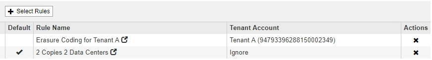

= デフォルトのILMルールを作成する
:allow-uri-read: 
:icons: font
:imagesdir: ../media/

[role="lead"]
すべてのILMポリシーに、オブジェクトをフィルタリングしないデフォルトルールが設定されている必要があります。ILMポリシーを作成する前に、ポリシーのデフォルトルールとして使用できるILMルールを少なくとも1つ作成する必要があります。

.必要なもの
* Grid Managerにはサポートされているブラウザを使用してサインインする必要があります。
* 特定のアクセス権限が必要です。

.このタスクについて
デフォルトルールは、ILMポリシーで評価される最後のルールであるため、フィルタは使用できません。デフォルトルールの配置手順は、ポリシー内の別のルールに一致しないオブジェクトに適用されます。

次のポリシーの例では、最初のルールがテナント A に属するオブジェクトにのみ適用されますデフォルトルールである最後のルールは、他のすべてのテナントアカウントに属する環境 オブジェクトです。

デフォルトルールを作成するときは、次の要件に注意してください。

* デフォルトのルールは、ポリシーの最後のルールとして自動的に配置されます。
* デフォルトルールでは、基本フィルタまたは詳細フィルタは使用できません。
* デフォルトのルールでレプリケートコピーを作成する必要があります。
+

IMPORTANT: イレイジャーコーディングコピーを作成するルールはポリシーのデフォルトルールとして使用しないでください。イレイジャーコーディングルールでは、高度なフィルタを使用して、小さなオブジェクトがイレイジャーコーディングされないようにします。

* 一般に、デフォルトルールではオブジェクトを無期限に保持する必要があります。
* S3 オブジェクトのグローバルロック設定を使用している（または有効にする）場合は、アクティブポリシーまたはドラフトポリシーのデフォルトルールが準拠している必要があります。

.手順
. [* ILM*>* Rules] を選択します。
+
ILM ルールページが表示されます。

. 「 * Create * 」を選択します。
+
Create ILM Rule ウィザードの Step 1 （ Define Basics ）が表示されます。

. [* 名前 *] フィールドに、ルールの一意の名前を入力します。
. 必要に応じて、ルールの短い概要 を * 概要 * フィールドに入力します。
. [* Tenant Accounts] フィールドは空白のままにします。
+
デフォルトのルールをすべてのテナントアカウントに適用する必要があります。

. Bucket Name * フィールドは空白のままにします。
+
デフォルトルールは、すべての S3 バケットと Swift コンテナに適用する必要があります。

. 「 * 高度なフィルタリング * 」は選択しないでください
+
デフォルトルールでフィルタを指定することはできません。

. 「 * 次へ * 」を選択します。
+
ステップ 2 （配置を定義）が表示されます。

. デフォルトルールの配置手順を指定します。
+
** デフォルトルールではオブジェクトを無期限に保持する必要があります。デフォルトルールによってオブジェクトが無期限に保持されない場合、新しいポリシーをアクティブ化すると警告が表示されます。これが想定どおりの動作であることを確認する必要があります。
** デフォルトのルールでレプリケートコピーを作成する必要があります。
+

IMPORTANT: イレイジャーコーディングコピーを作成するルールはポリシーのデフォルトルールとして使用しないでください。イレイジャーコーディングルールでは、高度なフィルタ「 * Object Size （ MB ） than 0.2 」を含めて、小さいオブジェクトがイレイジャーコーディングされないようにします。

** S3 オブジェクトのグローバルロック設定を使用している（または有効にする）場合は、デフォルトルールが準拠している必要があります。
+
*** 2 つ以上のレプリケートオブジェクトコピーまたは 1 つのイレイジャーコーディングコピーを作成する。
*** これらのコピーが、配置手順の各ラインの間、ストレージノード上に存在している必要があります。
*** オブジェクトコピーをクラウドストレージプールに保存することはできません。
*** オブジェクトコピーをアーカイブノードに保存することはできません。
*** 配置手順の少なくとも 1 行は、参照時間として取り込み時間を使用して 0 日目から開始する必要があります。
*** 配置手順の少なくとも 1 行は「無期限」である必要があります。

. [*更新*]をクリックして保持図を更新し'配置手順を確認します
. 「 * 次へ * 」をクリックします。
+
ステップ 3 （取り込み動作の定義）が表示されます。

. オブジェクトの取り込み時に使用するデータ保護オプションを選択し、 * 保存 * を選択します。

