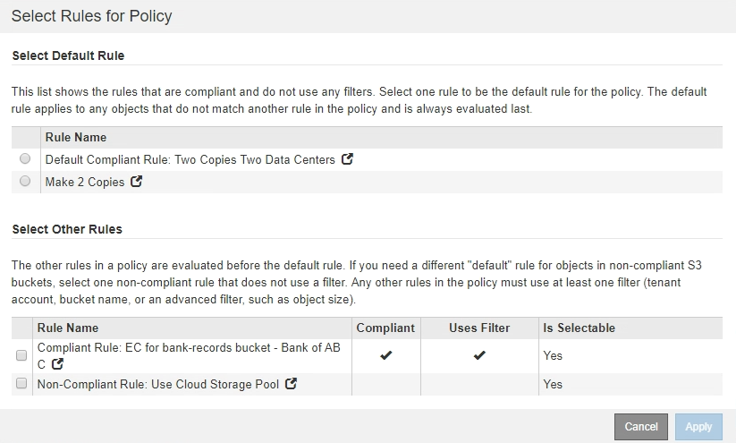

= S3オブジェクトのロックが有効になったあとのILMポリシーの作成
:allow-uri-read: 
:icons: font
:imagesdir: ../media/

[role="lead"]
グローバルな S3 オブジェクトのロック設定が有効になっている場合は、ポリシーの作成手順が少し異なります。S3 オブジェクトロックが有効になっているバケットの要件を ILM ポリシーが準拠していることを確認する必要があります。

.必要なもの
* Grid Managerにはサポートされているブラウザを使用してサインインする必要があります。
* 特定のアクセス権限が必要です。
* StorageGRID システムでグローバルなS3オブジェクトロック設定が有効になっている必要があります。
+
[NOTE]
====
グローバルなS3オブジェクトのロック設定が有効になっていない場合は、代わりにドラフトポリシーの作成手順を使用してください。

link:creating-proposed-ilm-policy.html["ドラフトのILMポリシーを作成します"]

====
* ドラフトポリシーに追加する準拠ILMルールと非準拠ILMルールを作成しておく必要があります。必要に応じて、ドラフトポリシーを保存して追加のルールを作成し、ドラフトポリシーを編集して新しいルールを追加できます。
+
link:example-7-compliant-ilm-policy-for-s3-object-lock.html["例 7 ： S3 オブジェクトロックの準拠 ILM ポリシー"]

* ポリシーの準拠デフォルトのILMルールを作成しておく必要があります。
+
link:creating-default-ilm-rule.html["デフォルトのILMルールを作成する"]

.手順
. 「 * ILM * > * Policies * 」を選択します。
+
ILM ポリシーページが表示されます。グローバルな S3 オブジェクトのロック設定が有効になっている場合は、 ILM ポリシーページに準拠している ILM ルールが表示されます。

+
image::../media/ilm_policies_page_compliant.png[ILM ポリシーページ準拠です]

. [* 名前 *] フィールドに、ドラフトポリシーの一意の名前を入力します。
+
1 文字以上 64 文字以下で入力する必要があります。

. [ 変更理由（ Reason for change ） ] フィールドに、新しいドラフトポリシーを作成する理由を入力します。
+
1 文字以上 128 文字以下で入力する必要があります。

. ポリシーにルールを追加するには、 * ルールの選択 * を選択します。
+
[Select Rules for Policy] ダイアログボックスが表示され、定義済みのすべてのルールが一覧表示されます。

+
** ［ デフォルトルールの選択 ］ セクションには、準拠ポリシーのデフォルトになるルールがリストされます。フィルタを使用しない準拠ルールが含まれています。
** [ その他のルールの選択 ] セクションには、このポリシーに選択できる他の準拠ルールと非準拠ルールが一覧表示されます。

. ルール名または詳細アイコンを選択します  をクリックすると、そのルールの設定が表示されます。
. [ デフォルトルールを選択（ * Select Default Rule ） ] セクションで、ドラフトポリシーにデフォルトルールを 1 つ選択します。
+
このセクションの表には、準拠ルールのみが表示され、フィルタは使用されません。

+
[NOTE]
====
ルールが[Select Default Rule]セクションに表示されない場合は、ILMポリシーページを終了して、準拠するデフォルトルールを作成する必要があります。

link:creating-default-ilm-rule.html["デフォルトのILMルールを作成する"]

====
+

IMPORTANT: Make 2 Copies ルールをポリシーのデフォルトルールとして使用しないでください。Make 2 Copies ルールは、 1 つのストレージプールであるすべてのストレージノードを使用します。このプールにはすべてのサイトが含まれています。このルールを使用すると、 1 つのオブジェクトの複数のコピーが同じサイトに配置される場合があります。

. [ その他のルールを選択してください ] セクションで、ポリシーに含める他のルールを選択します。
+
.. 非準拠 S3 バケット内のオブジェクトに別の「デフォルト」ルールが必要な場合は、必要に応じて、フィルタを使用しない非準拠ルールを 1 つ選択します。
+
たとえば、クラウドストレージプールやアーカイブノードを使用して、 S3 オブジェクトロックが有効になっていないバケットにオブジェクトを格納できます。

+

NOTE: フィルタを使用しない非準拠ルールは 1 つだけ選択できます。1 つのルールを選択すると、 [ 選択可能 ] 列には、フィルタのない他の非準拠ルールについては [ * いいえ ] と表示されます。

.. ポリシーで使用する他の準拠ルールと非準拠ルールを選択します。
+
他のルールでは、少なくとも 1 つのフィルタ（テナントアカウント、バケット名、オブジェクトサイズなどの高度なフィルタ）を使用する必要があります。

. ルールの選択が完了したら、 * 適用 * を選択します。
+
選択したルールが表示されます。デフォルトのルールは末尾にあり、その上に他のルールがあります。非準拠の「デフォルト」ルールも選択した場合、そのルールはポリシーの 2 番目から最後までのルールとして追加されます。

+
この例では、最後のルール「 2 Copies 2 Data Center 」がデフォルトルールで、準拠ルールでフィルタがありません。2 番目から最後までのルールである Cloud Storage Pool にもフィルタはありませんが、準拠していません。

+
image::../media/ilm_policies_selected_rules_compliant.png[ILM ポリシー - 選択したルール準拠]

+
。

. デフォルト以外のルールの行をドラッグアンドドロップして、ルールが評価される順序を決定します。
+
デフォルトのルールまたは非準拠の「デフォルト」ルールは移動できません。

+

IMPORTANT: ILM ルールの順序が正しいことを確認してください。ポリシーをアクティブ化すると、新規および既存のオブジェクトがリスト内の順にルールによって評価されます。

. 必要に応じて、削除アイコンをクリックします image:../media/icon_nms_delete_new.gif["削除アイコン"] ポリシーに不要なルールを削除するには、 [ ルールの選択 ] を選択してルールを追加します。
. 完了したら、 * 保存 * を選択します。
+
ILM ポリシーページが更新されます。

+
** 保存したポリシーがドラフトとして表示されます。ドラフトポリシーには開始日と終了日がありません。
** [ シミュレート（ Simulate ） ] および [ 活動化（ Activate ） ] * ボタンが有効になります。image:../media/ilm_policy_proposed_policy_s3_object_lock.png["ILM ポリシーのドラフトポリシーである S3 オブジェクトのロック"]

. に進みます link:simulating-ilm-policy.html["ILMポリシーをシミュレートする"]。

