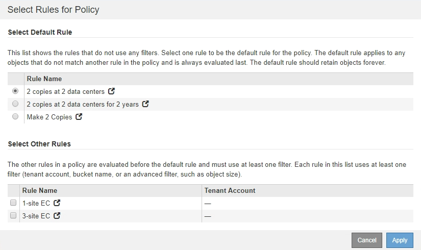
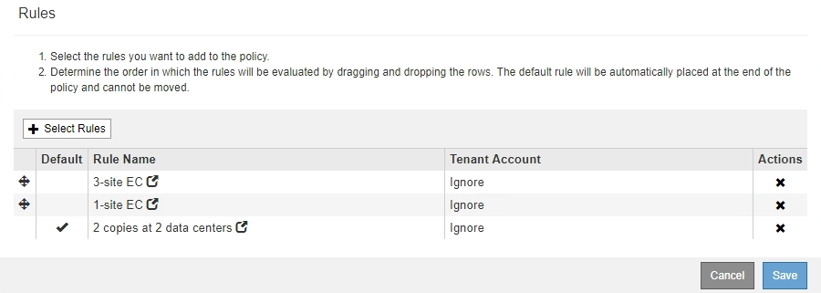

= ドラフトのILMポリシーを作成します
:allow-uri-read: 
:icons: font
:imagesdir: ../media/

[role="lead"]
ドラフトの ILM ポリシーを新規に作成できます。同じルールセットを使用する場合は、現在のアクティブポリシーをクローニングして作成できます。

.必要なもの
* Grid Managerにはサポートされているブラウザを使用してサインインする必要があります。
* 特定のアクセス権限が必要です。
* ドラフトポリシーに追加するILMルールを作成しておく必要があります。必要に応じて、ドラフトポリシーを保存して追加のルールを作成し、ドラフトポリシーを編集して新しいルールを追加できます。
* フィルタを含まないポリシー用のデフォルトのILMルールを作成しておく必要があります。
+
link:creating-default-ilm-rule.html["デフォルトのILMルールを作成する"]

.このタスクについて
ドラフトの ILM ポリシーを作成する主な理由は次のとおりです。

* 新しいサイトを追加した場合、そのサイトにオブジェクトを配置するために新しい ILM ルールを使用する必要があります。
* サイトの運用を停止しているときは、そのサイトを参照するすべてのルールを削除する必要があります。
* 新しいテナントには特別なデータ保護要件があります。
* クラウドストレージプールの使用を開始した。

IMPORTANT: システムに組み込まれているポリシーである Baseline 2 Copies Policy をテストシステムでのみ使用します。このポリシーの Make 2 Copies ルールは、すべてのサイトを含む All Storage Nodes ストレージプールを使用します。StorageGRID システムに複数のサイトがある場合は、 1 つのオブジェクトのコピーが同じサイトに 2 つ配置される可能性があります。

[NOTE]
====
グローバルなS3オブジェクトのロック設定が有効になっている場合は、ポリシーの作成手順が少し異なります。S3 オブジェクトロックが有効になっているバケットの要件を ILM ポリシーが準拠していることを確認する必要があります。

link:creating-ilm-policy-after-s3-object-lock-is-enabled.html["S3オブジェクトのロックが有効になったあとのILMポリシーの作成"]

====
.手順
. 「 * ILM * > * Policies * 」を選択します。
+
ILM ポリシーページが表示されます。このページでは、ドラフトポリシー、アクティブポリシー、履歴ポリシーのリストを確認し、 または、ドラフトポリシーを削除するか、アクティブポリシーをクローニングするか、すべてのポリシーの詳細を表示します。

+
image::../media/ilm_policies_page.gif[ILM Policies ページ]

. ドラフトの ILM ポリシーを作成する方法を決定します。
+
[cols="1a,2a"]
|===
| オプション | 手順 

 a| 
ルールが選択されていない新しいドラフトポリシーを作成します
 a| 
.. ドラフトのILMポリシーが現在存在する場合は、そのポリシーを選択し、*削除*をクリックします。
+
既存のドラフトポリシーがある場合、新しいドラフトポリシーを作成することはできません。

.. [*ドラフトポリシーの作成*]をクリックします。

 a| 
アクティブポリシーに基づいてドラフトポリシーを作成します
 a| 
.. ドラフトのILMポリシーが現在存在する場合は、そのポリシーを選択し、*削除*をクリックします。
+
すでにドラフトポリシーが存在する場合、アクティブポリシーをクローニングすることはできません。

.. テーブルからアクティブポリシーを選択します。
.. [* Clone* ] をクリックします。

 a| 
既存のドラフトポリシーを編集します
 a| 
.. テーブルからドラフトポリシーを選択します。
.. [ 編集（ Edit ） ] をクリックします。

|===
+
Configure ILM Policy （ ILM ポリシーの設定）ダイアログボックスが表示されます。

+
新しいドラフトポリシーを作成する場合は、すべてのフィールドが空白になり、ルールは選択されません。

+
image::../media/ilm_policies_configure_ilm_policy.png[ILM ポリシー ILM ポリシーによって ILM ポリシーが設定されます]

+
アクティブなポリシーを複製する場合、 * 名前 * フィールドにはアクティブなポリシーの名前が表示され、バージョン番号（この例では「 v2 」）が付加されます。アクティブポリシーで使用されているルールが選択され、現在の順序で表示されます。

+
image::../media/ilm_policies_version.gif[ILM ポリシーのバージョン]

. [* 名前 *] フィールドに、ドラフトポリシーの一意の名前を入力します。
+
1 文字以上 64 文字以下で入力する必要があります。アクティブポリシーをクローニングする場合は、現在の名前にバージョン番号を付加したものを使用することも、新しい名前を入力することもできます。

. [ 変更理由（ Reason for change ） ] フィールドに、新しいドラフトポリシーを作成する理由を入力します。
+
1 文字以上 128 文字以下で入力する必要があります。

. ポリシーにルールを追加するには、 * ルールの選択 * を選択します。
+
[Select Rules for Policy] ダイアログボックスが表示され、定義済みのすべてのルールが一覧表示されます。ポリシーをクローニングする場合は、次の手順を実行します。

+
** クローニングするポリシーで使用されているルールが選択されます。
** クローニングするポリシーで、デフォルトルールではないフィルタを使用していないルールが使用されている場合は、それらのルールを 1 つだけ残して、それを除くすべてのルールを削除するように求められます。
** デフォルトルールでフィルタを使用している場合は、新しいデフォルトルールを選択するように求められます。
** デフォルトルールが最後のルールではない場合は、ボタンを使用して新しいポリシーの末尾にルールを移動できます。

. ルール名または詳細アイコンを選択します image:../media/icon_nms_more_details.gif["詳細アイコン"] をクリックすると、そのルールの設定が表示されます。
+
この例は、 2 つのレプリケートコピーを 2 つのサイトに作成する ILM ルールの詳細を示しています。

+
image::../media/ilm_rule_summary_page.png[ILM ルールの概要ページ]

. [ デフォルトルールを選択（ * Select Default Rule ） ] セクションで、ドラフトポリシーにデフォルトルールを 1 つ選択します。
+
デフォルトルールは、ポリシー内の別のルールに一致しないオブジェクトの環境 を作成します。デフォルトルールではフィルタを使用できず、常に最後に評価されます。

+
[NOTE]
====
ルールが[Select Default Rule]セクションに表示されない場合は、ILMポリシーページを終了してデフォルトルールを作成する必要があります。

link:creating-default-ilm-rule.html["デフォルトのILMルールを作成する"]

====
+

IMPORTANT: Make 2 Copies ルールをポリシーのデフォルトルールとして使用しないでください。Make 2 Copies ルールは、 1 つのストレージプールであるすべてのストレージノードを使用します。このプールにはすべてのサイトが含まれています。StorageGRID システムに複数のサイトがある場合は、 1 つのオブジェクトのコピーが同じサイトに 2 つ配置される可能性があります。

. [ その他のルールを選択してください ] セクションで、ポリシーに含める他のルールを選択します。
+
他のルールはデフォルトルールの前に評価され、少なくとも1つのフィルタ（テナントアカウント、バケット名、オブジェクトサイズなどの高度なフィルタ）を使用する必要があります。

. ルールの選択が完了したら、 * 適用 * を選択します。
+
選択したルールが表示されます。デフォルトのルールは末尾にあり、その上に他のルールがあります。

+

+
[NOTE]
====
デフォルトルールによってオブジェクトが無期限に保持されない場合は、警告が表示されます。このポリシーをアクティブ化するときは、デフォルトルールの配置手順を経過したとき（バケットライフサイクルによってオブジェクトが長期間保持されないかぎり）に StorageGRID がオブジェクトを削除することを確認する必要があります。

image::../media/ilm_policy_default_rule_not_forever.png[ILM ポリシーの無期限でないデフォルトルール]

====
. デフォルト以外のルールの行をドラッグアンドドロップして、ルールが評価される順序を決定します。
+
デフォルトのルールは移動できません。

+

IMPORTANT: ILM ルールの順序が正しいことを確認してください。ポリシーをアクティブ化すると、新規および既存のオブジェクトがリスト内の順にルールによって評価されます。

. 必要に応じて、削除アイコンをクリックします image:../media/icon_nms_delete_new.gif["削除アイコン"] ポリシーに不要なルールを削除するには、 [ ルールの選択 ] を選択してルールを追加します。
. 完了したら、 * 保存 * を選択します。
+
ILM ポリシーページが更新されます。

+
** 保存したポリシーがドラフトとして表示されます。ドラフトポリシーには開始日と終了日がありません。
** [ シミュレート（ Simulate ） ] および [ 活動化（ Activate ） ] * ボタンが有効になります。image:../media/ilm_policy_proposed_policy_saved.png["ILM ポリシードラフトポリシーが保存されました"]

. に進みます link:simulating-ilm-policy.html["ILMポリシーをシミュレートする"]。

.関連情報
link:what-ilm-policy-is.html["ILM ポリシーとは"]

link:managing-objects-with-s3-object-lock.html["S3オブジェクトロックでオブジェクトを管理する"]
