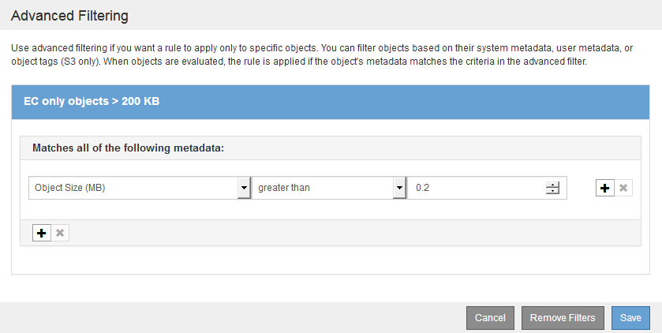

= 例 2 ： EC オブジェクトサイズのフィルタリング用の ILM ルールとポリシー
:allow-uri-read: 
:icons: font
:imagesdir: ../media/

[role="lead"]
以下に記載するサンプルルールとポリシーをベースに、オブジェクトサイズでフィルタリングして EC の推奨要件を満たす ILM ポリシーを定義できます。

CAUTION: 以下の ILM ルールとポリシーは一例にすぎません。ILM ルールを設定する方法は多数あります。新しいポリシーをアクティブ化する前に、ドラフトポリシーをシミュレートして、コンテンツの損失を防ぐためにドラフトポリシーが想定どおりに機能することを確認してください。

== 例2のILMルール1：200KBを超えるすべてのオブジェクトにイレイジャーコーディングを使用します

このILMルールの例では、200KB（0.20MB）を超えるすべてのオブジェクトをイレイジャーコーディングします。

[cols="1a,2a"]
|===
| ルール定義 | 値の例 

 a| 
ルール名
 a| 
ECのみのオブジェクト>200KB

 a| 
参照時間
 a| 
取り込み時間

 a| 
オブジェクトサイズの高度なフィルタリング
 a| 
オブジェクトサイズ（MB）が0.20より大きい

 a| 
コンテンツ配置
 a| 
3 つのサイトを使用して 2+1 のイレイジャーコーディングコピーを作成

|===

配置手順は、3つのサイトすべてを使用して2+1のイレイジャーコーディングコピーを作成するように指定します。

image::../media/policy_2_rule_1_ec_objects_placements.png[例2のILMルール1：200KBを超えるすべてのオブジェクトにイレイジャーコーディングを使用します]

== 例 2 の ILM ルール 2 ：レプリケートされたコピーを 2 つ

この ILM ルールの例では、レプリケートコピーを 2 つ作成し、オブジェクトサイズではフィルタリングしません。このルールはポリシー内の2番目のルールです。例2のILMルール1が200KBを超えるすべてのオブジェクトを除外するため、例2のILMルール2は200KB以下の環境 オブジェクトのみを除外します。

[cols="1a,2a"]
|===
| ルール定義 | 値の例 

 a| 
ルール名
 a| 
2 つのレプリケートコピー

 a| 
参照時間
 a| 
取り込み時間

 a| 
オブジェクトサイズの高度なフィルタリング
 a| 
なし

 a| 
コンテンツ配置
 a| 
レプリケートコピーを 2 つ作成して、 DC1 と DC2 の 2 つのデータセンターに保存します

|===
image:../media/ilm_rule_2_example_2_two_replicated_copies.png["例：2 - 2のレプリケートコピーのILMルール2"]

== 例2のILMポリシー：200KBを超えるオブジェクトにイレイジャーコーディングを使用

このポリシーの例では、200KBを超えるオブジェクトがイレイジャーコーディングされます。他のすべてのオブジェクトから2つのレプリケートコピーが作成されます。

この例のILMポリシーには、次のILMルールが含まれています。

* 200KBを超えるすべてのオブジェクトをイレイジャーコーディングします。
* オブジェクトが最初のILMルールに一致しない場合は、デフォルトのILMルールを使用して、そのオブジェクトのレプリケートコピーを2つ作成します。200KBを超えるオブジェクトはルール1で除外されているため、ルール2では200KB以下の環境 オブジェクトのみが除外されます。
+
image::../media/policy_2_configured_policy.png[例2のILMポリシー：200KBを超えるオブジェクトにイレイジャーコーディングを使用]

