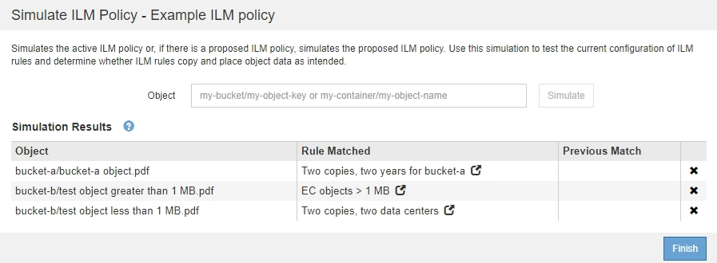
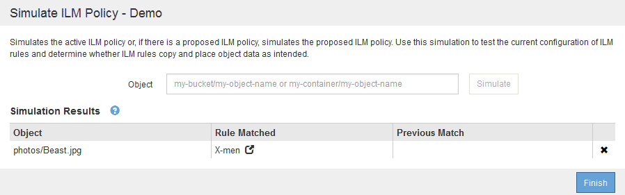

= ILMポリシーのシミュレート例
:allow-uri-read: 
:icons: font
:imagesdir: ../media/

[role="lead"]
以下の例は、ILMポリシーをアクティブ化する前にシミュレートして、ILMルールを確認する方法を示しています。

== 例1：ドラフトのILMポリシーをシミュレートしてルールを確認する

この例は、ドラフトポリシーをシミュレートしてルールを確認する方法を示しています。

この例では、 2 つのバケットに取り込まれたオブジェクトに対して * サンプルの ILM ポリシー * をシミュレートします。このポリシーには、次の 3 つのルールが含まれています。

* 最初のルール「 * 2 copies 、 buckets-a * 」の 2 年間は、 bucket-a のオブジェクトにのみ適用されます
* 2番目のルールのメニュー：ECオブジェクト[1MB ]、環境 Allバケット。ただし1MBを超えるオブジェクトでフィルタリングします。
* 3番目のルールはデフォルトルールであり、フィルタは含まれません。

image::../media/saved_policy_for_simulation.png[シミュレーションの保存済みポリシー]

.手順
. ルールを追加してポリシーを保存したら、* Simulate *をクリックします。
+
Simulate ILM Policy ダイアログボックスが表示されます。

. * Object *フィールドに、テストオブジェクトのS3バケット/オブジェクトキーまたはSwiftコンテナ/オブジェクト名を入力し、* Simulate *をクリックします。
+
シミュレーション結果が表示され、ポリシー内のどのルールがテストした各オブジェクトに一致したかが示されます。

+

. 各オブジェクトが正しいルールに一致したことを確認します。
+
次の例では、

+
.. `bucket-a/bucket-a object.pdf` のオブジェクトをフィルタリングする最初のルールを正しくマッチングしました `bucket-a`。
.. `bucket-b/test object greater than 1 MB.pdf` がにあります `bucket-b`では、最初のルールと一致しませんでした。代わりに、 1MB を超えるオブジェクトをフィルタリングする 2 つ目のルールに正しく一致しました。
.. `bucket-b/test object less than 1 MB.pdf` 最初の2つのルールのフィルタに一致しなかったため、フィルタが含まれていないデフォルトルールによって配置されます。

== 例 2 ：ドラフトの ILM ポリシーをシミュレートする際にルールの順序を変更する

この例では、ポリシーをシミュレートする際に、ルールの順序を変更して結果を変更する方法を示します。

この例では、 * Demo * ポリシーをシミュレートします。このポリシーの目的は次の 3 つのルールで、 series = x -men ユーザメタデータを含むオブジェクトを検索することです。

* 最初のルール「* PNGs *」はで終わるキー名に対してフィルタを適用します `.png`。
* 2つ目のルール「* X-men」はテナントAのオブジェクトにのみ適用され、フィルタを適用します `series=x-men` ユーザメタデータ。
* 最後のルール「 * 2 Copies 2 data centers * 」はデフォルトルールで、最初の 2 つのルールに一致しないオブジェクトに一致します。

image::../media/simulate_reorder_rules_pngs_rule.png[例 2 ：ドラフトの ILM ポリシーをシミュレートする際にルールの順序を変更する]

.手順
. ルールを追加してポリシーを保存したら、* Simulate *をクリックします。
. * Object *フィールドに、テストオブジェクトのS3バケット/オブジェクトキーまたはSwiftコンテナ/オブジェクト名を入力し、* Simulate *をクリックします。
+
シミュレーション結果が表示され、が表示されます `Havok.png` オブジェクトは「* PNGs *」ルールに一致しました。

+
image::../media/simulate_reorder_rules_pngs_result.gif[例 2 ：ドラフトの ILM ポリシーをシミュレートする際にルールの順序を変更する]

+
ただし、そのルールはです `Havok.png` オブジェクトは* X-men *ルールをテストすることを意図していました。

. 問題 を解決するには、ルールの順序を変更します。
+
.. Finish *をクリックして、Simulate ILM Policyページを閉じます。
.. * Edit *をクリックして、ポリシーを編集します。
.. 「 * X-men 」ルールをリストの先頭にドラッグします。
+
image::../media/simulate_reorder_rules_correct_rule.png[シミュレーション - ルールの順序変更 - 正しいルール]

.. [ 保存（ Save ） ] をクリックします。

. * Simulate *をクリックします。
+
以前にテストしたオブジェクトが更新したポリシーに照らして再評価され、新しいシミュレーション結果が表示されます。この例では、Rule Matched列にが表示されています `Havok.png` 想定どおりに「X-men」メタデータルールに一致します。以前の一致列には、 PNGs ルールが以前のシミュレーションでオブジェクトに一致したことが示されます。

+
image::../media/simulate_reorder_rules_correct_result.gif[例 2 ：ドラフトの ILM ポリシーをシミュレートする際にルールの順序を変更する]

+

NOTE: [ ポリシーの設定 ] ページを開いたままにしておくと、テストオブジェクトの名前を再入力しなくても、変更後にポリシーを再シミュレートできます。

== 例 3 ：ドラフトの ILM ポリシーをシミュレートする際にルールを修正する

この例では、ポリシーをシミュレートしてポリシー内のルールを修正し、シミュレーションを続行する方法を示します。

この例では、 * Demo * ポリシーをシミュレートします。このポリシーの目的は、が含まれるオブジェクトを検索することです `series=x-men` ユーザメタデータ。ただし、に対してシミュレートしたところ予期しない結果が発生しました `Beast.jpg` オブジェクト。オブジェクトが「 X-men 」メタデータルールではなくデフォルトルールに一致しましたが、 2 つのデータセンターがコピーされています。

image::../media/simulate_results_for_object_wrong_metadata.png[例 3 ：ドラフトの ILM ポリシーをシミュレートする際にルールを修正する]

テストオブジェクトがポリシー内の想定したルールに一致しない場合は、ポリシー内の各ルールを調べてエラーを修正する必要があります。

.手順
. ポリシー内のルールごとに、ルール名または詳細アイコンをクリックしてルール設定を確認します image:../media/icon_nms_more_details.gif["詳細アイコン"] をクリックします。
. ルールのテナントアカウント、参照時間、およびフィルタ条件を確認します。
+
この例では、「 X-men 」ルールのメタデータにエラーがあります。メタデータ値は「 x-men. 」ではなく「 x-men1 」として入力されました。

+
image::../media/simulate_rules_select_rule_popup_with_wrong_metadata.png[例 3 ：ドラフトの ILM ポリシーをシミュレートする際にルールを修正する]

. このエラーを解決するには、次のようにルールを修正します。
+
** ルールがドラフトポリシーに含まれている場合は、ルールをクローニングするか、ポリシーから削除してポリシーを編集できます。
** ルールがアクティブポリシーに含まれている場合は、ルールをクローニングする必要があります。アクティブポリシーのルールは編集または削除できません。
+
[cols="1a,3a"]
|===
| オプション | 説明 

 a| 
ルールをクローニングしています
 a| 
... [* ILM*>* Rules] を選択します。
... 不正なルールを選択し、* Clone *をクリックします。
... 誤った情報を変更して、*保存*をクリックします。
... 「 * ILM * > * Policies * 」を選択します。
... ドラフトポリシーを選択し、* Edit *をクリックします。
... [*ルールの選択*]をクリックします。
... 新しいルールのチェックボックスをオンにし、元のルールのチェックボックスをオフにして、*適用*をクリックします。
... [ 保存（ Save ） ] をクリックします。

 a| 
ルールを編集しています
 a| 
... ドラフトポリシーを選択し、* Edit *をクリックします。
... 削除アイコンをクリックします image:../media/icon_nms_delete_new.gif["削除アイコン"] 誤ったルールを削除するには、*保存*をクリックします。
... [* ILM*>* Rules] を選択します。
... 不正なルールを選択し、*編集*をクリックします。
... 誤った情報を変更して、*保存*をクリックします。
... 「 * ILM * > * Policies * 」を選択します。
... ドラフトポリシーを選択し、* Edit *をクリックします。
... 修正したルールを選択し、*適用*をクリックして、*保存*をクリックします。

|===

. もう一度シミュレーションを実行します。
+

NOTE: ILM ポリシーページから移動してルールを編集したため、以前にシミュレーションで入力したオブジェクトは表示されなくなりました。オブジェクトの名前を再入力する必要があります。

+
この例では、修正した「X-men」ルールがに一致します `Beast.jpg` に基づくオブジェクト `series=x-men` ユーザメタデータ（期待どおり）。

+

