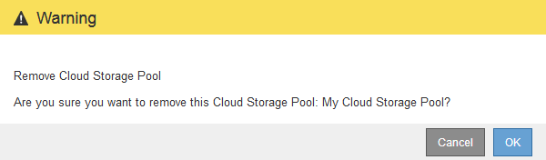

= クラウドストレージプールの削除
:allow-uri-read: 
:icons: font
:imagesdir: ../media/

[role="lead"]
ILM ルールで使用されておらず、オブジェクトデータが含まれていないクラウドストレージプールを削除できます。

.必要なもの
* Grid Managerにはサポートされているブラウザを使用してサインインする必要があります。
* 特定のアクセス権限が必要です。
* S3 バケットまたは Azure コンテナにオブジェクトが含まれていないことを確認します。クラウドストレージプールにオブジェクトが含まれている場合、そのストレージプールを削除しようとするとエラーが発生します。「クラウドストレージプールのトラブルシューティング」を参照してください。
+

NOTE: クラウドストレージプールを作成すると、 StorageGRID はバケットまたはコンテナにマーカーファイルを書き込み、クラウドストレージプールとして識別します。このファイルは削除しないでください `x-ntap-sgws-cloud-pool-uuid`。

* プールを使用している可能性のある ILM ルールを削除しておきます。

.手順
. ILM *>* Storage Pools *を選択します。
+
Storage Pools （ストレージプール）ページが表示されます。

. ILM ルールで現在使用されていないクラウドストレージプールのラジオボタンを選択します。
+
ILM ルールで使用されているクラウドストレージプールは削除できません。「 * 削除」ボタンは無効になっています。

+
image::../media/cloud_storage_pool_used_in_ilm_rule.png[ILM ルールで使用されているクラウドストレージプール]

. [ 削除（ Remove ） ] をクリックします。
+
確認の警告が表示されます。

+

. [OK] をクリックします。
+
クラウドストレージプールが削除されます。

.関連情報
link:troubleshooting-cloud-storage-pools.html["クラウドストレージプールのトラブルシューティング"]
