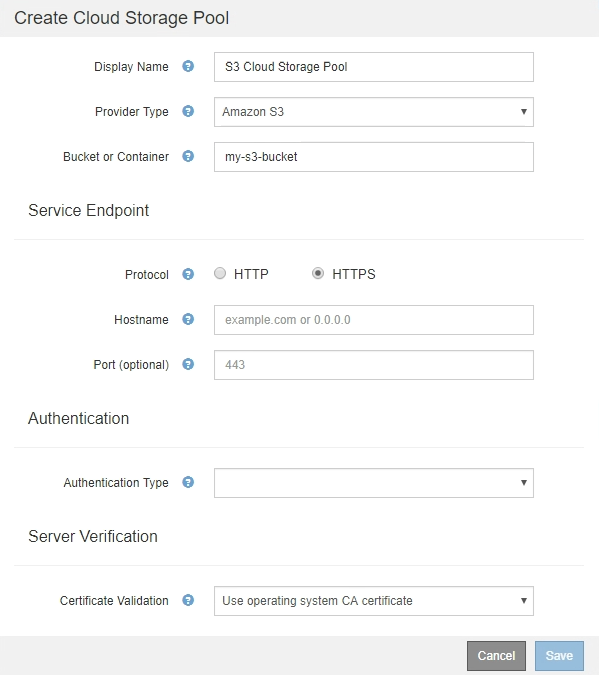

= S3 ：クラウドストレージプールの認証情報の指定
:allow-uri-read: 
:icons: font
:imagesdir: ../media/

[role="lead"]
S3 用のクラウドストレージプールを作成する場合は、クラウドストレージプールのエンドポイントで必要な認証のタイプを選択する必要があります。匿名を指定するか、アクセスキー ID とシークレットアクセスキーを入力できます。

.必要なもの
* クラウドストレージプールの基本情報を入力し、プロバイダタイプとして* Amazon S3 *を指定しておく必要があります。
+

* アクセスキー認証を使用している場合は、外部のS3バケットのアクセスキーIDとシークレットアクセスキーを把握しておく必要があります。

.手順
. 「 * Service Endpoint * 」セクションで、次の情報を入力します。
+
.. クラウドストレージプールに接続するときに使用するプロトコルを選択します。
+
デフォルトのプロトコルは HTTPS です。

.. クラウドストレージプールのサーバのホスト名または IP アドレスを入力します。
+
例：

+
`s3-_aws-region_.amazonaws.com`

+

NOTE: バケット名はこのフィールドに含めないでください。バケット名は「 * Bucket 」フィールドまたは「 Container * 」フィールドに入力します。

.. 必要に応じて、クラウドストレージプールへの接続時に使用するポートを指定します。
+
デフォルトのポート（ HTTPS の場合はポート 443 、 HTTP の場合はポート 80 ）を使用する場合は、このフィールドを空白のままにします。

. [* 認証 *] セクションで、クラウドストレージプールエンドポイントに必要な認証のタイプを選択します。
+
[cols="1a,2a"]
|===
| オプション | 説明 

 a| 
アクセスキー
 a| 
Cloud Storage Pool バケットにアクセスするには、アクセスキー ID とシークレットアクセスキーが必要です。

 a| 
匿名
 a| 
すべてのユーザが Cloud Storage Pool バケットにアクセスできます。アクセスキー ID とシークレットアクセスキーは不要です。

 a| 
CAP （ C2S Access Portal ）
 a| 
C2S S3 にのみ使用されます。に進みます link:c2s-s3-authentication-details-for-cloud-storage-pool.html["C2S S3 ：クラウドストレージプールの認証情報の指定"]。

|===
. アクセスキーを選択した場合は、次の情報を入力します。
+
[cols="1a,2a"]
|===
| オプション | 説明 

 a| 
アクセスキー ID
 a| 
外部バケットを所有するアカウントのアクセスキー ID 。

 a| 
シークレットアクセスキー
 a| 
関連付けられているシークレットアクセスキー。

|===
. Server Verification セクションで、クラウドストレージプールへの TLS 接続用の証明書を検証する方法を選択します。
+
[cols="1a,2a"]
|===
| オプション | 説明 

 a| 
オペレーティングシステムの CA 証明書を使用します
 a| 
オペレーティングシステムにインストールされているデフォルトのCA証明書を使用して接続を保護します。

 a| 
カスタム CA 証明書を使用する
 a| 
カスタム CA 証明書を使用する。Select New *をクリックし、PEMでエンコードされたCA証明書をアップロードします。

 a| 
証明書を検証しないでください
 a| 
TLS 接続に使用される証明書は検証されません。

|===
. [ 保存（ Save ） ] をクリックします。

クラウドストレージプールを保存すると、 StorageGRID では次の処理が実行されます。

* バケットとサービスエンドポイントが存在し、指定したクレデンシャルを使用してそれらにアクセスできることを検証します。
* バケットをクラウドストレージプールとして識別するために、バケットにマーカーファイルを書き込みます。このファイルは削除しないでください `x-ntap-sgws-cloud-pool-uuid`。

クラウドストレージプールの検証に失敗すると、その理由を記載したエラーメッセージが表示されます。たとえば、証明書エラーが発生した場合や、指定したバケットが存在しない場合などにエラーが報告されます。

image::../media/cloud_storage_pool_create_error.gif[クラウドストレージプールの作成エラー]

クラウドストレージプールのトラブルシューティングの手順を参照し、問題 を解決してから、クラウドストレージプールをもう一度保存してください。

.関連情報
link:troubleshooting-cloud-storage-pools.html["クラウドストレージプールのトラブルシューティング"]
