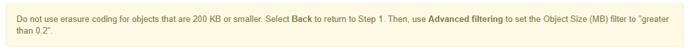

= ステップ 2 / 3 ：配置を定義する
:allow-uri-read: 
:icons: font
:imagesdir: ../media/

[role="lead"]
Create ILM Rule ウィザードのステップ 2 （配置を定義）では、オブジェクトを格納する期間、コピーのタイプ（レプリケートまたはイレイジャーコーディング）、格納場所、およびコピーの数を決定する配置手順を定義できます。

.このタスクについて
ILM ルールには 1 つ以上の配置手順を含めることができます。各配置手順環境 は一定期間です。複数の手順を使用する場合は、期間が連続していて、少なくとも 1 つの手順が 0 日目に開始されている必要があります。手順は無期限に、またはオブジェクトコピーが不要になるまで継続できます。

複数のタイプのコピーを作成する場合や、期間中に別々の場所を使用する場合は、各配置手順に複数の行を追加することができます。

この ILM ルールの例では、最初の 1 年間にレプリケートコピーを 2 つ作成します。各コピーは、別々のサイトのストレージプールに保存されます。1 年後、 2+1 のイレイジャーコーディングコピーが作成され、 1 つのサイトにのみ保存されます。

image::../media/ilm_create_ilm_rule_wizard_2.png[Create ILM Rule ウィザードの 2 ページ目]

.手順
. [ * 基準時間 * （ * Reference Time * ） ] で、配置手順の開始時間の計算に使用する時間のタイプを選択します。
+
[cols="1a,2a"]
|===
| オプション | 説明 

 a| 
取り込み時間
 a| 
オブジェクトが取り込まれた時間。

 a| 
最終アクセス時間
 a| 
オブジェクトが最後に読み出された（読み取られた、または表示された）時間。

* 注：このオプションを使用するには、 S3 バケットまたは Swift コンテナに対する最終アクセス時間の更新が有効になっている必要があります。

link:using-last-access-time-in-ilm-rules.html["ILMルールで最終アクセス日時を使用する"]

 a| 
最新でなくなった時間
 a| 
新しいバージョンが取り込まれて最新バージョンになったことが原因で、あるオブジェクトバージョンが最新でなくなった時間。

* 注：最新でない時間は、バージョン管理が有効なバケット内の S3 オブジェクトにのみ適用されます。

このオプションを使用すると、最新でないオブジェクトバージョンをフィルタリングすることで、バージョン管理オブジェクトによるストレージへの影響を軽減できます。「例4：S3バージョン管理オブジェクトのILMルールとポリシー」を参照してください。

 a| 
ユーザ定義の作成時間
 a| 
ユーザ定義のメタデータで指定された時間。

|===
+

NOTE: 準拠ルールを作成する場合は、 * 取り込み時間 * を選択する必要があります。

. [ 配置（ Plations] ）セクションで、最初の期間の開始時間と期間を選択します。
+
たとえば ' 最初の年のオブジェクトを格納する場所を指定することができます ("365 日の場合は 0 日 ")少なくとも 1 つの手順は 0 日目から開始する必要があります。

. レプリケートコピーを作成する場合は、次の手順を実行します。
+
.. [* タイプ *] ドロップダウンリストから、 [*Replicated-*] を選択します。
.. ［ * 場所 * ］ フィールドで、追加するストレージ・プールごとに ［ * プールの追加 * ］ を選択します。
+
* ストレージプールを 1 つしか指定しない場合、 StorageGRID は 1 つのオブジェクトのレプリケートコピーを任意のストレージノードに 1 つだけ格納できます。グリッドにストレージノードが 3 つある場合は、コピー数として 4 を選択すると、各ストレージノードにコピーが 1 つずつ、合計 3 つだけ作成されます。

+

NOTE: ILM placement unAchievable * アラートがトリガーされ、 ILM ルールを完全に適用できなかったことを示します。

+
* 複数のストレージプールを指定する場合は、次の点に注意してください。 *

+
*** コピー数をストレージプール数よりも多くすることはできません。
*** コピーの数がストレージプールの数と同じ場合は、オブジェクトのコピーが 1 つずつ各ストレージプールに格納されます。
*** コピーの数がストレージプールの数より少ない場合、プール間のディスク使用量のバランスを維持し、サイトがオブジェクトのコピーを複数取得しないようにコピーが分散されます。
*** ストレージプールが重複している（同じストレージノードを含んでいる）場合は、オブジェクトのすべてのコピーが 1 つのサイトにのみ保存される可能性があります。そのため、デフォルトの All Storage Nodes ストレージプールと別のストレージプールは指定しないでください。
+
image::../media/ilm_rule_with_multiple_storage_pools.png[複数のストレージプールの配置手順]

.. 作成するコピーの数を選択します。
+
[IMPORTANT]
====
コピー数を 1 に変更すると、警告が表示されます。ある期間にレプリケートコピーを 1 つしか作成しない ILM ルールには、データが永続的に失われるリスクがあります。ある期間にオブジェクトのレプリケートコピーが1つしか存在しない場合、ストレージノードに障害が発生したり、重大なエラーが発生すると、そのオブジェクトは失われます。また、アップグレードなどのメンテナンス作業中は、オブジェクトへのアクセスが一時的に失われます。

image::../media/ilm_create_ilm_rule_warning_for_1_copy.png[Create ILM Rule ウィザードの 2 ページ目：コピー数 1 に関する警告]

これらのリスクを回避するには、次のいずれかの操作を行います。

*** 期間のコピー数を増やします。
*** プラス記号アイコンをクリックします image:../media/icon_plus_sign_black_on_white.gif["白い背景に黒のプラス記号が付いています"] 期間中に追加のコピーを作成します。次に、別のストレージプールまたはクラウドストレージプールを選択します。
*** 「 * Replicated * 」ではなく、「 * erasure Coded * 」を選択します。このルールですべての期間に対して複数のコピーを作成するようすでに定義されている場合は、この警告を無視してかまいません。

====
.. ストレージプールを 1 つしか指定していない場合は、「 * 一時的な場所 * 」フィールドは無視してください。
+

NOTE: 一時的な場所は廃止され、今後のリリースで削除される予定です。

. オブジェクトをクラウドストレージプールに格納する場合は、次の手順を実行します。
+
.. [* タイプ *] ドロップダウンリストから、 [*Replicated-*] を選択します。
.. [ * 場所 * ] フィールドで、 [ * プールの追加 * ] を選択します。次に、クラウドストレージプールを選択します。
+
image::../media/ilm_cloud_storage_pool.gif[配置手順へのクラウドストレージプールの追加]

+
クラウドストレージプールを使用する場合は、次の点に注意してください。

+
*** 1 つの配置手順で複数のクラウドストレージプールを選択することはできません。同様に、クラウドストレージプールとストレージプールを同じ配置手順で選択することはできません。
+
image::../media/ilm_cloud_storage_pool_error.gif[ILM ルール > クラウドストレージプールのエラー]

*** 任意のクラウドストレージプールに格納できるオブジェクトのコピーは 1 つだけです。「 * Copies * 」を 2 以上に設定すると、エラーメッセージが表示されます。
+
image::../media/ilm_cloud_storage_pool_error_one_copy.gif[ILM ルール：複数のコピーに関するクラウドストレージプールのエラー]

*** どのクラウドストレージプールにも、複数のオブジェクトコピーを同時に格納することはできません。クラウドストレージプールを使用する複数の配置で日付が重複している場合や、同じ配置内の複数の行でクラウドストレージプールを使用している場合は、エラーメッセージが表示されます。
+
image::../media/ilm_rule_cloud_storage_pool_error_overlapping_dates.png[ILM ルールクラウドストレージプールのエラーの重複日付]

*** オブジェクトをレプリケートコピーまたはイレイジャーコーディングコピーとして StorageGRID に格納するときに、オブジェクトをクラウドストレージプールに格納することができます。ただし、この例に示すように、各場所のコピーの数とタイプを指定できるように、配置手順には複数の行を含める必要があります。
+
image::../media/ilm_cloud_storage_pool_multiple_locations.png[ILM ルール > クラウドストレージプールとその他の場所]

. イレイジャーコーディングコピーを作成する場合は、次の手順を実行します。
+
.. [ * タイプ * （ * Type * ） ] ドロップダウンリストから [ * イレイジャーコーディング * （ * erasure Coded * ） ] を選択
+
コピーの数が 1 に変わります。200KB 以下のオブジェクトを無視する高度なフィルタがルールに含まれていない場合は警告が表示されます。

+

+

IMPORTANT: 200KB 未満のオブジェクトにはイレイジャーコーディングを使用しないでください。イレイジャーコーディングされた非常に小さなフラグメントを管理するオーバーヘッドは発生しません。

.. オブジェクトサイズの警告が表示された場合は、次の手順に従ってクリアします。
+
... 「戻る」を選択して、ステップ1に戻ります。
... 「*高度なフィルタリング*」を選択します。
... [オブジェクトサイズ(MB)]フィルタを「0.2より大きい」に設定します。

.. 格納場所を選択します。
+
イレイジャーコーディングコピーの格納場所には、ストレージプール名とイレイジャーコーディングプロファイル名が続けて含まれます。

+
image::../media/storage_pool_and_erasure_coding_profile.png[ストレージプールと EC プロファイルの名前]

. 必要に応じて、別の期間を追加するか、別の場所に追加のコピーを作成します。
+
** プラスアイコンをクリックして、同じ期間に追加のコピーを別の場所に作成します。
** 別の期間を配置手順に追加するには、* Add *をクリックします。
+

NOTE: 最終期間が * forever * で終わる場合を除き、オブジェクトは最終期間の終了時に自動的に削除されます。

. [*更新*]をクリックして保持図を更新し'配置手順を確認します
+
図の中の各ラインは、オブジェクトコピーをいつどこに配置するかを示しています。コピーのタイプは次のいずれかのアイコンで表されます。

+
[cols="1a,2a"]
|===

 a| 
image:../media/icon_nms_replicated.gif["レプリケートコピーのアイコン"]
 a| 
レプリケートコピー

 a| 
image:../media/icon_nms_erasure_coded.gif["イレイジャーコーディングコピーのアイコン"]
 a| 
イレイジャーコーディングコピー

 a| 
image:../media/icon_cloud_storage_pool.gif["クラウドストレージプールアイコン"]
 a| 
クラウドストレージプールのコピー

|===
+
この例では、 2 つのレプリケートコピーが 2 つのストレージプール（ DC1 と DC2 ）に 1 年間保存されます。その後、 3 つのサイトで 6+3 のイレイジャーコーディングスキームを使用して、イレイジャーコーディングコピーがさらに 10 年間保存されます。11 年後、オブジェクトは StorageGRID から削除されます。

+
image::../media/ilm_rule_retention_diagram.png[ILM ルールによる保持の図]

. 「 * 次へ * 」をクリックします。
+
ステップ 3 （取り込み動作の定義）が表示されます。

.関連情報
link:what-ilm-placement-instructions-are.html["ILM ルールの配置手順とは"]

link:example-4-ilm-rules-and-policy-for-s3-versioned-objects.html["例 4 ： S3 バージョン管理オブジェクトの ILM ルールとポリシー"]

link:why-you-should-not-use-single-copy-replication.html["シングルコピーレプリケーションを使用しない理由"]

link:managing-objects-with-s3-object-lock.html["S3オブジェクトロックでオブジェクトを管理する"]

link:using-storage-pool-as-temporary-location-deprecated.html["一時的な場所としてのストレージプールの使用（廃止）"]

link:step-3-of-3-define-ingest-behavior.html["ステップ 3 / 3 ：取り込み動作を定義する"]
