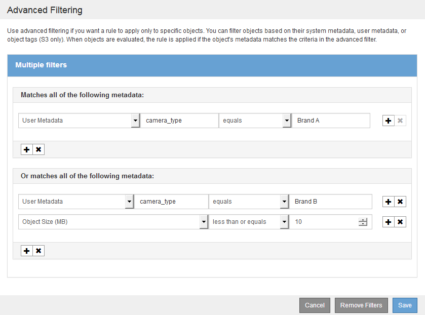

= ILMルールで高度なフィルタを使用する
:allow-uri-read: 
:icons: font
:imagesdir: ../media/

[role="lead"]
高度なフィルタを使用すると、メタデータに基づいて特定のオブジェクトにのみ適用する ILM ルールを作成できます。ルールに対して高度なフィルタを設定するには、照合するメタデータのタイプを選択し、演算子を選択して、メタデータ値を指定します。オブジェクトが評価されると、高度なフィルタに一致するメタデータを含むオブジェクトにのみ ILM ルールが適用されます。

次の表に、高度なフィルタで指定できるメタデータタイプ、各タイプのメタデータに使用できる演算子、および想定されるメタデータ値を示します。

[cols="1a,1a,2a"]
|===
| メタデータタイプ | サポートされる演算子 | メタデータ値 

 a| 
取り込み時間（マイクロ秒）
 a| 
* が等しい
* が同じではありません
* より小さい
* が次の値以下です
* が次の値より大きい
* が次の値以上である

 a| 
オブジェクトが取り込まれた日時。

* 注：新しい ILM ポリシーをアクティブ化する際にリソースの問題が発生しないように、既存のオブジェクトの数が多い場合は、ルールで取り込み時間の高度なフィルタを使用することができます。既存のオブジェクトが不必要に移動されないようにするために、新しいポリシーが適用されるおおよその時間よりも長くなるように取り込み時間を設定します。

 a| 
キーを押します
 a| 
* が等しい
* が同じではありません
* が含まれます
* にはを含めません
* がで始まります
* で始まるものではありません
* が次の値で終わる
* で終わることはありません

 a| 
一意の S3 または Swift オブジェクトキーのすべてまたは一部。

たとえば、で終わるオブジェクトを照合できます `.txt` またはで開始します `test-object/`。

 a| 
最終アクセス時間（マイクロ秒）
 a| 
* が等しい
* が同じではありません
* より小さい
* が次の値以下です
* が次の値より大きい
* が次の値以上である
* が存在します
* は存在しません

 a| 
オブジェクトが最後に読み出された（読み取られた、または表示された）日時。

* 注：最終アクセス時間を高度なフィルタとして使用する場合は、 S3 バケットまたは Swift コンテナに対して最終アクセス時間の更新を有効にする必要があります。

link:using-last-access-time-in-ilm-rules.html["ILMルールで最終アクセス日時を使用する"]

 a| 
場所の制約（ S3 のみ）
 a| 
* が等しい
* が同じではありません

 a| 
S3 バケットが作成されたリージョン。表示されるリージョンを定義するには、 * ilm * > * Regions * を使用します。

* 注： us-east-1 の値は、 us-east-1 リージョンで作成されたバケット内のオブジェクト、およびリージョンが指定されていないバケット内のオブジェクトに一致します。

link:configuring-regions-optional-and-s3-only.html["リージョンの設定（オプション、S3のみ）"]

 a| 
オブジェクトサイズ（ MB ）
 a| 
* が等しい
* が次の値と等しくない
* より小さい
* が次の値以下です
* が次の値より大きい
* が次の値以上である

 a| 
オブジェクトのサイズ（ MB 単位）。

1MB未満のオブジェクトサイズでフィルタリングするには、10進値を入力します。たとえば、イレイジャーコーディングコピーを作成するルールの場合は、「* Object Size（MB）* advanced filter」を「* greater than 0.2 *」に設定します。この設定により、200KB以下のオブジェクトにイレイジャーコーディングが使用されることはありません。

*注意：*ブラウザの種類とロケールの設定によって、小数点としてピリオドまたはカンマを使用する必要があるかどうかが制御されます。

 a| 
ユーザメタデータ
 a| 
* が含まれます
* が次の値で終わる
* が等しい
* が存在します
* にはを含めません
* で終わることはありません
* が同じではありません
* は存在しません
* で始まるものではありません
* がで始まります

 a| 
キーと値のペア。 * User Metadata Name * はキー、 * User Metadata Value * は値です。

たとえば、ユーザメタデータがあるオブジェクトでフィルタリングするには、のように指定します `color=blue`、を指定します `color` ユーザーメタデータ名*の場合、 `equals` 演算子の場合は、および `blue` For * User Metadata Value *を参照してください。

* 注： * ユーザメタデータ名では大文字と小文字は区別されませんが、値では大文字と小文字が区別されます。

 a| 
オブジェクトタグ（ S3 のみ）
 a| 
* が含まれます
* が次の値で終わる
* が等しい
* が存在します
* にはを含めません
* で終わることはありません
* が同じではありません
* は存在しません
* で始まるものではありません
* がで始まります

 a| 
キーと値のペア。 * オブジェクトタグ名 * はキー、 * オブジェクトタグ値 * は値です。

たとえば、オブジェクトタグがのオブジェクトでフィルタリングする場合などです `Image=True`、を指定します `Image` *オブジェクトタグ名*の場合、 `equals` 演算子の場合は、および `True` for * Object Tag value *。

* 注： * オブジェクトタグ名とオブジェクトタグ値では、大文字と小文字が区別されます。これらの項目は、オブジェクトに対して定義されたとおりに正確に入力する必要があります。

|===

== 複数のメタデータタイプと値を指定する

高度なフィルタを定義する場合は、複数のタイプのメタデータと複数のメタデータ値を指定できます。たとえば、サイズが 10~100MB のオブジェクトに一致するルールを設定するには、 * Object Size * メタデータタイプを選択し、 2 つのメタデータ値を指定します。

* 最初のメタデータ値で 10MB 以上のオブジェクトを指定します。
* 2 番目のメタデータ値で 100MB 以下のオブジェクトを指定します。

image::../media/advanced_filtering_size_between.gif[オブジェクトサイズの高度なフィルタの例]

複数のエントリを使用すると、照合するオブジェクトを正確に制御できます。次の例では、 camera_type ユーザメタデータの値が Brand A または Brand B の環境 オブジェクトをルールします。ただし、ルールでは、 10MB より小さい Brand B のオブジェクトのみが環境 されます。

.関連情報
link:using-last-access-time-in-ilm-rules.html["ILMルールで最終アクセス日時を使用する"]

link:configuring-regions-optional-and-s3-only.html["リージョンの設定（オプション、S3のみ）"]
