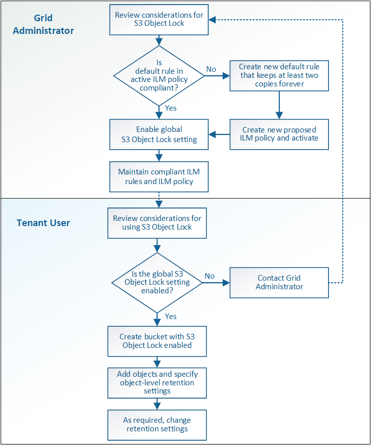

= S3 オブジェクトロックのワークフロー
:allow-uri-read: 
:icons: font
:imagesdir: ../media/

[role="lead"]
グリッド管理者は、テナントユーザと緊密に連携し、保持要件に応じてオブジェクトが保護されるようにする必要があります。

次のワークフロー図は、 S3 オブジェクトロックの使用手順の概要を示しています。以下の手順は、グリッド管理者およびテナントユーザが実行します。

== Grid 管理者タスク

ワークフロー図に示されているように、 S3 テナントユーザが S3 オブジェクトロックを使用できるようにするには、グリッド管理者が次の 2 つのタスクを実行する必要があります。

. 準拠 ILM ルールを少なくとも 1 つ作成し、アクティブな ILM ポリシー内のデフォルトルールに設定します。
. StorageGRID システム全体で、グローバルな S3 オブジェクトロック設定を有効にします。

== テナントユーザタスク

グローバルな S3 オブジェクトのロック設定を有効にしたあと、テナントは次のタスクを実行できます。

. S3 オブジェクトのロックを有効にしたバケットを作成する。
. これらのバケットにオブジェクトを追加し、オブジェクトレベルの保持期間とリーガルホールドの設定を指定します。
. 必要に応じて、個々のオブジェクトの保持期間を更新するか、リーガルホールド設定を変更します。

.関連情報
link:../tenant/index.html["テナントアカウントを使用する"]

link:../s3/index.html["S3 を使用する"]
