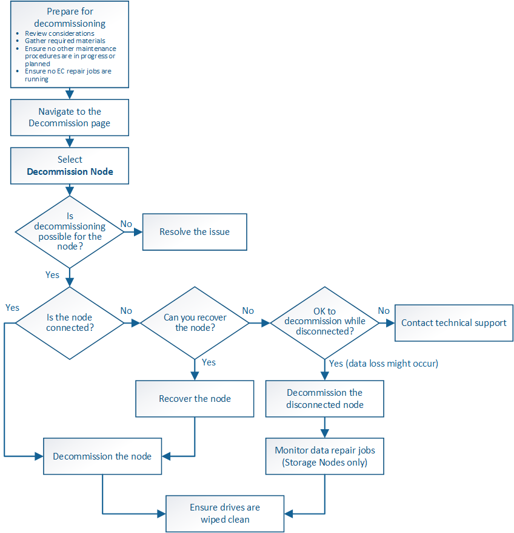

= グリッドノードの運用停止
:allow-uri-read: 
:icons: font
:imagesdir: ../media/

[role="lead"]
ノードの運用停止手順 を使用して、 1 つ以上のサイトの 1 つ以上のストレージノード、ゲートウェイノード、または非プライマリ管理ノードを削除できます。プライマリ管理ノードとアーカイブノードの運用を停止することはできません。

一般に、グリッドノードの運用を停止するのは、グリッドノードがStorageGRID システムに接続されていて、すべてのノードが正常な状態であるときにしてください（* Nodes *ページおよび* Decommission Nodes *ページに緑色のアイコンが表示されています）。ただし、必要に応じて、切断されているグリッドノードの運用を停止できます。切断されているノードを削除する前に、そのプロセスの影響と制限を理解しておいてください。

次のいずれかに該当する場合は、ノードの運用停止手順 を使用します。

* システムに大きなストレージノードを追加したあとに、オブジェクトを保持したまま小さなストレージノードを 1 つ以上削除する場合。
* 総ストレージ容量を減らす必要がある場合。
* ゲートウェイノードが不要になった場合。
* 非プライマリ管理ノードが不要になった場合。
* 切断されていて、リカバリしたりオンラインに戻したりすることができないノードがグリッドに含まれている場合。

次のフローチャートは、グリッドノードの運用停止手順の概要を示しています。

.手順
* link:preparing-to-decommission-grid-nodes.html["グリッドノードの運用を停止する準備をしています"]
* link:gathering-required-materials-node-decom.html["前提要件"]
* link:accessing-decommission-nodes-page.html["Decommission Nodesページにアクセスします"]
* link:decommissioning-disconnected-grid-nodes.html["切断されているグリッドノードの運用停止"]
* link:decommissioning-connected-grid-nodes.html["接続されているグリッドノードの運用停止"]
* link:pausing-and-resuming-decommission-process-for-storage-nodes.html["ストレージノードの運用停止プロセスの一時停止と再開"]
* link:troubleshooting-node-decommissioning.html["ノードの運用停止のトラブルシューティング"]

