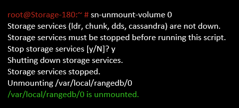

= 障害ストレージボリュームを特定し、アンマウントします
:allow-uri-read: 
:icons: font
:imagesdir: ../media/

[role="lead"]
ストレージボリュームに障害が発生したストレージノードをリカバリする場合は、障害ボリュームを特定し、アンマウントする必要があります。障害ストレージボリュームのみがリカバリ手順 で再フォーマットされることを確認する必要があります。

.必要なもの
Grid Managerにはサポートされているブラウザを使用してサインインする必要があります。

.このタスクについて
障害が発生したストレージボリュームはできるだけ早くリカバリする必要があります。

まず最初に、接続解除されたボリューム、アンマウントが必要なボリューム、または I/O エラーが発生しているボリュームを検出します。障害ボリュームがランダムに破損したファイルシステムを含んでいる状態で接続されている場合は、ディスクの未使用部分または未割り当て部分の破損をシステムが検出できないことがあります。

NOTE: ディスクの追加や再接続、ノードの停止、ノードの開始、リブートなど、ボリュームをリカバリするための手動手順を実行する前に、この手順 を完了しておく必要があります。それ以外の場合は、を実行したときに `reformat_storage_block_devices.rb` スクリプトでファイルシステムエラーが発生し、スクリプトがハングしたり失敗したりする場合があります。

NOTE: を実行する前に、ハードウェアを修理し、ディスクを適切に接続します `reboot` コマンドを実行します

CAUTION: 障害ストレージボリュームは慎重に特定してください。この情報を使用して、再フォーマットが必要なボリュームを確認します。ボリュームを再フォーマットすると、そのボリュームのデータはリカバリできません。

障害ストレージボリュームを正しくリカバリするには、障害ストレージボリュームのデバイス名とそのボリューム ID の両方を把握しておく必要があります。

インストール時に、各ストレージデバイスにはファイルシステムの Universal Unique Identifier （ UUID ）が割り当てられ、その UUID を使用してストレージノードの rangedb ディレクトリにマウントされます。ファイルシステムのUUIDとrangedbディレクトリは、に記載されています `/etc/fstab` ファイル。デバイス名、 rangedb ディレクトリ、およびマウントされたボリュームのサイズは、 Grid Manager に表示されます。

次の例では、deviceです `/dev/sdc` には4TBのボリュームがマウントされています `/var/local/rangedb/0`デバイス名を使用します `/dev/disk/by-uuid/822b0547-3b2b-472e-ad5e-e1cf1809faba` を参照してください /`etc/fstab` ファイル：

image::../media/mounting_storage_devices.gif[ボリュームサイズのサンプル]

.手順
. 次の手順を実行して、障害ストレージボリュームとそのデバイス名を記録します。
+
.. Support *>* Tools *>* Grid Topology *を選択します。
.. 「* site * failed Storage Node ** LDR * Storage ** Overview ** Main *」を選択し、アラームが発生しているオブジェクトストアを探します。
+
image::../media/ldr_storage_object_stores.gif[オブジェクトストアセクション]

.. 「* site * failed Storage Node ** SSM * Resources * Overview ** Main *」を選択します。前の手順で特定した各障害ストレージボリュームのマウントポイントとボリュームサイズを確認します。
+
オブジェクトストアには、 16 進表記の番号が付けられています。たとえば、 0000 は最初のボリューム、 000F は 16 番目のボリュームです。この例では、IDが0000のオブジェクトストアはに対応しています `/var/local/rangedb/0` デバイス名がsdcで、サイズが107GBの場合。

+
image::../media/ssm_storage_volumes.gif[オブジェクトストアとマウントポイントを示す例]

. 障害が発生したストレージノードにログインします。
+
.. 次のコマンドを入力します。 `ssh admin@_grid_node_IP_`
.. に記載されているパスワードを入力します `Passwords.txt` ファイル。
.. 次のコマンドを入力してrootに切り替えます。 `su -`
.. に記載されているパスワードを入力します `Passwords.txt` ファイル。

+
rootとしてログインすると、プロンプトがから変わります `$` 終了： `#`。

. 次のスクリプトを実行してストレージサービスを停止し、障害ストレージボリュームをアンマウントします。
+
`sn-unmount-volume object_store_ID`

+
。 `object_store_ID` は、障害ストレージボリュームのIDです。たとえば、と指定します `0` IDが0000のオブジェクトストアのコマンド。

. プロンプトが表示されたら、 * y * を押してストレージノード上のストレージサービスを停止します。
+

NOTE: ストレージサービスがすでに停止している場合は、プロンプトは表示されません。Cassandra サービスは、ボリューム 0 に対してのみ停止します。

+

+
数秒後にストレージサービスが停止し、ボリュームがアンマウントされます。プロセスの各ステップを示すメッセージが表示されます。最後のメッセージは、ボリュームがアンマウントされたことを示しています。

