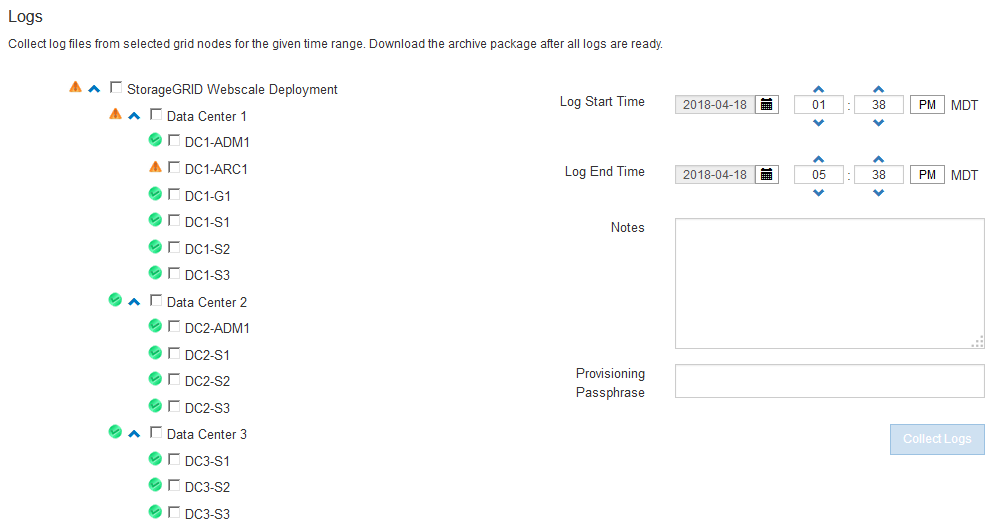

= ログファイルとシステムデータを収集しています
:allow-uri-read: 
:icons: font
:imagesdir: ../media/

[role="lead"]
Grid Manager を使用して、 StorageGRID システムのログファイルとシステムデータ（設定データを含む）を取得できます。

.必要なもの
* Grid Managerにはサポートされているブラウザを使用してサインインする必要があります。
* 特定のアクセス権限が必要です。
* プロビジョニングパスフレーズが必要です。

.このタックについて
Grid Managerを使用して、選択した期間について任意のグリッドノードからログファイル、システムデータ、および設定データを収集できます。収集されたデータは .tar.gz ファイルにアーカイブされ、ローカルコンピュータにダウンロードできます。

アプリケーションログファイルは非常に大きくなる可能性があるため、アーカイブされたログファイルのダウンロード先ディレクトリには1GB以上の空きスペースが必要です。

.手順
. [*サポート*（Support *）]>[*ツール*（* Tools *）]>[*ログ*（* Logs *）]
+

. ログファイルを収集するグリッドノードを選択します。
+
必要に応じて、グリッド全体またはデータセンターサイト全体のログファイルを収集できます。

. ログファイルに含めるデータの時間範囲を設定するには、 * Start Time * および * End Time * を選択します。
+
非常に長い期間を選択したり、大規模なグリッド内のすべてのノードからログを収集したりすると、ログアーカイブが大きくなりすぎてノードに格納できなくなったり、ダウンロード用にプライマリ管理ノードに保存できなくなったりすることがあります。その場合は、より小さなデータセットを使用してログ収集を再開する必要があります。

. 必要に応じて、収集するログファイルに関するメモを* Notes *テキストボックスに入力します。
+
このメモを使用して、ログファイルを収集する原因となった問題に関するテクニカルサポート情報を入力できます。メモはというファイルに追加されます `info.txt`と、ログファイルの収集に関するその他の情報。。 `info.txt` ファイルはログファイルのアーカイブパッケージに保存されます。

. StorageGRID システムのプロビジョニングパスフレーズを * プロビジョニングパスフレーズ * テキストボックスに入力します。
. [*Collect Logs*](ログの収集)をクリック
+
新しい要求を送信すると、以前に収集されたログファイルは削除されます。

+
image::../media/support_logs_in_progress.gif[進行中のログ収集：スクリーンショット]

+
ログページを使用して、各グリッドノードのログファイル収集の進捗状況を監視できます。

+
ログサイズに関するエラーメッセージが表示された場合は、ログを収集する期間を短縮するか、またはノードの数を減らしてください。

. ログファイルの収集が完了したら、* Download *をクリックします。
+
.tar.gz ファイルには、ログ収集が成功したすべてのグリッドノードのログファイルが含まれています。Combined .tar.gz_file には、グリッドノードごとに 1 つのログファイルアーカイブがあります。

.完了後
必要に応じて、ログファイルのアーカイブパッケージはあとから再度ダウンロードできます。

必要に応じて、* Delete *をクリックしてログファイルアーカイブパッケージを削除し、ディスクスペースを解放できます。ログファイルの現在のアーカイブパッケージは、次回ログファイルを収集すると自動的に削除されます。

.関連情報
link:../monitor/logs-files-reference.html["ログファイル参照"]
