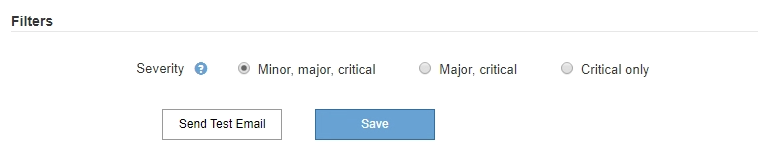

= アラートの管理
:allow-uri-read: 
:icons: font
:imagesdir: ../media/

[role="lead"]
アラートを使用すると、 StorageGRID システム内のさまざまなイベントや状態を監視できます。アラートの管理では、カスタムアラートの作成、デフォルトアラートの編集または無効化、アラート用の E メール通知の設定、アラート通知のサイレント化を行うことができます。

.関連情報
link:viewing-current-alerts.html["現在のアラートの表示"]

link:viewing-resolved-alerts.html["解決済みのアラートの表示"]

link:viewing-specific-alert.html["特定のアラートの表示"]

link:alerts-reference.html["アラート一覧"]

== アラートとは

アラートシステムでは、 StorageGRID の運用中に発生する問題を、使いやすいインターフェイスを通じて検出し、評価し、解決することができます。

* アラートシステムは、システムで実行可能な問題に焦点を当てます。従来のシステムのアラームとは異なり、無視しても安全なイベントではアラートはトリガーされず、すぐに対処が必要なイベントに対してトリガーされます。
* Current Alerts （現在のアラート）ページには、現在の問題を表示するための使いやすいインターフェイスが用意されています。リストは、個々のアラートやアラートグループでソートできます。たとえば、すべてのアラートをノード / サイトでソートして、特定のノードに影響しているアラートを確認できます。または、グループ内のアラートを時間でソートして、特定のアラートの最新のインスタンスを確認することもできます。
* 解決済みアラートページには、現在のアラートページと同様の情報が表示されますが、アラートがトリガーされた日時や解決された日時など、解決済みのアラートの履歴を検索して表示することができます。
* 同じ種類の複数のアラートが 1 つの E メールにグループ化され、通知の数が削減されます。また、同じタイプの複数のアラートが [Alerts] ページにグループとして表示されます。アラートグループを展開または縮小すると、個々のアラートの表示と非表示を切り替えることができます。たとえば、複数のノードから「 Unable to communicate with node * 」アラートがほぼ同時に報告された場合、送信される E メールは 1 通だけで、アラートは Alerts ページのグループとして表示されます。
* アラートには、問題をすばやく把握できるように、わかりやすい名前と説明が使用されています。アラート通知には、影響を受けるノードとサイトに関する詳細、アラートの重大度、アラートルールがトリガーされた時刻、およびアラートに関連する指標の現在の値が含まれます。
* アラート E メール通知および現在のアラートおよび解決済みアラートのページに表示されるアラートリストは、アラートを解決するための推奨される対処方法を提供します。これらの対処方法には、 StorageGRID ドキュメントセンターへの直接リンクが含まれていることが多く、より詳細なトラブルシューティング手順を見つけてアクセスしやすくなっています。
* 1 つ以上の重大度のアラートの通知を一時的に停止する必要がある場合は、特定のアラートルールを簡単に一定期間、およびグリッド全体、単一サイト、または単一ノードでサイレント化することができます。また、ソフトウェアアップグレードなどの計画的なメンテナンス手順 の実行中など、すべてのアラートルールをサイレント化することもできます。
* 必要に応じてデフォルトのアラートルールを編集できます。アラートルールは完全に無効にすることも、トリガー条件と期間を変更することもできます。
* 環境に応じた特定の条件を対象にカスタムのアラートルールを作成して、独自の対処方法を提供できます。カスタムアラートの条件を定義するには、グリッド管理 API の指標セクションで使用できる Prometheus 指標を使用して式を作成します。

== アラートルールの管理

アラートルールは、特定のアラートをトリガーする条件を定義します。StorageGRID には一連のデフォルトアラートルールが用意されており、そのまま使用したり変更したりすることができます。また、カスタムのアラートルールを作成することもできます。

=== アラートルールを表示しています

デフォルトとカスタムのアラートルールをすべて表示して、各アラートをトリガーする条件を確認したり、アラートが無効になっているかどうかを確認したりできます。

.必要なもの
* Grid Managerにはサポートされているブラウザを使用してサインインする必要があります。
* Manage AlertsまたはRoot Access権限が必要です。

.手順
. [*アラート*>]>[*アラートルール*]を選択します。
+
[Alert Rules] ページが表示されます。

+
image::../media/alert_rules_page.png[アラートルールページ]

. アラートルールのテーブルの情報を確認します。
+
|===
| 列ヘッダー | 説明 

 a| 
名前
 a| 
アラートルールの一意の名前と概要 。カスタムのアラートルールが最初に表示され、そのあとにデフォルトのアラートルールが表示されます。アラートルール名は E メール通知の件名となります。

 a| 
条件：
 a| 
このアラートがトリガーされるタイミングを決定する Prometheus 式。アラートは次の 1 つ以上の重大度レベルでトリガーできますが、重大度ごとの条件は不要です。

** * 重要 * image:../media/icon_alert_red_critical.png["アイコンアラート赤アラーム"]：異常な状態で、 StorageGRID のノードやサービスの通常の動作が停止しています。基盤となる問題 にすぐに対処する必要があります。問題 が解決されないと、サービスの停止やデータの損失を招くおそれがあります。
** * メジャー * image:../media/icon_alert_orange_major.png["アイコンアラートオレンジメジャー"]：異常な状態で、現在の処理に影響しているか、重大アラートのしきい値に近づいています。Major アラートを調査し、根本的な問題に対処して、異常な状態が発生した場合に StorageGRID のノードやサービスが正常に動作しなくなる事態を防ぐ必要があります。
** * マイナー * image:../media/icon_alert_yellow_miinor.png["アイコンアラート黄マイナー"]：システムは正常に動作していますが、継続するとシステムの動作に影響する可能性がある異常な状態が発生しています。自動的にクリアされない Minor アラートを監視し、解決して、深刻な問題が生じないようにする必要があります。

 a| 
を入力します
 a| 
アラートルールのタイプ。

** * デフォルト * ：システムに付属のアラートルール。デフォルトのアラートルールは、無効にするか、条件と期間を編集できます。デフォルトのアラートルールは削除できません。
** * デフォルト ** ：条件または期間が編集されたデフォルトのアラートルール。必要に応じて、変更した条件を元のデフォルトに戻すことができます。
** * Custom * ：ユーザが作成したアラートルール。カスタムのアラートルールは、無効化、編集、削除することができます。

 a| 
ステータス
 a| 
このアラートルールが現在有効になっているか無効になっているか。アラートルールが無効になっている場合は、条件が評価されないため、アラートはトリガーされません。

|===

.関連情報
link:alerts-reference.html["アラート一覧"]

=== カスタムのアラートルールを作成する

カスタムのアラートルールを作成して、アラートをトリガーする条件を独自に定義することができます。

.必要なもの
* Grid Managerにはサポートされているブラウザを使用してサインインする必要があります。
* Manage AlertsまたはRoot Access権限が必要です。

.このタスクについて
StorageGRID はカスタムアラートを検証しません。カスタムのアラートルールを作成する場合は、次の一般的なガイドラインに従ってください。

* デフォルトのアラートルールの条件を参考に、カスタムのアラートルールを作成します。
* アラートルールに複数の条件を定義する場合は、すべての条件に同じ式を使用します。その後、各条件のしきい値を変更します。
* 各条件に入力ミスやロジックエラーがないか、慎重にチェックしてください。
* Grid 管理 API にリストされている指標のみを使用してください。
* Grid Management API を使用して式をテストする場合、「 Successful 」応答は単に空の応答本文になる場合があります（アラートはトリガーされません）。アラートが実際にトリガーされるかどうかを確認するには、現在 true になるしきい値を一時的に設定します。
+
たとえば、式をテストする場合などです `node_memory_MemTotal_bytes < 24000000000`を実行します `node_memory_MemTotal_bytes >= 0` また、想定される結果を確認します（すべてのノードが値を返します）。次に、演算子としきい値を目的の値に戻して再実行します。結果がない場合は、この式に対するアラートが現在発生していません。

* 想定どおりにトリガーされることを確認するまでは、カスタムアラートが機能していると判断しないでください。

.手順
. [*アラート*>]>[*アラートルール*]を選択します。
+
[Alert Rules] ページが表示されます。

. [ * カスタムルールの作成 * ] を選択します。
+
[Create Custom Rule] ダイアログボックスが表示されます。

+
image::../media/alerts_create_custom_rule.png[アラート > カスタムルールを作成]

. このアラートルールが現在有効になっているかどうかを確認するには、 [ 有効 *] チェックボックスをオンまたはオフにします。
+
アラートルールを無効にすると、ルールの式は評価されず、アラートはトリガーされません。

. 次の情報を入力します。
+
|===
| フィールド | 説明 

 a| 
一意の名前
 a| 
このルールの一意の名前。アラートルール名は、 [Alerts] ページに表示され、電子メール通知の件名にもなります。アラートルールの名前は 1~64 文字で指定できます。

 a| 
説明
 a| 
発生している問題の概要 。概要 は、アラートページおよび E メール通知に表示されるアラートメッセージです。アラートルールの説明は、 1~128 文字で指定できます。

 a| 
推奨される対処方法
 a| 
必要に応じて、このアラートがトリガーされたときに実行する推奨される対処方法を指定します。推奨される対処方法をプレーンテキスト（書式コードなし）で入力します。アラートルールの推奨される対処方法は、 0~1 、 024 文字で指定できます。

|===
. Conditions セクションで、アラートの重大度レベルを 1 つ以上指定する Prometheus 式を入力します。
+
基本式は、通常、次の形式で指定します。

+
[listing]
----
[metric] [operator] [value]
----
+
式の文字数に制限はありませんが、ユーザインターフェイスでは 1 行で表示されます。少なくとも 1 つの式が必要です。

+
使用可能な指標を確認したり、Prometheus式をテストしたりするには、ヘルプアイコンをクリックします image:../media/icon_nms_question.gif["疑問符アイコン"] グリッド管理 API のメトリクスセクションへのリンクをクリックします。

+
グリッド管理APIの使用方法については、StorageGRID の管理手順を参照してください。Prometheusクエリの構文の詳細については、Prometheusのドキュメントを参照してください。

+
次の式では、あるノードに搭載された RAM の容量が 24 、 000 、 000 、 000 バイト（ 24GB ）未満である場合にアラートがトリガーされます。

+
[listing]
----
node_memory_MemTotal_bytes < 24000000000
----
. [ * 期間 * ] フィールドに、アラートがトリガーされるまでに条件を継続的に有効にしておく必要がある期間を入力し、時間の単位を選択します。
+
条件が true になったときにすぐにアラートをトリガーするには、「 * 0 * 」と入力します。一時的な状況でアラートがトリガーされないようにするには、この値を大きくし

+
デフォルトは 5 分です。

. [ 保存（ Save ） ] をクリックします。
+
ダイアログボックスが閉じ、新しいカスタムアラートルールがアラートルールテーブルに表示されます。

.関連情報
link:../admin/index.html["StorageGRID の管理"]

link:commonly-used-prometheus-metrics.html["よく使用される Prometheus 指標"]

https://prometheus.io/docs/querying/basics/["Prometheus：クエリの基本"]

=== アラートルールを編集する

アラートルールを編集してトリガー条件を変更したり、カスタムのアラートルールを使用してルール名、概要 、および推奨される対処方法を更新したりできます。

.必要なもの
* Grid Managerにはサポートされているブラウザを使用してサインインする必要があります。
* Manage AlertsまたはRoot Access権限が必要です。

.このタスクについて
デフォルトのアラートルールを編集する場合は、 Minor 、 Major 、 Critical の各アラートの条件と期間を変更できます。カスタムのアラートルールを編集する際に、ルールの名前、概要 、および推奨される対処方法を編集することもできます。

IMPORTANT: アラートルールを編集する場合は注意が必要です。トリガー値を変更した場合、重大な処理を完了できなくなるまで、根本的な問題が検出されないことがあります。

.手順
. [*アラート*>]>[*アラートルール*]を選択します。
+
[Alert Rules] ページが表示されます。

. 編集するアラートルールのラジオボタンを選択します。
. [ * ルールの編集 * ] を選択します。
+
Edit Rule ダイアログボックスが表示されます。この例はデフォルトのアラートルールを示しています。一意の名前、概要 、および推奨されるアクションフィールドは無効になっており、編集することはできません。

+
image::../media/alert_rules_edit_rule.png[アラート > ルールの編集]

. このアラートルールが現在有効になっているかどうかを確認するには、 [ 有効 *] チェックボックスをオンまたはオフにします。
+
アラートルールを無効にすると、ルールの式は評価されず、アラートはトリガーされません。

+

NOTE: 現在のアラートのアラートルールを無効にした場合は、アラートがアクティブなアラートとして表示されなくなるまで数分待つ必要があります。

+

IMPORTANT: 通常は、デフォルトのアラートルールを無効にすることは推奨されません。アラートルールが無効になっている場合は、重大な処理を完了できなくなるまで、根本的な問題が検出されない可能性があります。

. カスタムのアラートルールの場合は、次の情報を必要に応じて更新します。
+

NOTE: この情報はデフォルトのアラートルールでは編集できません。

+
|===
| フィールド | 説明 

 a| 
一意の名前
 a| 
このルールの一意の名前。アラートルール名は、 [Alerts] ページに表示され、電子メール通知の件名にもなります。アラートルールの名前は 1~64 文字で指定できます。

 a| 
説明
 a| 
発生している問題の概要 。概要 は、アラートページおよび E メール通知に表示されるアラートメッセージです。アラートルールの説明は、 1~128 文字で指定できます。

 a| 
推奨される対処方法
 a| 
必要に応じて、このアラートがトリガーされたときに実行する推奨される対処方法を指定します。推奨される対処方法をプレーンテキスト（書式コードなし）で入力します。アラートルールの推奨される対処方法は、 0~1 、 024 文字で指定できます。

|===
. Conditions セクションで、 1 つ以上のアラート重大度レベルの Prometheus 式を入力または更新します。
+

NOTE: 編集したデフォルトのアラートルールの条件を元の値に戻すには、変更した条件の右側にある3つの点をクリックします。

+
image::../media/alert_rules_edit_revert_to_default.png[アラートルール：編集した条件をデフォルト値に戻します]

+

NOTE: 現在のアラートの条件を更新した場合は、更新前の条件が解決されるまで変更が適用されないことがあります。ルールのいずれかの条件が次回満たされた時点で、更新された値がアラートに反映されます。

+
基本式は、通常、次の形式で指定します。

+
[listing]
----
[metric] [operator] [value]
----
+
式の文字数に制限はありませんが、ユーザインターフェイスでは 1 行で表示されます。少なくとも 1 つの式が必要です。

+
使用可能な指標を確認したり、Prometheus式をテストしたりするには、ヘルプアイコンをクリックします image:../media/icon_nms_question.gif["疑問符アイコン"] グリッド管理 API のメトリクスセクションへのリンクをクリックします。

+
グリッド管理APIの使用方法については、StorageGRID の管理手順を参照してください。Prometheusクエリの構文の詳細については、Prometheusのドキュメントを参照してください。

+
次の式では、あるノードに搭載された RAM の容量が 24 、 000 、 000 、 000 バイト（ 24GB ）未満である場合にアラートがトリガーされます。

+
[listing]
----
node_memory_MemTotal_bytes < 24000000000
----
. [* Duration * （時間 * ） ] フィールドに、アラートがトリガーされるまでに条件が継続的に有効である必要がある時間を入力し、時間の単位を選択します。
+
条件が true になったときにすぐにアラートをトリガーするには、「 * 0 * 」と入力します。一時的な状況でアラートがトリガーされないようにするには、この値を大きくし

+
デフォルトは 5 分です。

. [ 保存（ Save ） ] をクリックします。
+
デフォルトのアラート・ルールを編集した場合は ' ［ タイプ ］ カラムに *Default** と表示されますデフォルトまたはカスタムのアラートルールを無効にした場合は、 * Status * 列に * Disabled * と表示されます。

.関連情報
link:../admin/index.html["StorageGRID の管理"]

link:commonly-used-prometheus-metrics.html["よく使用される Prometheus 指標"]

https://prometheus.io/docs/querying/basics/["Prometheus：クエリの基本"]

=== アラートルールを無効にします

デフォルトまたはカスタムのアラートルールの有効 / 無効の状態を変更できます。

.必要なもの
* Grid Managerにはサポートされているブラウザを使用してサインインする必要があります。
* Manage AlertsまたはRoot Access権限が必要です。

.このタスクについて
アラートルールを無効にすると、ルールの式は評価されず、アラートはトリガーされません。

IMPORTANT: 通常は、デフォルトのアラートルールを無効にすることは推奨されません。アラートルールが無効になっている場合は、重大な処理を完了できなくなるまで、根本的な問題が検出されない可能性があります。

.手順
. [*アラート*>]>[*アラートルール*]を選択します。
+
[Alert Rules] ページが表示されます。

. 無効または有効にするアラートルールのラジオボタンを選択します。
. [ * ルールの編集 * ] を選択します。
+
Edit Rule ダイアログボックスが表示されます。

. このアラートルールが現在有効になっているかどうかを確認するには、 [ 有効 *] チェックボックスをオンまたはオフにします。
+
アラートルールを無効にすると、ルールの式は評価されず、アラートはトリガーされません。

+

NOTE: 現在のアラートのアラートルールを無効にした場合は、アラートがアクティブなアラートとして表示されなくなるまで数分待つ必要があります。

. [ 保存（ Save ） ] をクリックします。
+
* 無効 * は、 * ステータス * 列に表示されます。

=== カスタムのアラートルールを削除する

不要となったカスタムのアラートルールは削除できます。

.必要なもの
* Grid Managerにはサポートされているブラウザを使用してサインインする必要があります。
* Manage AlertsまたはRoot Access権限が必要です。

.手順
. [*アラート*>]>[*アラートルール*]を選択します。
+
[Alert Rules] ページが表示されます。

. 削除するカスタムのアラートルールのラジオボタンを選択します。
+
デフォルトのアラートルールは削除できません。

. [*カスタムルールの削除*]をクリックします。
+
確認のダイアログボックスが表示されます。

. [OK]をクリックして、アラートルールを削除します。
+
アラートのアクティブなインスタンスがあった場合、 10 分以内に解決されます。

== アラート通知の管理

アラートがトリガーされると、StorageGRID からEメール通知および簡易ネットワーク管理プロトコル（SNMP）通知（トラップ）を送信できます。

=== アラートのSNMP通知の設定

アラート発生時に StorageGRID から SNMP 通知を送信するには、 StorageGRID SNMP エージェントを有効にし、 1 つ以上のトラップ送信先を設定する必要があります。

.このタスクについて
Grid Managerまたはグリッド管理APIのSNMPエンドポイントで* Configuration *>* Monitoring *>* SNMP Agent *オプションを使用して、StorageGRID SNMPエージェントを有効にして設定できます。SNMP エージェントは、 3 つのバージョンの SNMP プロトコルをすべてサポートします。

SNMPエージェントの設定方法については、SNMPモニタリングの使用に関するセクションを参照してください。

StorageGRID SNMP エージェントの設定後に、次の 2 種類のイベントベースの通知を送信できます。

* トラップは、 SNMP エージェントから送信される通知であり、管理システムによる確認応答は必要ありません。トラップは、アラートがトリガーされているなど、 StorageGRID 内で何らかの問題が発生したことを管理システムに通知するために使用されます。トラップは、SNMPの3つのバージョンすべてでサポートされています
* 通知はトラップと似ていますが、管理システムによる確認応答が必要です。SNMP エージェントが一定時間内に確認応答を受信しなかった場合、確認応答を受信するか、最大再試行値に達するまで、通知を再送信します。インフォームは SNMPv2c および SNMPv3 でサポートされます。

トラップ通知およびインフォーム通知は、デフォルトまたはカスタムアラートがいずれかの重大度レベルでトリガーされたときに送信されます。アラートの SNMP 通知を停止するには、アラートのサイレンスを設定する必要があります。アラート通知は、優先送信者として設定された管理ノードから送信されます。デフォルトでは、プライマリ管理ノードが選択されます。詳細については、 StorageGRID の管理手順を参照してください。

NOTE: トラップ通知およびインフォーム通知は、指定された重大度レベル以上で特定のアラーム（レガシーシステム）がトリガーされたときにも送信されますが、 SNMP 通知はすべてのアラームまたはすべてのアラーム重大度に対して送信されるわけではありません。

.関連情報
link:using-snmp-monitoring.html["SNMPによる監視を使用する"]

link:managing-alerts.html["アラート通知のサイレント化"]

link:../admin/index.html["StorageGRID の管理"]

link:alarms-that-generate-snmp-notifications.html["SNMP 通知を生成するアラーム（従来のシステム）"]

=== アラート用のEメール通知の設定

アラート発生時に E メール通知が送信されるようにするには、 SMTP サーバに関する情報を指定する必要があります。また、アラート通知の受信者の E メールアドレスを入力する必要があります。

.必要なもの
* Grid Managerにはサポートされているブラウザを使用してサインインする必要があります。
* Manage AlertsまたはRoot Access権限が必要です。

.必要なもの
アラームとアラートは別々のシステムであるため、アラート通知に使用される E メール設定は、アラーム通知と AutoSupport メッセージには使用されません。ただし、すべての通知に同じ E メールサーバを使用できます。

StorageGRID 環境に複数の管理ノードが含まれている場合は、アラート通知の優先送信者となる管理ノードを選択できます。同じ「優先送信者」は、アラーム通知と AutoSupport メッセージにも使用されます。デフォルトでは、プライマリ管理ノードが選択されます。詳細については、 StorageGRID の管理手順を参照してください。

.手順
. [* Alerts*>*Email Setup*]を選択します。
+
[ 電子メールの設定 ] ページが表示されます。

+
image::../media/alerts_email_setup_disabled.png[アラート E メールセットアップが無効になりました]

. [ 電子メール通知を有効にする *] チェックボックスをオンにして、アラートが設定されたしきい値に達したときに通知電子メールを送信するように指定します。
+
電子メール（ SMTP ）サーバー、 Transport Layer Security （ TLS ）、電子メールアドレス、およびフィルタセクションが表示されます。

. 電子メール（ SMTP ）サーバーセクションで、 StorageGRID が SMTP サーバーにアクセスするために必要な情報を入力します。
+
SMTP サーバで認証が必要な場合は、ユーザ名とパスワードの両方を指定する必要があります。TLSも必要で、CA証明書を指定する必要があります。

+
|===
| フィールド | 入力するコマンド 

 a| 
メールサーバ
 a| 
SMTP サーバの完全修飾ドメイン名（ FQDN ）または IP アドレス。

 a| 
ポート
 a| 
SMTP サーバへのアクセスに使用するポート。1~65535 の範囲で指定する必要があります。

 a| 
ユーザ名（オプション）
 a| 
SMTP サーバで認証が必要な場合は、認証に使用するユーザ名を入力します。

 a| 
パスワード（オプション）
 a| 
SMTP サーバで認証が必要な場合は、で認証するためのパスワードを入力します。

|===
+
image:../media/alerts_email_smtp_server.png["アラート E メール SMTP サーバ"]

. [ 電子メールアドレス ] セクションで、送信者と各受信者の電子メールアドレスを入力します。
+
.. * 送信者電子メールアドレス * には、アラート通知の送信元アドレスとして使用する有効な電子メールアドレスを指定します。
+
例： `storagegrid-alerts@example.com`

.. [ 受信者 ] セクションで、電子メールリストごとに電子メールアドレスを入力するか、アラートが発生したときに電子メールを受信する必要があるユーザーを入力します。
+
プラスアイコンをクリックします image:../media/icon_plus_sign_black_on_white.gif["プラスアイコン"] をクリックします。

+
image::../media/alerts_email_recipients.png[アラートの E メール受信者]

. SMTPサーバとの通信にTransport Layer Security（TLS）が必要な場合は、Transport Layer Security（TLS）セクションで、* Require TLS *チェックボックスをオンにします。
+
.. [CA 証明書 *] フィールドに、 SMTP サーバの識別に使用する CA 証明書を入力します。
+
このフィールドに内容をコピーして貼り付けるか、*参照*をクリックしてファイルを選択します。

+
各中間発行認証局（ CA ）の証明書を含む単一のファイルを指定する必要があります。このファイルには、 PEM でエンコードされた各 CA 証明書ファイルが、証明書チェーンの順序で連結して含まれている必要があります。

.. SMTP 電子メールサーバーが認証用のクライアント証明書を提供するために電子メール送信者を必要とする場合は、 [ クライアント証明書の送信 *] チェックボックスをオンにします。
.. [ * クライアント証明書 * ] フィールドに、 SMTP サーバに送信する PEM でエンコードされたクライアント証明書を入力します。
+
このフィールドに内容をコピーして貼り付けるか、*参照*をクリックしてファイルを選択します。

.. [*Private Key*] フィールドに、クライアント証明書の秘密鍵を暗号化されていない PEM エンコードで入力します。
+
このフィールドに内容をコピーして貼り付けるか、*参照*をクリックしてファイルを選択します。

+

NOTE: Eメールのセットアップを編集する必要がある場合は、鉛筆のアイコンをクリックしてこのフィールドを更新します。

+
image::../media/alerts_email_tls.png[アラートの E メール TLS]

. [ フィルタ ] セクションで、特定のアラートのルールがサイレント化されていない限り、電子メール通知を行うアラート重大度レベルを選択します。
+
|===
| 重大度 | 説明 

 a| 
マイナー、メジャー、クリティカルです
 a| 
アラートルールの Minor 、 Major 、 Critical のいずれかの条件が満たされたときに、 E メール通知が送信されます。

 a| 
メジャー、クリティカルです
 a| 
アラートルールの Major または Critical の条件が満たされたときに、 E メール通知が送信されます。Minor アラートの場合、通知は送信されません。

 a| 
重大な問題のみ
 a| 
アラートルールの Critical 条件が満たされたときにのみ、 E メール通知が送信されます。Minor または Major アラートの場合、通知は送信されません。

|===
+

. E メールの設定をテストする準備ができたら、次の手順を実行します。
+
.. [テストメールの送信]をクリックします。
+
テスト用 E メールが送信されたことを示す確認メッセージが表示されます。

.. すべての E メール受信者の受信ボックスを調べて、テスト用 E メールが受信されたことを確認します。
+

NOTE: 数分以内に電子メールが受信されない場合、または * 電子メール通知エラー * アラートがトリガーされた場合は、設定を確認してから再試行してください。

.. 他の管理ノードにサインインし、テスト用 E メールを送信してすべてのサイトからの接続を確認します。
+

NOTE: アラート通知をテストするときは、すべての管理ノードにサインインして接続を確認する必要があります。これは、すべての管理ノードがテスト E メールを送信する、アラーム通知と AutoSupport メッセージをテストするのとは異なります。

. [ 保存（ Save ） ] をクリックします。
+
テスト用 E メールを送信しても設定は保存されません。[保存（Save）]をクリックする必要があります。

+
E メール設定が保存されます。

.関連情報
link:managing-alerts.html["アラートEメール通知のトラブルシューティング"]

link:../maintain/index.html[""]

=== アラート E メール通知に記載される情報

SMTP E メールサーバを設定すると、アラートルールがサイレンスによって停止されていないかぎり、アラートがトリガーされたときに E メール通知が指定の受信者に送信されます。

E メール通知には次の情報が含まれます。

image::../media/alerts_email_notification.png[アラートの E メール通知]

[cols="1a,5a"]
|===
|  | 説明 

 a| 
1.
 a| 
アラートの名前と、そのアラートのアクティブなインスタンスの数。

 a| 
2.
 a| 
アラートの概要 。

 a| 
3.
 a| 
アラートの推奨される対処方法。

 a| 
4.
 a| 
アラートのアクティブな各インスタンスに関する詳細情報。対象となるノードとサイト、アラートの重大度、アラートルールがトリガーされた UTC 時間、影響を受けるジョブとサービスの名前などが含まれます。

 a| 
5.
 a| 
通知を送信した管理ノードのホスト名。

|===
.関連情報
link:managing-alerts.html["アラート通知のサイレント化"]

=== StorageGRID でのEメール通知でのアラートのグループ化

StorageGRID は、アラートがトリガーされたときに大量の E メール通知が送信されないように、複数のアラートを同じ通知にまとめます。

StorageGRID で複数のアラートを E メール通知でグループ化する例については、次の表を参照してください。

|===
| 動作 | 例 

 a| 
各アラート通知は、同じ名前のアラートにのみ適用されます。名前が異なる 2 つのアラートが同時にトリガーされると、 2 つの E メール通知が送信されます。
 a| 
* アラート A は 2 つのノードで同時にトリガーされます。1 つの通知のみが送信されます。
* アラート A はノード 1 でトリガーされ、アラート B はノード 2 で同時にトリガーされます。2 つの通知が送信されます各アラートに 1 つずつ送信されます

 a| 
特定のノードの特定のアラートが複数の重大度のしきい値に達した場合は、最も重大度の高いアラートに関してのみ通知が送信されます。
 a| 
* アラート A がトリガーされ、 Minor 、 Major 、 Critical の各アラートしきい値に達した場合重大アラートに対して 1 つの通知が送信されます。

 a| 
あるアラートが初めてトリガーされた場合、 StorageGRID は 2 分待ってから通知を送信します。この時間内に同じ名前のアラートがほかにもトリガーされた場合、 StorageGRID はすべてのアラートを最初の通知の最初のグループにまとめます
 a| 
. アラート A は、ノード 1 で 08 ： 00 にトリガーされます。通知は送信されません。
. ノード 2 の 08 ： 01 でアラート A がトリガーされます。通知は送信されません。
. 08:02 で、アラートの両方のインスタンスを報告する通知が送信されます。

 a| 
同じ名前の別のアラートがトリガーされた場合、 StorageGRID は 10 分待ってから新しい通知を送信します。新しい通知では、以前に報告されたものも含めて、アクティブなアラート（サイレント化されていない現在のアラート）がすべて報告されます。
 a| 
. アラート A は、ノード 1 で 08 ： 00 にトリガーされます。通知が 08:02 に送信されます。
. アラート A は、ノード 2 の 08 ： 05 でトリガーされます。2 回目の通知は 8 ： 15 （ 10 分後）に送信されます。両方のノードが報告されます。

 a| 
同じ名前の現在のアラートが複数あり、そのうちの 1 つのアラートが解決された場合、そのアラートが解決されたノードでアラートが再度発生しても新しい通知は送信されません。
 a| 
. アラート A はノード 1 に対してトリガーされます。通知が送信されます。
. アラート A がノード 2 に対してトリガーされます。2 回目の通知が送信されます。
. アラート A はノード 2 について解決されましたが、ノード 1 に対してはアクティブなままです。
. アラート A がノード 2 に対して再度トリガーされます。ノード 1 のアラートがまだアクティブなため、新しい通知は送信されません。

 a| 
StorageGRID は、アラートのすべてのインスタンスが解決されるか、アラートルールがサイレント化されるまで、 7 日ごとに E メール通知を送信します。
 a| 
. 3 月 8 日にノード 1 のアラート A がトリガーされます。通知が送信されます。
. アラート A が解決されていないか、サイレント化されていその他の通知は 3 月 15 日、 3 月 22 日、 3 月 29 日などに送信されます。

|===

=== アラートEメール通知のトラブルシューティング

* Email notification failure * アラートがトリガーされた場合、またはテストアラート E メール通知を受信できない場合は、次の手順に従って問題 を解決します。

.必要なもの
* Grid Managerにはサポートされているブラウザを使用してサインインする必要があります。
* Manage AlertsまたはRoot Access権限が必要です。

.手順
. 設定を確認します。
+
.. [* Alerts*>*Email Setup*]を選択します。
.. E メール（ SMTP ）サーバの設定が正しいことを確認します。
.. 受信者の有効な E メールアドレスが指定されていることを確認します。

. スパムフィルタを確認し、 E メールが迷惑メールフォルダに送信されていないことを確認します。
. E メール管理者に依頼して、送信者アドレスからの E メールがブロックされていないことを確認します。
. 管理ノードのログファイルを収集し、テクニカルサポートに連絡します。
+
テクニカルサポートは、ログの情報を参考に問題の原因を特定します。たとえば、指定したサーバに接続するときに、 prometheus.log ファイルにエラーが表示されることがあります。

.関連情報
link:collecting-log-files-and-system-data.html["ログファイルとシステムデータを収集しています"]

== アラート通知のサイレント化

必要に応じて、サイレンスを設定してアラート通知を一時的に停止することができます。

.必要なもの
* Grid Managerにはサポートされているブラウザを使用してサインインする必要があります。
* Manage AlertsまたはRoot Access権限が必要です。

.このタスクについて
アラートルールは、グリッド全体、単一サイト、または単一ノードと、 1 つ以上の重大度に対してサイレント化できます。各サイレンスは、 1 つのアラートルールまたはすべてのアラートルールのすべての通知を停止します。

SNMP エージェントを有効にすると、サイレンスは SNMP トラップおよびインフォームも抑制します。

IMPORTANT: アラートルールをサイレント化する場合は注意が必要です。アラートをサイレント化すると、重大な処理を完了できなくなるまで、原因となっている問題が検出されない可能性があります。

NOTE: アラームとアラートは別々のシステムであるため、この機能を使用してアラーム通知を停止することはできません。

.手順
. [*アラート*>]>[*サイレンス*]を選択します。
+
[Silences] ページが表示されます。

+
image::../media/alerts_silences_page.png[［ アラート ］ > ［ サイレンス ］ ページ]

. 「 * Create * 」を選択します。
+
[ 無音の作成 ] ダイアログボックスが表示されます。

+
image::../media/alerts_create_silence.png[[ アラート ]>[ サイレンスの作成 ] をクリックし]

. 次の情報を選択または入力します。
+
[cols="1a,3a"]
|===
| フィールド | 説明 

 a| 
アラートルール
 a| 
サイレント化するアラートルールの名前。アラートルールが無効になっている場合でも、任意のデフォルトまたはカスタムのアラートルールを選択できます。

* 注：このダイアログボックスで指定した条件を使用してすべてのアラートルールをサイレント化する場合は、「 * すべてのルール * 」を選択します。

 a| 
説明
 a| 
必要に応じて、サイレンスの概要 。たとえば、このサイレンスの目的を入力します。

 a| 
期間
 a| 
このサイレンスを有効にしておく期間（分、時間、または日数）。サイレンスを有効にできる期間は、 5 分から 1 、 825 日（ 5 年）です。

* 注： * アラートルールを長時間サイレント化しないでください。アラートルールがサイレント化されている場合、重大な処理が完了しないかぎり、根本的な問題が検出されないことがあります。ただし、 * サービスアプライアンスリンク停止 * アラートや * ストレージアプライアンスリンク停止 * アラートなど、特定の意図的な設定によってアラートがトリガーされた場合は、拡張サイレンスを使用する必要があります。

 a| 
重大度
 a| 
サイレント化するアラートの重大度。選択した重大度のいずれかでアラートがトリガーされた場合、通知は送信されません。

 a| 
ノード
 a| 
このサイレンスを適用するノード。アラートルール、またはグリッド全体、単一サイト、または単一ノード上のすべてのルールを抑制することができます。グリッド全体を選択環境 する場合は、すべてのサイトとすべてのノードをサイレント化します。サイトを選択すると、そのサイトのノードにのみサイレンスが適用されます。

* 注： * 1 つのサイレンスで複数のノードまたは複数のサイトを選択することはできません。同じアラートルールを複数のノードまたは複数のサイトで一度に停止するには、追加のサイレンスを作成する必要があります。

|===
. [ 保存（ Save ） ] をクリックします。
. 期限が切れる前に変更または終了するには、サイレンスを編集または削除できます。
+
[cols="1a,3a"]
|===
| オプション | 説明 

 a| 
サイレンスを編集する
 a| 
.. [*アラート*>]>[*サイレンス*]を選択します。
.. テーブルで、編集するサイレンスのラジオボタンを選択します。
.. [ 編集（ Edit ） ] をクリックします。
.. 概要 、残り時間、選択した重大度、または対象となるノードを変更します。
.. [ 保存（ Save ） ] をクリックします。

 a| 
サイレンスを削除する
 a| 
.. [*アラート*>]>[*サイレンス*]を選択します。
.. テーブルで、削除するサイレンスのラジオボタンを選択します。
.. [ 削除（ Remove ） ] をクリックします。
.. [OK]をクリックして、このサイレンスを削除することを確定します。
+
* 注 * ：このアラートがトリガーされると（別のサイレンスで停止されていないかぎり）通知が送信されるようになりました。このアラートが現在トリガーされている場合は、 E メールまたは SNMP 通知の送信やアラートページの更新に数分かかることがあります。

|===

.関連情報
link:configuring-snmp-agent.html["SNMPエージェントの設定"]
