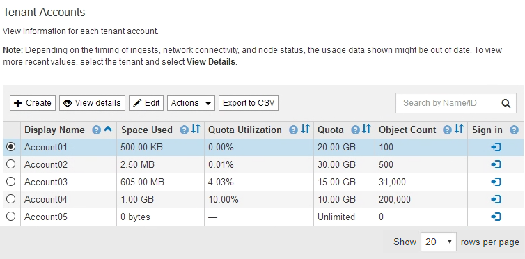
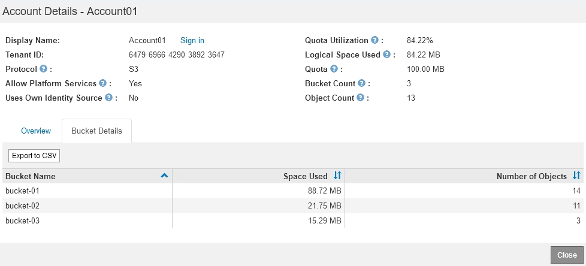

= テナントアクティビティの監視
:allow-uri-read: 
:icons: font
:imagesdir: ../media/

[role="lead"]
すべてのクライアントアクティビティがテナントアカウントに関連付けられている。Grid Manager を使用してテナントのストレージ使用状況やネットワークトラフィックを監視できます。または、監査ログまたは Grafana ダッシュボードを使用して、テナントが StorageGRID を使用している状況に関する詳細情報を収集できます。

.必要なもの
* Grid Managerにはサポートされているブラウザを使用してサインインする必要があります。
* Root Access権限またはAdministrator権限が必要です。

.このタスクについて

IMPORTANT: 使用済みスペースの値は推定値です。これらの推定値は、取り込みのタイミング、ネットワーク接続、ノードのステータスによって左右されます。

.手順
. すべてのテナントで使用されているストレージの量を確認するには、「* tenants *」を選択します。
+
テナントごとに、使用済みスペース、クォータ利用率、クォータ、オブジェクト数が表示されます。テナントにクォータが設定されていない場合は'[Quota Utilization]フィールドにダッシュ（-）が表示され'Quotaフィールドには[Unlimited]と表示されます

+

+
システムに20個を超えるアイテムが含まれている場合は、各ページに一度に表示する行数を指定できます。検索ボックスを使用して、表示名またはテナントIDでテナントアカウントを検索します。

+
テナントアカウントにサインインするには、テーブルの*サインイン*列でリンクを選択します。

. 必要に応じて、 * Export to CSV * を選択し、すべてのテナントの使用量の値を含む .csv ファイルを表示およびエクスポートします。
+
を開くか保存するかを確認するメッセージが表示されます `.csv` ファイル。

+
.csv ファイルの内容は次の例のようになります。

+
image::../media/tenant_accounts_example_csv.png[テナントアカウントの例： .csv]

+
.csv ファイルをスプレッドシートアプリケーションで開くか、自動化で使用できます。

. 使用状況グラフなど、特定のテナントの詳細を表示するには、テナントアカウントページでテナントアカウントを選択し、*詳細を表示*を選択します。
+
Account Detailsページが表示され、概要情報、使用済みクォータと残りのクォータの量を示すグラフ、およびバケット（S3）またはコンテナ（Swift）内のオブジェクトデータの量を表すグラフが表示されます。

+
image::../media/tenant_usage_modal.png[テナント使用モード]

+
** *クォータ*
+
このテナントにクォータが設定されている場合は、* Quota *チャートに、このテナントが使用したクォータの量とまだ使用可能なクォータの量が表示されます。クォータが設定されていない場合、テナントのクォータは無制限となり、情報メッセージが表示されます。テナントがストレージクォータを 1% 以上かつ 1GB 以上超過した場合は、クォータの総容量と超過容量がグラフに表示されます。

+
使用済みスペースセグメントにカーソルを合わせると、格納されているオブジェクトの数と使用されている合計バイト数を確認できます。空きスペースセグメントにカーソルを合わせると、使用可能なストレージクォータのバイト数を確認できます。

+

IMPORTANT: クォータ使用率は内部の推定値に基づいており、場合によっては超過することがあります。たとえば、テナントがクォータを超えた場合、 StorageGRID はテナントがオブジェクトのアップロードを開始したときにクォータをチェックし、新しい取り込みを拒否します。ただし、 StorageGRID では、クォータを超過したかどうかを判断する際に、現在のアップロードのサイズは考慮されません。オブジェクトが削除された場合、クォータ使用率が再計算されるまでテナントが一時的に新しいオブジェクトをアップロードできなくなることがあります。クォータ使用率の計算には 10 分以上かかることがあります。

+

NOTE: テナントのクォータ利用率は、テナントが StorageGRID にアップロードしたオブジェクトデータの総容量（論理サイズ）を示します。クォータ利用率は、これらのオブジェクトおよびそのメタデータのコピーを格納するために使用されるスペース（物理サイズ）を表していません。

+

NOTE: テナントのクォータ使用率が高い * アラートを有効にすると、テナントがそのクォータを消費しているかどうかを確認できます。有効にすると、テナントのクォータの 90% が使用されたときにこのアラートがトリガーされます。詳細については、アラートリファレンスを参照してください。

** *使用済みスペース*
+
バケットで使用されているスペース*（S3）またはコンテナで使用されているスペース*（Swift）グラフには、テナントの最大バケットが表示されます。使用済みスペースは、バケット内のオブジェクトデータの総容量です。この値は、 ILM コピーとオブジェクトメタデータに必要なストレージスペースを表しているわけではありません。

+
テナントに含まれているバケットまたはコンテナが9つを超える場合は、それらのバケットが「Other」というセグメントに結合されます。一部のグラフセグメントは小さすぎてラベルを含めることができません。任意のセグメントにカーソルを合わせると、ラベルが表示され、格納されているオブジェクトの数や各バケットまたはコンテナの合計バイト数などの詳細情報を確認できます。

+
image::../media/tenant_dashboard_storage_usage_segment_other.png[ストレージ使用セグメント-その他]

. 「* Bucket Details *（S3）」または「* Container Details *（Swift）」を選択して、各テナントのバケットまたはコンテナのスペース使用済みオブジェクトとオブジェクト数のリストを表示します。
+

. 必要に応じて、「 * Export to CSV * 」を選択し、各バケットまたはコンテナの使用量の値を含む .csv ファイルを表示してエクスポートします。
+
.csvファイルを開くか保存するように求められます。

+
個々の S3 テナントの .csv ファイルの内容は、次の例のようになります。

+
image::../media/tenant_bucket_details_csv.png[テナントバケットの詳細の CSV の例]

+
.csv ファイルをスプレッドシートアプリケーションで開くか、自動化で使用できます。

. テナントにトラフィック分類ポリシーが設定されている場合は、そのテナントのネットワークトラフィックを確認します。
+
.. [* Configuration *]>[* Network Settings *]>[* Traffic Classification]を選択します。
+
[Traffic Classification Policies] ページが表示され、既存のポリシーがテーブルにリストされます。

+
image::../media/traffic_classification_policies_main_screen_w_examples.png[グラフのトラフィックポリシーの例]

.. ポリシーのリストを確認して、特定のテナントに適用されるポリシーを特定します。
.. ポリシーに関連付けられている指標を表示するには、ポリシーの左側にあるオプションボタンを選択し、 [*Metrics] をクリックします。
.. グラフを分析して、ポリシーがトラフィックを制限している頻度と、ポリシーを調整する必要があるかどうかを判断します。
+
トラフィック分類ポリシーを作成、編集、または削除するには、 StorageGRID の管理手順を参照してください。

. 必要に応じて、監査ログを使用してテナントのアクティビティをより詳細に監視できます。
+
たとえば、次の種類の情報を監視できます。

+
** PUT 、 GET 、 DELETE など、特定のクライアント処理
** オブジェクトサイズ
** オブジェクトに適用されている ILM ルール
** クライアント要求の送信元 IP

+
監査ログは、選択したログ分析ツールを使用して分析可能なテキストファイルに書き込まれます。これにより、クライアントアクティビティをよりよく理解したり、高度なチャージバックおよび課金モデルを実装したりできます。詳細については、監査メッセージを確認する手順を参照してください。

. 必要に応じて、 Prometheus 指標を使用してテナントのアクティビティをレポートします。
+
** Grid Managerで、* Support *>* Tools *>* Metrics *を選択します。S3 の概要など、既存のダッシュボードを使用してクライアントのアクティビティを確認できます。
+

IMPORTANT: Metrics ページで使用できるツールは、主にテクニカルサポートが使用することを目的としています。これらのツールの一部の機能およびメニュー項目は、意図的に機能しないようになっています。

** ヘルプ*>* APIドキュメント*を選択します。グリッド管理 API の指標セクションの指標を使用して、テナントアクティビティ用のカスタムのアラートルールとダッシュボードを作成できます。

.関連情報
link:alerts-reference.html["アラート一覧"]

link:../audit/index.html["監査ログを確認します"]

link:../admin/index.html["StorageGRID の管理"]

link:reviewing-support-metrics.html["サポート指標の確認"]
