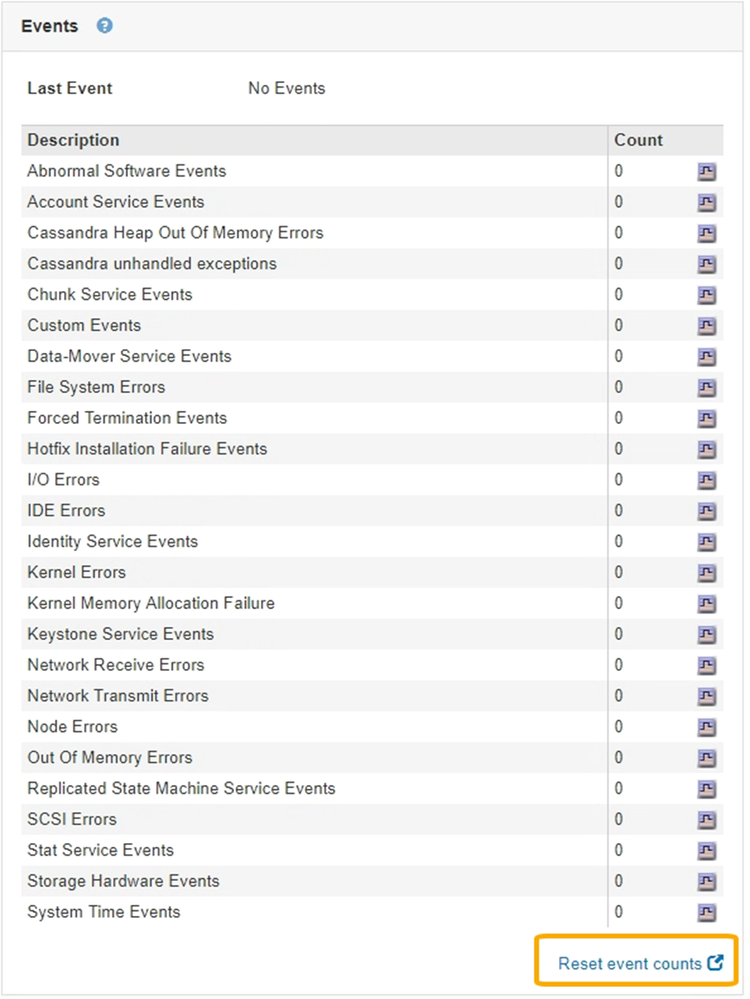

= イベント数のリセット
:allow-uri-read: 
:icons: font
:imagesdir: ../media/

[role="lead"]
システムイベントを解決したら、イベント数を0にリセットできます。

.必要なもの
* Grid Managerにはサポートされているブラウザを使用してサインインする必要があります。
* Grid Topology Page Configuration権限が必要です。

.手順
. ノード*>*_グリッドノード_*>*イベント*を選択します。
. カウントが0より大きいイベントがすべて解決されたことを確認します。
. [*イベントカウントのリセット*]をクリックします。
+

