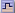

= グラフとグラフの種類
:allow-uri-read: 
:icons: font
:imagesdir: ../media/

[role="lead"]
グラフには、特定の StorageGRID 指標や属性の値がまとめて表示されます。

Grid Managerのダッシュボードには、グリッドと各サイトで利用可能なストレージをまとめた円グラフ（ドーナツグラフ）が表示されます。

image::../media/dashboard_available_storage_panel.png[ダッシュボード - 使用可能なストレージパネル]

Tenant Manager のダッシュボードの Storage usage パネルには、次の情報が表示されます。

* テナントの最大バケット（ S3 ）またはコンテナ（ Swift ）のリスト
* 最大のバケットまたはコンテナの相対サイズを表す棒グラフ
* 使用済みスペースの合計。クォータが設定されている場合は、残りのスペースの量と割合

image::../media/tenant_dashboard_with_buckets.png[テナントダッシュボード]

また、StorageGRID の指標や属性の変化を示すグラフは、Nodesページと* Support *>* Tools *>* Grid Topology *ページからも参照できます。

グラフには次の 4 種類があります。

* * Grafana チャート * ：ノードページで表示される、 Grafana チャートは、時間の経過に伴う Prometheus 指標の値のプロットに使用されます。たとえば、管理ノードの* Nodes *>* Load Balancer *タブには、4つのGrafanaチャートが含まれています。
+
image::../media/nodes_page_load_balancer_tab.png[[ ノード ] ページ [ ロードバランサ ] タブ]

+

NOTE: Grafanaチャートは、* Support *>* Tools *>* Metrics *ページで使用可能な事前構築済みのダッシュボードにも含まれています。

* *折れ線グラフ*：ノードページおよび* Support *>* Tools *>* Grid Topology *ページ（グラフアイコンをクリック）で使用できます  データ値のあとに線グラフを使用して、単位値（ NTP 周波数オフセットの ppm など）を含む StorageGRID 属性の値がプロットされます。値の変化が時間の経過に合わせて一定の間隔でプロットされます。
+
image::../media/line_graph.gif[線グラフ（ Line Graph ）]

* *面グラフ*：ノードページまたは*サポート*>*ツール*>*グリッドトポロジ*ページ（グラフアイコンをクリック）で確認できます  データ値のあとに）オブジェクト数やサービスの負荷の値など、容量の属性値のプロットには面グラフが使用されます。面グラフは折れ線グラフに似ていますが、線の下の部分の背景が薄い茶色になります。値の変化が時間の経過に合わせて一定の間隔でプロットされます。
+
image::../media/area_graph.gif[面積グラフ（ Area Graph ）]

* グラフの中には、別の種類のグラフアイコンで示されるものもあります image:../media/icon_chart_new_for_11_5.png["グラフアイコン- 11.5で新規に追加されました"] また、形式が異なります。
+
image::../media/charts_lost_object_detected.png[グラフに損失オブジェクトが検出されました]

* *状態グラフ*：サポート*>*ツール*>*グリッドトポロジ*ページで使用できます（グラフアイコンをクリックします）  データ値のあとに）状態グラフを使用して、オンライン、スタンバイ、オフラインのいずれかの状態を表す属性値がプロットされます。状態グラフは折れ線グラフに似ていますが、値が連続しておらず、別の状態に切り替わると値が飛んで表示されます。
+
image::../media/state_graph.gif[状態グラフ（ State Graph ）]

.関連情報
link:viewing-nodes-page.html["Nodesページを表示します"]

link:viewing-grid-topology-tree.html["グリッドトポロジツリーの表示"]

link:reviewing-support-metrics.html["サポート指標の確認"]
