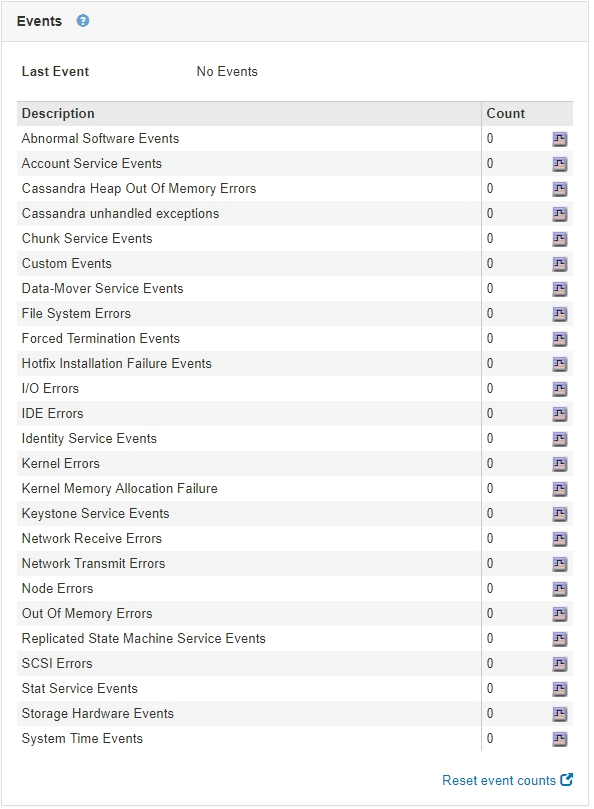

= [イベント]タブを表示します
:allow-uri-read: 
:icons: font
:imagesdir: ../media/

[role="lead"]
Eventsタブには、ノードのシステムエラーまたは障害イベントの数が表示されます。これには、ネットワークエラーなどのエラーも含まれます。

すべてのノードのEventsタブが表示されます。

特定のノードで問題が発生した場合は、Eventsタブで問題 の詳細を確認できます。テクニカルサポートは、[Events]タブの情報をトラブルシューティングに使用することもできます。

ページの[イベント]タブ]

[イベント]タブでは、次のタスクを実行できます。

* 表の上部にある「* Last Event *」フィールドに表示される情報を使用して、最近発生したイベントを特定します。
* グラフアイコンをクリックします image:../media/icon_chart_new.gif["グラフアイコン"] をクリックして、そのイベントがいつ発生したかを確認します。
* 問題解決後にイベントの数をゼロにリセットする。

.関連情報
link:monitoring-events.html["イベントの監視"]

link:displaying-charts-and-graphs.html["グラフやグラフの表示"]

link:resetting-event-counts.html["イベント数のリセット"]
