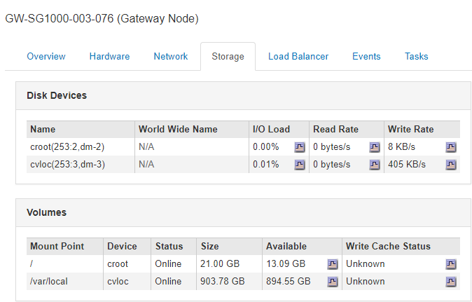

= アプライアンスの管理ノードとゲートウェイノードに関する情報の表示
:allow-uri-read: 
:icons: font
:imagesdir: ../media/

[role="lead"]
ノードページには、管理ノードまたはゲートウェイノードに使用される各サービスアプライアンスのサービスの健常性とすべてのコンピューティング、ディスクデバイス、およびネットワークリソースに関する情報が表示されます。メモリ、ストレージハードウェア、ネットワークリソース、ネットワークインターフェイス、ネットワークアドレスも表示できます。 データを送受信します。

.手順
. Nodes ページで、アプライアンスの管理ノードまたはアプライアンスのゲートウェイノードを選択します。
. 「 * 概要 * 」を選択します。
+
OverviewタブのNode Informationテーブルには'ノードのIDと名前'ノードのタイプ'インストールされているソフトウェアのバージョン'およびノードに関連付けられているIPアドレスが表示されます[Interface]列には、次のようにインターフェイスの名前が表示されます。

+
** * adllb * および * adlli * ：管理ネットワーク・インターフェイスでアクティブ / バックアップ・ボンディングが使用されている場合に表示されます
** * eth * ：グリッドネットワーク、管理ネットワーク、またはクライアントネットワーク。
** * HIC * ：アプライアンスの 10 、 25 、または 100GbE の物理ポートの 1 つ。これらのポートをボンディングして、 StorageGRID のグリッドネットワーク（ eth0 ）とクライアントネットワーク（ eth2 ）に接続できます。
** * mtc *：アプライアンス上の物理1GbEポートの1つ。ボンディングまたはエイリアスを設定し、StorageGRID 管理ネットワーク（eth1）に接続できます。image:../media/nodes_page_overview_tab_services_appliance.png["NodesページサービスアプライアンスのOverviewタブ"]

. アプライアンスの詳細情報を表示するには、「 * Hardware * 」を選択します。
+
.. CPU Utilization および Memory のグラフで、一定期間の CPU およびメモリ使用量の割合を確認します。別の期間を表示するには、グラフまたはグラフの上にあるコントロールのいずれかを選択します。1 時間、 1 日、 1 週間、または 1 カ月の期間の情報を表示できます。また、カスタムの間隔を設定して、日時の範囲を指定することもできます。
+
image::../media/nodes_page_hardware_tab_graphs_services_appliance.png[ノードページサービスアプライアンスのハードウェアタブのグラフ]

.. 下にスクロールして、アプライアンスのコンポーネントの表を表示します。この表には、モデル名、シリアル番号、コントローラファームウェアのバージョン、各コンポーネントのステータスなどの情報が含まれています。
+
image::../media/nodes_page_hardware_tab_services_appliance_do_not_use.png[ノードページサービスアプライアンスのハードウェアタブ]

+
|===
| Appliance テーブルのフィールド | 説明 

 a| 
アプライアンスモデル
 a| 
この StorageGRID アプライアンスのモデル番号。

 a| 
ストレージコントローラ障害ドライブ数
 a| 
最適な状態でないドライブの数。

 a| 
ストレージデータドライブタイプ
 a| 
アプライアンスのドライブのタイプ。 HDD （ハードディスクドライブ）や SSD （ソリッドステートドライブ）など。

 a| 
ストレージデータドライブサイズ
 a| 
アプライアンス内のすべてのデータドライブの合計容量。

 a| 
Storage RAID Mode（ストレージRAIDモード）
 a| 
アプライアンスの RAID モード。

 a| 
全体的な電源装置
 a| 
アプライアンスのすべての電源装置のステータス。

 a| 
Compute Controller BMC IPの略
 a| 
コンピューティングコントローラ内の Baseboard Management Controller （ BMC ；ベースボード管理コントローラ）ポートの IP アドレス。この IP を使用して BMC インターフェイスに接続し、アプライアンスハードウェアを監視および診断することができます。

このフィールドは、 BMC が含まれないアプライアンスモデルに対しては表示されません。

 a| 
コンピューティングコントローラのシリアル番号
 a| 
コンピューティングコントローラのシリアル番号。

 a| 
コンピューティングハードウェア
 a| 
コンピューティングコントローラハードウェアのステータス。

 a| 
コンピューティングコントローラの CPU 温度
 a| 
コンピューティングコントローラの CPU の温度ステータス。

 a| 
コンピューティングコントローラシャーシの温度
 a| 
コンピューティングコントローラの温度ステータス。

|===
.. すべてのステータスが「 Nominal 」であることを確認します。
+
ステータスが「公称」でない場合は、現在のアラートを確認します。

. 各ネットワークの情報を表示するには、「 * ネットワーク * 」を選択します。
+
Network Traffic グラフには、ネットワークトラフィック全体のサマリが表示されます。

+
image::../media/nodes_page_network_traffic_graph.gif[Nodes Page Network Traffic Graph の略]

+
.. ネットワークインターフェイスセクションを確認します。
+
image::../media/nodes_page_hardware_tab_network_services_appliance.png[[ ノード ] ページ [ ハードウェア ] タブ Network Services Appliance]

+
次の表のネットワークインターフェイスの表の「 * Speed * 」列の値を使用して、アプライアンス上の 4 つの 40 / 100GbE ネットワークポートがアクティブ / バックアップモードと LACP モードのどちらを使用するように設定されているかを確認してください。

+

NOTE: この表の値は、 4 つのリンクがすべて使用されていることを前提としています。

+
|===
| リンクモード | ボンディングモード | 個々の HIC リンク速度（ hic1 、 hic2 、 hic3 、 hic4 ） | 想定されるグリッド / クライアントネットワーク速度（ eth0 、 eth2 ） 

 a| 
アグリゲート
 a| 
LACP
 a| 
100
 a| 
400

 a| 
固定（ Fixed ）
 a| 
LACP
 a| 
100
 a| 
200

 a| 
固定（ Fixed ）
 a| 
アクティブ / バックアップ
 a| 
100
 a| 
100

 a| 
アグリゲート
 a| 
LACP
 a| 
40
 a| 
160

 a| 
固定（ Fixed ）
 a| 
LACP
 a| 
40
 a| 
80

 a| 
固定（ Fixed ）
 a| 
アクティブ / バックアップ
 a| 
40
 a| 
40

|===
.. 「ネットワーク通信」セクションを確認します。
+
受信および送信テーブルには、各ネットワークで送受信されたバイト数とパケット数、およびその他の受信および送信メトリックが表示されます。

+
image::../media/nodes_page_network_communication.gif[Nodes Page Network Comm の略]

. サービス・アプライアンス上のディスク・デバイスおよびボリュームに関する情報を表示するには、「 * Storage * 」を選択します。
+

.関連情報
link:../sg100-1000/index.html["SG100 SG1000サービスアプライアンス"]
