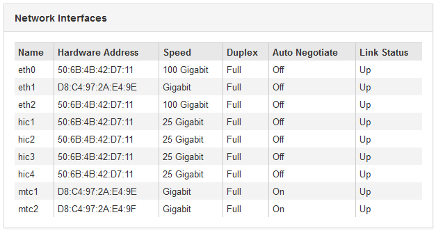
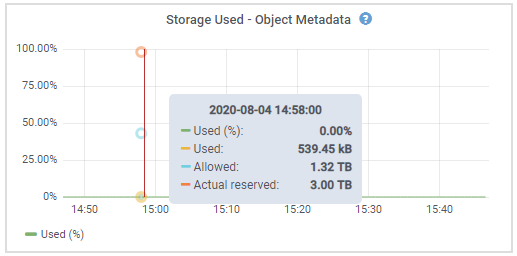
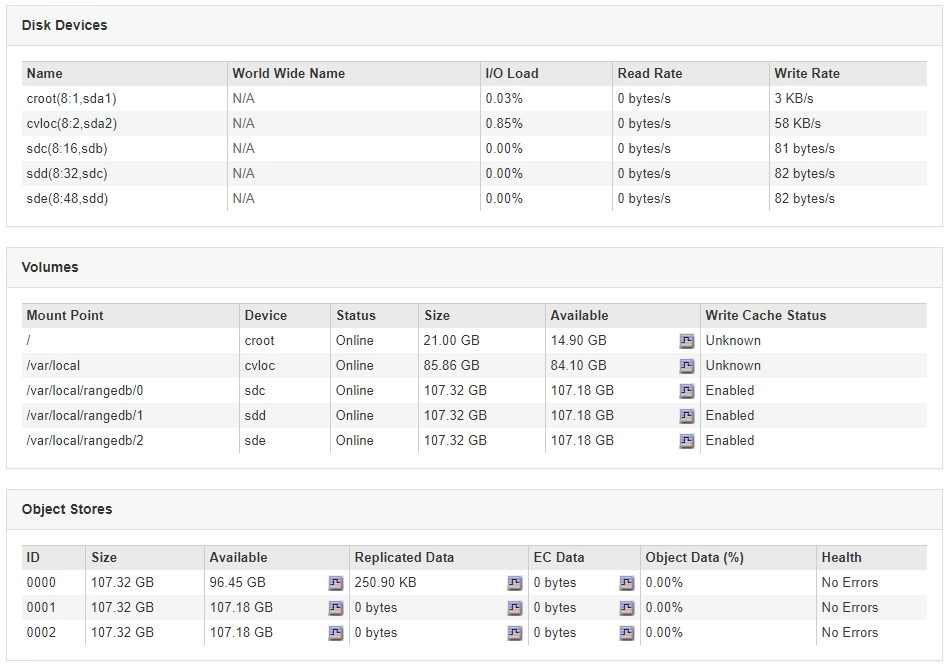

= アプライアンスストレージノードに関する情報の表示
:allow-uri-read: 
:icons: font
:imagesdir: ../media/

[role="lead"]
ノードページには、各アプライアンスストレージノードのサービスの健常性と、すべてのコンピューティング、ディスクデバイス、およびネットワークリソースに関する情報が表示されます。メモリ、ストレージハードウェア、コントローラファームウェアのバージョン、ネットワークリソース、ネットワークインターフェイスも表示されます。 ネットワークアドレス、およびデータの送受信。

.手順
. ノードページで、アプライアンスストレージノードを選択します。
. 「 * 概要 * 」を選択します。
+
OverviewタブのNode Informationテーブルには'ノードのIDと名前'ノードのタイプ'インストールされているソフトウェアのバージョン'およびノードに関連付けられているIPアドレスが表示されます[Interface]列には、次のようにインターフェイスの名前が表示されます。

+
** * eth * ：グリッドネットワーク、管理ネットワーク、またはクライアントネットワーク。
** * HIC * ：アプライアンスの 10 、 25 、または 100GbE の物理ポートの 1 つ。これらのポートをボンディングして、 StorageGRID のグリッドネットワーク（ eth0 ）とクライアントネットワーク（ eth2 ）に接続できます。
** * mtc *：アプライアンス上の物理1GbEポートの1つ。ボンディングまたはエイリアスを設定し、StorageGRID 管理ネットワーク（eth1）に接続できます。image:../media/nodes_page_overview_tab_extended.png["ノードページの概要が拡張されました"]

. アプライアンスの詳細情報を表示するには、「 * Hardware * 」を選択します。
+
.. CPU Utilization および Memory のグラフで、一定期間の CPU およびメモリ使用量の割合を確認します。別の期間を表示するには、グラフまたはグラフの上にあるコントロールのいずれかを選択します。1 時間、 1 日、 1 週間、または 1 カ月の期間の情報を表示できます。また、カスタムの間隔を設定して、日時の範囲を指定することもできます。
+
image::../media/nodes_page_hardware_tab_graphs.png[ハードウェアグラフ]

.. 下にスクロールして、アプライアンスのコンポーネントの表を表示します。この表には、アプライアンスのモデル名、コントローラ名、シリアル番号、 IP アドレス、各コンポーネントのステータスなどの情報が含まれています。
+

NOTE: Compute Controller BMC IPやCompute Hardwareなどの一部のフィールドは、その機能を持つアプライアンスに対してのみ表示されます。

+
ストレージシェルフのコンポーネントと拡張シェルフが設置に含まれている場合は、アプライアンステーブルの下の個別のテーブルに表示されます。

+
image::../media/nodes_page_hardware_tab_for_appliance.png[Nodes Page アプライアンスのハードウェアタブ]

+
|===
| Appliance テーブルのフィールド | 説明 

 a| 
アプライアンスモデル
 a| 
SANtricity ソフトウェアに表示されるこの StorageGRID アプライアンスのモデル番号。

 a| 
ストレージコントローラ名
 a| 
SANtricity ソフトウェアに表示されるこの StorageGRID アプライアンスの名前。

 a| 
ストレージコントローラAの管理IP
 a| 
ストレージコントローラ A 上の管理ポート 1 の IP アドレスストレージの問題をトラブルシューティングするには、この IP を使用して SANtricity ソフトウェアにアクセスします。

 a| 
ストレージコントローラBの管理IP
 a| 
ストレージコントローラ B 上の管理ポート 1 の IP アドレスストレージの問題をトラブルシューティングするには、この IP を使用して SANtricity ソフトウェアにアクセスします。

一部のアプライアンスモデルには、ストレージコントローラ B がありません

 a| 
ストレージコントローラWWID
 a| 
SANtricity ソフトウェアに表示されるストレージコントローラの World-Wide Identifier 。

 a| 
ストレージアプライアンスのシャーシのシリアル番号
 a| 
アプライアンスのシャーシのシリアル番号。

 a| 
ストレージコントローラのファームウェアバージョン
 a| 
このアプライアンスのストレージコントローラ上のファームウェアのバージョン。

 a| 
ストレージハードウェア
 a| 
ストレージコントローラハードウェアの全体的なステータス。SANtricity System Manager からストレージハードウェアの要注意のステータスが報告された場合、 StorageGRID システムからも報告されます。

ステータスが「 Needs Attention 」の場合は、まず SANtricity ソフトウェアを使用してストレージコントローラをチェックします。次に、コンピューティングコントローラに関するアラームが他にないことを確認します。

 a| 
ストレージコントローラ障害ドライブ数
 a| 
最適な状態でないドライブの数。

 a| 
ストレージコントローラ A
 a| 
ストレージコントローラ A のステータス

 a| 
ストレージコントローラ B
 a| 
ストレージコントローラ B のステータス一部のアプライアンスモデルには、ストレージコントローラ B がありません

 a| 
ストレージコントローラの電源装置A
 a| 
ストレージコントローラの電源装置 A のステータス。

 a| 
ストレージコントローラの電源装置B
 a| 
ストレージコントローラの電源装置 B のステータス。

 a| 
ストレージデータドライブタイプ
 a| 
アプライアンスのドライブのタイプ。 HDD （ハードディスクドライブ）や SSD （ソリッドステートドライブ）など。

 a| 
ストレージデータドライブサイズ
 a| 
アプライアンス内のすべてのデータドライブの合計容量。

 a| 
Storage RAID Mode（ストレージRAIDモード）
 a| 
アプライアンスに設定されている RAID モード。

 a| 
ストレージ接続
 a| 
ストレージ接続の状態。

 a| 
全体的な電源装置
 a| 
アプライアンスのすべての電源装置のステータス。

 a| 
Compute Controller BMC IPの略
 a| 
コンピューティングコントローラ内の Baseboard Management Controller （ BMC ；ベースボード管理コントローラ）ポートの IP アドレス。この IP を使用して BMC インターフェイスに接続し、アプライアンスハードウェアを監視および診断します。

このフィールドは、 BMC が含まれないアプライアンスモデルに対しては表示されません。

 a| 
コンピューティングコントローラのシリアル番号
 a| 
コンピューティングコントローラのシリアル番号。

 a| 
コンピューティングハードウェア
 a| 
コンピューティングコントローラハードウェアのステータス。このフィールドは、コンピューティングハードウェアとストレージハードウェアが個別に用意されていないアプライアンスモデルに対しては表示されません。

 a| 
コンピューティングコントローラの CPU 温度
 a| 
コンピューティングコントローラの CPU の温度ステータス。

 a| 
コンピューティングコントローラシャーシの温度
 a| 
コンピューティングコントローラの温度ステータス。

|===
+
|===
| ストレージシェルフテーブルの列 | 説明 

 a| 
シェルフシャーシのシリアル番号
 a| 
ストレージシェルフシャーシのシリアル番号。

 a| 
シェルフ ID
 a| 
ストレージシェルフの数値識別子。

*** 99 ：ストレージコントローラシェルフ
*** 0 ：最初の拡張シェルフ
*** 1 ： 2 台目の拡張シェルフ

* 注： * 拡張シェルフは SG6060 にのみ適用されます。

 a| 
シェルフステータス
 a| 
ストレージシェルフの全体的なステータス。

 a| 
IOMのステータス
 a| 
拡張シェルフの入出力モジュール（ IOM ）のステータス。拡張シェルフでない場合は N/A 。

 a| 
電源装置ステータス
 a| 
ストレージシェルフの電源装置の全体的なステータス。

 a| 
ドロワーステータス
 a| 
ストレージシェルフのドロワーのステータス。N/A は、シェルフにドロワーが搭載されていない場合。

 a| 
ファンのステータス
 a| 
ストレージシェルフの冷却ファンの全体的なステータス。

 a| 
ドライブスロット
 a| 
ストレージシェルフ内のドライブスロットの総数。

 a| 
データドライブ
 a| 
ストレージシェルフ内の、データストレージに使用されるドライブの数。

 a| 
データドライブサイズ
 a| 
ストレージシェルフ内の 1 つのデータドライブの実効サイズ。

 a| 
キャッシュドライブ
 a| 
ストレージシェルフ内のキャッシュとして使用されるドライブの数。

 a| 
キャッシュドライブサイズ
 a| 
ストレージシェルフ内で最小のキャッシュドライブのサイズ。通常、キャッシュドライブのサイズはすべて同じです。

 a| 
構成ステータス
 a| 
ストレージシェルフの設定ステータス。

|===

. すべてのステータスが「 Nominal 」であることを確認します。
+
ステータスが「公称」でない場合は、現在のアラートを確認します。SANtricity System Manager を使用して、これらのハードウェアの値の一部を確認することもできます。アプライアンスの設置とメンテナンスの手順を参照してください。

. 各ネットワークの情報を表示するには、「 * ネットワーク * 」を選択します。
+
Network Traffic グラフには、ネットワークトラフィック全体のサマリが表示されます。

+
image::../media/nodes_page_network_traffic_graph.gif[Nodes Page Network Traffic Graph の略]

+
.. ネットワークインターフェイスセクションを確認します。
+

+
次の表に、 Network Interfaces テーブルの * Speed * 列の値を記載した値を使用して、アプライアンス上の 10 / 25GbE ネットワークポートがアクティブ / バックアップモードと LACP モードのどちらを使用するように設定されているかを判断します。

+

NOTE: この表の値は、 4 つのリンクがすべて使用されていることを前提としています。

+
|===
| リンクモード | ボンディングモード | 個々の HIC リンク速度（ hic1 、 hic2 、 hic3 、 hic4 ） | 想定されるグリッド / クライアントネットワーク速度（ eth0 、 eth2 ） 

 a| 
アグリゲート
 a| 
LACP
 a| 
25
 a| 
100

 a| 
固定（ Fixed ）
 a| 
LACP
 a| 
25
 a| 
50

 a| 
固定（ Fixed ）
 a| 
アクティブ / バックアップ
 a| 
25
 a| 
25

 a| 
アグリゲート
 a| 
LACP
 a| 
10.
 a| 
40

 a| 
固定（ Fixed ）
 a| 
LACP
 a| 
10.
 a| 
20

 a| 
固定（ Fixed ）
 a| 
アクティブ / バックアップ
 a| 
10.
 a| 
10.

|===
+
10 / 25GbE ポートの設定の詳細については、ご使用のアプライアンスのインストールおよびメンテナンスの手順を参照してください。

.. 「ネットワーク通信」セクションを確認します。
+
Receive テーブルと Transmit テーブルには、各ネットワークで送受信されたバイト数とパケット数、およびその他の送受信メトリックが表示されます。

+
image::../media/nodes_page_network_communication.gif[Nodes Page Network Comm の略]

. 「 * Storage * 」を選択すると、オブジェクトデータとオブジェクトメタデータに使用されているストレージの割合、およびディスクデバイス、ボリューム、オブジェクトストアに関する情報がグラフに表示されます。
+
image::../media/nodes_page_storage_used_object_data.png[Storage Used - オブジェクトデータ]

+

+
.. 下にスクロールして、各ボリュームとオブジェクトストアに使用可能なストレージ容量を表示します。
+
各ディスクの Worldwide Name は、 SANtricity ソフトウェア（アプライアンスのストレージコントローラに接続される管理ソフトウェア）で標準のボリュームプロパティとして表示される、ボリュームの World-Wide Identifier （ WWID ）と同じです。

+
ボリュームマウントポイントに関連するディスクの読み取りと書き込みの統計情報を解釈できるように、 Disk Devices テーブルの * Name * 列に表示される名前の最初の部分（つまり、 _sdc_sd_,_sde_ ）が Volumes テーブルの * Device * 列に表示される値と一致していることを確認します。

+

.関連情報
link:../sg6000/index.html["SG6000 ストレージアプライアンス"]

link:../sg5700/index.html["SG5700 ストレージアプライアンス"]

link:../sg5600/index.html["SG5600 ストレージアプライアンス"]
