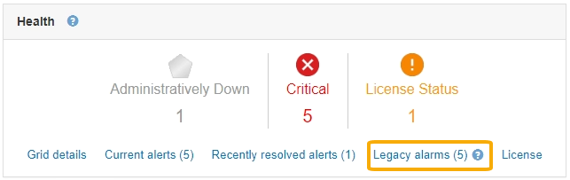

= 古いアラームの表示
:allow-uri-read: 
:icons: font
:imagesdir: ../media/

[role="lead"]
システム属性がアラームのしきい値に達すると、アラーム（従来のシステム）がトリガーされます。現在アクティブなアラームは、DashboardまたはCurrent Alarmsページで表示できます。

.必要なもの
* Grid Managerにはサポートされているブラウザを使用してサインインする必要があります。

.このタスクについて
1つまたは複数のレガシーアラームが現在アクティブな場合、ダッシュボードのヘルスパネルには*レガシーアラーム*リンクが含まれます。かっこ内の数字は、現在アクティブなアラームの数を示します。

Dashboardの* Legacy alarms *カウントは、レガシーアラームがトリガーされるたびに増分されます。アラームのEメール通知を無効にしていても、この数が増分します。通常はこの数値を無視するか（アラートによってシステムがより正確に把握されるため）、現在アクティブなアラームを表示することができます。

NOTE: 従来のアラームシステムは引き続きサポートされますが、アラートシステムには大きなメリットがあり、使いやすくなっています。

.手順
. 現在アクティブなレガシーアラームを表示するには、次のいずれかを実行します。
+
** ダッシュボードの正常性パネルで、*レガシーアラーム*をクリックします。このリンクは、少なくとも1つのアラームが現在アクティブである場合にのみ表示されます。
** [*Support*>]>[* Alarms (legac)*>]>[* Current Alarms]を選択します。[Current Alarms]ページが表示されます。

image::../media/current_alarms_page.png[Current Alarms ページ]

アラームアイコンは、各アラームの重大度を次のように示します。

|===
| をクリックします。 | 色（ Color ） | アラームの重大度 | 意味 

 a| 
image:../media/icon_alarm_yellow_notice.gif["黄色の四角形のアイコン"]
 a| 
黄色
 a| 
注意
 a| 
ノードはグリッドに接続されていますが、正常な状態ではありません。通常の動作に影響はありません。

 a| 
image:../media/icon_alarm_light_orange_minor.gif["薄いオレンジの菱形のアイコン"]
 a| 
薄いオレンジ
 a| 
マイナー
 a| 
ノードはグリッドに接続されていますが、正常な状態ではありません。将来的に動作に影響する可能性があります。さらに重大な問題にならないように調査が必要です。

 a| 

 a| 
濃いオレンジ
 a| 
メジャー（ Major ）
 a| 
ノードはグリッドに接続されていますが、正常な状態ではありません。すでに動作に影響が及んでいます。エスカレーションを防ぐために早急な対応が必要です。

 a| 
image:../media/icon_alarm_red_critical.gif["赤の x 印のアイコン"]
 a| 
赤
 a| 
重要
 a| 
ノードはグリッドに接続されていますが、正常な状態ではありません。正常に動作しなくなっています。問題 にはすぐに対処する必要があります。

|===
. アラームをトリガーした原因となった属性を確認するには、テーブルで属性名を右クリックします。
. アラームのその他の詳細情報を表示するには、テーブルでサービス名をクリックします。
+
選択したサービスのAlarmsタブが表示されます（* Support *>* Tools *>* Grid Topology *>*_Grid Node_*>*_Service_*>* Alarms *）。

+
image::../media/alarms_acknowledging.png[アラームの確認応答]

. 現在のアラームの数を消去するには、必要に応じて次の操作を行います。
+
** アラームを確認します。確認済みのアラームは、重大度レベルが次のレベルでトリガーされるか、解決されてから再度発生するまで、レガシーアラームの数に含まれなくなります。
** システム全体で特定のデフォルトアラームまたはグローバルカスタムアラームを無効にして、再度トリガーされないようにします。

.関連情報
link:alarms-reference.html["アラーム一覧（従来のシステム）"]

link:managing-alarms.html["現在のアラームの確認応答（従来のシステム）"]

link:managing-alarms.html["アラームの無効化（従来のシステム）"]
