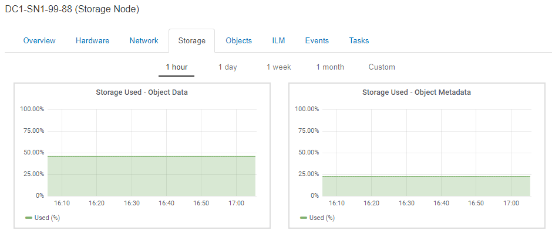

= Storage（ストレージ）タブを表示します
:allow-uri-read: 
:icons: font
:imagesdir: ../media/

[role="lead"]
ストレージタブには、ストレージの可用性やその他のストレージ指標が表示されます。

ストレージタブは、すべてのノード、各サイト、およびグリッド全体に対して表示されます。

== Storage Usedグラフ

ストレージノード、各サイト、およびグリッド全体が対象である場合は、オブジェクトデータとオブジェクトメタデータで一定期間にわたって使用されているストレージの量を示すグラフがストレージタブに表示されます。

NOTE: サイトまたはグリッドの合計値には、オフラインノードなど、指標が報告されていないノードは 5 分以上含まれません。

 → [ ストレージノード ] → [ ストレージ ] タブ]

== Disk Devices, Volumes, and Object Storeの各テーブルに格納されています

すべてのノードが対象である場合は、ノード上のディスクデバイスとボリュームの詳細が表示されます。ストレージノードの場合、 Object Stores テーブルに各ストレージボリュームの情報が表示されます。

image::../media/nodes_page_storage_tables.png[Nodes ページストレージテーブル]

.関連情報
link:monitoring-storage-capacity-for-entire-grid.html["グリッド全体のストレージ容量を監視する"]

link:monitoring-storage-capacity-for-each-storage-node.html["各ストレージノードのストレージ容量を監視しています"]

link:monitoring-object-metadata-capacity-for-each-storage-node.html["各ストレージノードのオブジェクトメタデータ容量を監視します"]
