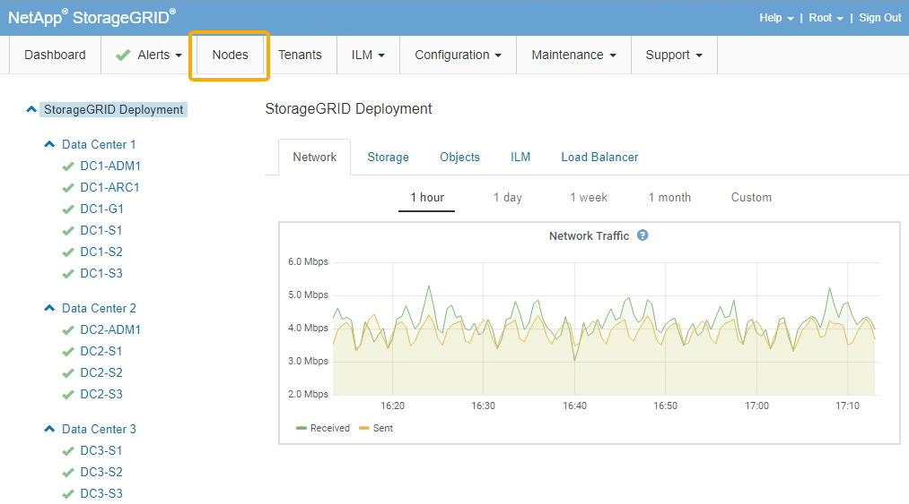
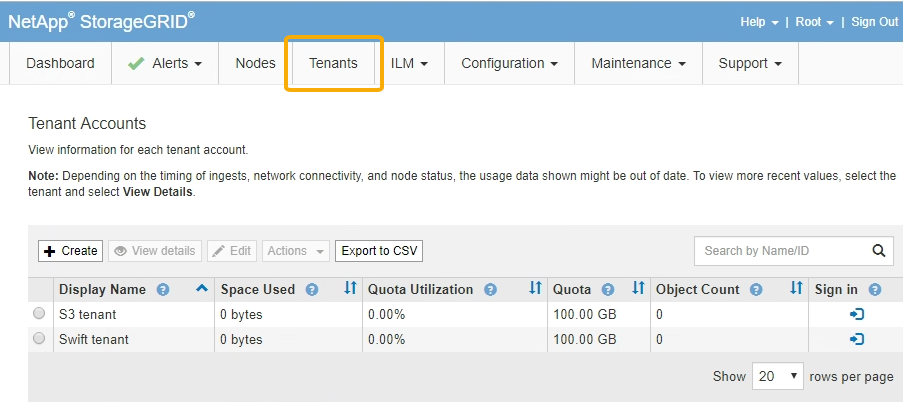
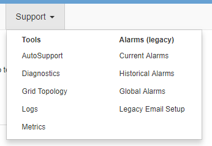

= Grid Managerの概要
:allow-uri-read: 
:icons: font
:imagesdir: ../media/

[role="lead"]
Grid Manager はブラウザベースのグラフィカルインターフェイスで、 StorageGRID システムの設定、管理、監視に使用できます。

Grid Manager にサインインすると、管理ノードに接続されます。各 StorageGRID システムには、 1 つのプライマリ管理ノードと、任意の数のプライマリ以外の管理ノードが含まれています。どの管理ノードにも接続が可能で、各管理ノードに表示される StorageGRID システムのビューもほぼ同じです。

Grid Managerには、サポートされているWebブラウザからアクセスできます。

== Web ブラウザの要件

サポートされている Web ブラウザを使用する必要があります。

[cols="1a,1a"]
|===
| Web ブラウザ | サポートされる最小バージョン 

 a| 
Google Chrome
 a| 
87

 a| 
Microsoft Edge の場合
 a| 
87

 a| 
Mozilla Firefox
 a| 
84

|===
ブラウザウィンドウの幅を推奨される値に設定してください。

[cols="1a,1a"]
|===
| ブラウザの幅 | ピクセル 

 a| 
最小（ Minimum ）
 a| 
1024

 a| 
最適
 a| 
1280

|===

== Grid Manager ダッシュボード

Grid Manager に初めてサインインするときは、ダッシュボードを使用してシステムのアクティビティを一目で監視できます。

ダッシュボードには、システムの健常性、ストレージの使用状況、 ILM プロセス、 S3 および Swift 処理に関する概要情報が表示されます。

image::../media/grid_manager_dashboard.png[Grid Manager のダッシュボード]

各パネルの情報の説明については、ヘルプアイコンをクリックしてください image:../media/icon_nms_question.gif["疑問符アイコン"] をクリックしてください。

.関連情報
link:../monitor/index.html["トラブルシューティングを監視します"]

== ［ アラート ］ メニュー

[Alerts] メニューには、 StorageGRID の動作中に発生する可能性のある問題を検出、評価、解決するための使いやすいインターフェイスが用意されています。

image::../media/alerts_menu.png[アラートメニュー]

[Alerts] メニューでは ' 次の操作を実行できます

* 現在のアラートを確認します
* 解決済みのアラートを確認
* サイレンスを設定してアラート通知を停止する
* アラート通知用の E メールサーバを設定します
* アラートをトリガーする条件のアラートルールを定義

.関連情報
link:monitoring-and-managing-alerts.html["アラートの監視と管理"]

link:../monitor/index.html["トラブルシューティングを監視します"]

== Nodes ヘエシ

Nodes ページには、グリッド全体、グリッド内の各サイト、およびサイトの各ノードに関する情報が表示されます。

ノードのホームページには、グリッド全体の複数の指標の合計が表示されます。特定のサイトまたはノードの情報を表示するには、左側の該当するリンクをクリックします。

.関連情報
link:viewing-nodes-page.html["Nodesページを表示します"]

link:../monitor/index.html["トラブルシューティングを監視します"]

== テナントアカウントヘエシ

Tenant Accountsページでは、StorageGRID システムのストレージテナントアカウントを作成および監視できます。オブジェクトの格納と読み出しを実行できるユーザを指定し、どの機能を利用可能とするかを指定するには、少なくとも 1 つのテナントアカウントを作成する必要があります。

テナントアカウントページには、使用されているストレージの容量やオブジェクトの数など、各テナントの使用状況の詳細も表示されます。テナントの作成時にクォータを設定すると、そのクォータのうちどれくらいが使用されているかを確認できます。

]

.関連情報
link:managing-tenants-and-client-connections.html["テナントとクライアント接続の管理"]

link:../admin/index.html["StorageGRID の管理"]

link:../tenant/index.html["テナントアカウントを使用する"]

== ILM メニュー

ILM メニューでは、データの保持と可用性を制御する情報ライフサイクル管理（ ILM ）のルールとポリシーを設定できます。オブジェクト ID を入力して、そのオブジェクトのメタデータを表示することもできます。

image::../media/ilm_menu_and_page.png[ILM のメニューとページ]

.関連情報
link:using-information-lifecycle-management.html["情報ライフサイクル管理の使用"]

link:../ilm/index.html["ILM を使用してオブジェクトを管理する"]

== 設定メニュー

[Configuration]メニューでは、ネットワーク設定、システム設定、モニタリングオプション、およびアクセスコントロールオプションを指定できます。

image::../media/configuration_menu.png[Configuration Menu （設定メニュー）]

.関連情報
link:configuring-network-settings.html["ネットワークの設定"]

link:managing-tenants-and-client-connections.html["テナントとクライアント接続の管理"]

link:reviewing-audit-messages.html["監査メッセージの確認"]

link:controlling-storagegrid-access.html["StorageGRID アクセスの制御"]

link:../admin/index.html["StorageGRID の管理"]

link:../monitor/index.html["トラブルシューティングを監視します"]

link:../audit/index.html["監査ログを確認します"]

== メンテナンスメニュー

Maintenance（メンテナンス）メニューでは、メンテナンスタスク、ネットワークタスク、およびシステムタスクを実行できます。

image::../media/maintenance_menu_and_page.png[メンテナンスメニューとページ]

=== メンテナンスタスク

保守作業には次のものが含ま

* 運用停止処理：使用されていないグリッドノードとサイトを削除します。
* 新しいグリッドノードとサイトを追加するための拡張処理。
* 障害が発生したノードの交換とデータのリストアに使用するリカバリ処理。

=== ネットワーク

Maintenanceメニューから実行できるネットワークタスクは次のとおりです。

* DNS サーバの情報を編集します。
* グリッドネットワークで使用されるサブネットを設定します。
* NTP サーバの情報を編集しています。

=== システム

Maintenanceメニューから実行できるシステムタスクは次のとおりです。

* 現在の StorageGRID ライセンスの詳細を確認するか、新しいライセンスをアップロードしています。
* リカバリパッケージを生成しています。
* 選択したアプライアンスで、ソフトウェアのアップグレード、ホットフィックス、 SANtricity OS ソフトウェアの更新など、 StorageGRID ソフトウェアの更新を実行する。

.関連情報
link:performing-maintenance-procedures.html["メンテナンス手順の実行"]

link:downloading-recovery-package.html["リカバリパッケージをダウンロードしています"]

link:../expand/index.html["グリッドを展開します"]

link:../upgrade/index.html["ソフトウェアをアップグレードする"]

link:../maintain/index.html[""]

link:../sg6000/index.html["SG6000 ストレージアプライアンス"]

link:../sg5700/index.html["SG5700 ストレージアプライアンス"]

link:../sg5600/index.html["SG5600 ストレージアプライアンス"]

== サポートメニュー

Support （サポート）メニューには、テクニカルサポートがシステムの分析とトラブルシューティングに役立つオプションが表示されます。[ サポート ] メニューには、 [ ツール ] と [ アラーム ] （レガシー）の 2 つの部分があります。

=== ツール

[ サポート（ Support ） ] メニューの [ ツール（ Tools ） ] セクションから、次の操作を実行できます。

* AutoSupport を有効にします。
* グリッドの現在の状態に対して一連の診断チェックを実行します。
* グリッドトポロジツリーにアクセスして、グリッドノード、サービス、および属性に関する詳細情報を表示します。
* ログファイルとシステムデータを取得します。
* 詳細な指標やチャートを確認
+

IMPORTANT: [*Metrics] オプションで使用できるツールは、テクニカル・サポートが使用することを目的としています。これらのツールの一部の機能およびメニュー項目は、意図的に機能しないようになっています。

=== アラーム（レガシー）

サポートメニューのアラーム（レガシー）セクションでは、現在のアラーム、履歴アラーム、グローバルアラームを確認したり、従来のアラームとAutoSupport のEメール通知を設定したりできます。

.関連情報
link:storagegrid-architecture-and-network-topology.html["StorageGRID のアーキテクチャとネットワークトポロジ"]

link:storagegrid-attributes.html["StorageGRID 属性"]

link:using-storagegrid-support-options.html["StorageGRID サポートオプションを使用する"]

link:../admin/index.html["StorageGRID の管理"]

link:../monitor/index.html["トラブルシューティングを監視します"]

== ヘルプメニュー

ヘルプオプションを使用すると、最新リリースの StorageGRID ドキュメントセンターや API ドキュメントにアクセスできます。現在インストールされている StorageGRID のバージョンを確認することもできます。

image::../media/help_menu.png[ヘルプメニュー]

.関連情報
link:../admin/index.html["StorageGRID の管理"]
