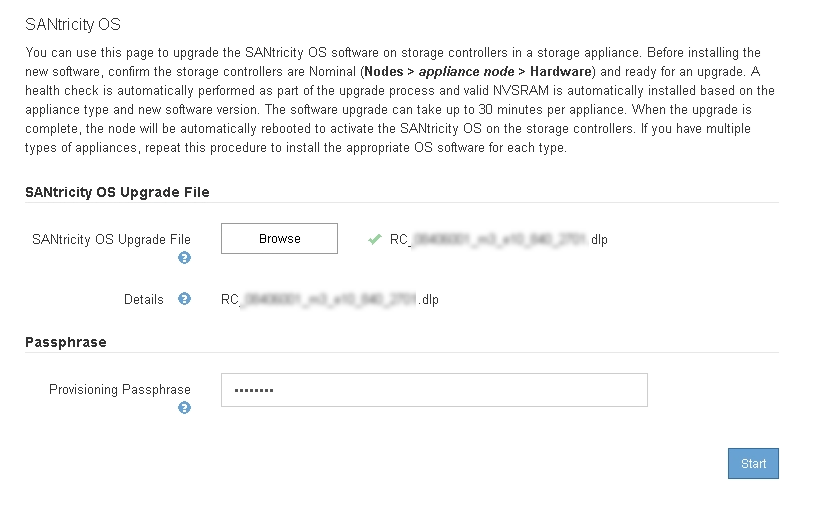

= グリッドマネージャを使用してストレージコントローラのSANtricity OSをアップグレードします
:allow-uri-read: 
:icons: font
:imagesdir: ../media/

[role="lead"]
現在 SANtricity OS 08.42.20.00 （ 11.42 ）以降を使用しているストレージコントローラの場合、 Grid Manager を使用してアップグレードを適用する必要があります。

.必要なもの
* NetApp Interoperability Matrix Tool （ IMT ）を参照して、アップグレードに使用する SANtricity OS のバージョンがお使いのアプライアンスと互換性があることを確認してください。
* Maintenance権限が必要です。
* Grid Managerにはサポートされているブラウザを使用してサインインする必要があります。
* プロビジョニングパスフレーズが必要です。
* SANtricity OSに関するネットアップのダウンロードページを利用する必要があります。

.このタスクについて
SANtricity OS のアップグレードプロセスが完了するまで、他のソフトウェアの更新（ StorageGRID ソフトウェアのアップグレードまたはホットフィックス）は実行できません。SANtricity OS のアップグレードプロセスが完了する前にホットフィックスや StorageGRID ソフトウェアのアップグレードを開始しようとすると、 SANtricity OS のアップグレードページが表示されます。

該当するすべてのノードにSANtricity OSのアップグレードが正常に適用されるまで、手順 は完了しません。各ノードにSANtricity OSがロードされ、各StorageGRID ストレージアプライアンスがリブートされるまでに30分以上かかることがあります。

CAUTION: 次の手順は、 Grid Manager を使用してアップグレードを実行する場合にのみ実行できます。08.42.20.00（11.42）より前のSANtricity OSを使用しているコントローラの場合、SG6000シリーズアプライアンスのストレージコントローラをGrid Managerを使用してアップグレードすることはできません。

NOTE: この手順 は、 SANtricity OS のアップグレードに関連付けられた最新バージョンに NVSRAM を自動的にアップグレードします。個別の NVSRAM アップグレードファイルを適用する必要はありません。

.手順
. サービスラップトップから、NetApp Support Site から新しいSANtricity OSソフトウェアファイルをダウンロードします。
+
アプライアンス内のストレージコントローラに対応する正しいバージョンのSANtricity OSを選択してください。SG6060ではE2800コントローラを、SGF6024ではEF570コントローラを使用します。

+
https://mysupport.netapp.com/site/products/all/details/eseries-santricityos/downloads-tab["ネットアップのダウンロード： SANtricity OS"^]

. サポートされているブラウザを使用してGrid Managerにサインインします。
. [* Maintenance（メンテナンス）]を選択します次に、メニューの[システム]セクションで、[ソフトウェア・アップデート]を選択します。
+
Software Update ページが表示されます。

+
image::../media/software_update_landing.png[ソフトウェアアップデートのランディングページ]

. SANtricity OS *をクリックします。
+
SANtricity OSページが表示されます。

+
image::../media/santricity_os_upgrade_first.png[StorageGRID First SANtricity OS ページを示すスクリーンショット]

. NetApp Support Siteからダウンロードした SANtricity OS アップグレードファイルを選択します。
+
.. [* 参照 ] をクリックします。
.. ファイルを探して選択します。
.. * 開く * をクリックします。
+
ファイルがアップロードされて検証されます。検証プロセスが完了すると、[詳細]フィールドにファイル名が表示されます。

+

NOTE: ファイル名は検証プロセスで指定されるため変更しないでください。

+
image::../media/santricity_upgrade_os_file_validated.png[SANtricity OSアップグレード有効なファイル]

. プロビジョニングパスフレーズを入力します。
+
「 * Start * （スタート * ）」ボタンが有効になります。

+

. [ スタート ] ボタンをクリックします。
+
アップグレードされたノードのサービスを再起動するとブラウザの接続が一時的に失われる可能性があることを示す警告ボックスが表示されます。

+
image::../media/santricity_upgrade_warning.png[接続が一時的に失われることを示すダイアログボックスのスクリーンショット]

. OK *をクリックして、SANtricity OSアップグレードファイルをプライマリ管理ノードにステージングします。
+
SANtricity OS のアップグレードを開始すると、次の処理が行わ

+
.. 健全性チェックが実行されます。このプロセスにより、ステータスが「 Needs Attention 」になっているノードがないかどうかが確認されます。
+

NOTE: エラーが報告された場合は、エラーを解決してから、*開始*をもう一度クリックします。

.. SANtricity OS Upgrade Progress テーブルが表示されます。この表には、グリッド内のすべてのストレージノードと、各ノードのアップグレードの現在のステージが表示されます。
+

NOTE: ソフトウェアベースのストレージノードを含むすべてのストレージノードが表示されます。SANtricity OSのアップグレードがソフトウェアベースのストレージノードに影響しない場合でも、すべてのストレージノードのアップグレードを承認する必要があります。ソフトウェア・ベースのストレージ・ノードに対して返されたアップグレード・メッセージは「SANtricity OS upgrade is not applicable to this node.」です。

+
image::../media/santricity_upgrade_progress_table.png[SANtricity OS のアップグレードページの「 SANtricity OS のアップグレードの進捗状況」部分を示すスクリーンショット]

. 必要に応じて、ノードのリストを* Site *、* Name *、* Progress *、* Stage *、または* Details *で昇順または降順にソートします。または、 * 検索 * ボックスに用語を入力して特定のノードを検索します。
+
ノードのリストをスクロールするには、セクションの右下隅にある左右の矢印を使用します。

. アップグレードキューに追加する準備ができたグリッドノードを承認します。同じタイプの承認済みノードが一度に 1 つずつアップグレードされます。
+

IMPORTANT: アプライアンスストレージノードのSANtricity OSアップグレードは、ノードを停止およびリブートする準備ができているかどうかが確認されないかぎり承認しないでください。ノードでSANtricity OSのアップグレードが承認されると、そのノードのサービスが停止します。あとでノードをアップグレードすると、アプライアンスノードがリブートされます。このような処理を実行すると、ノードと通信しているクライアントで原因 サービスが中断する可能性があります。

+
** すべてのストレージノードをSANtricity OSアップグレードキューに追加するには、いずれかの*すべて承認ボタンをクリックします。
+

NOTE: ノードのアップグレード順序が重要な場合は、ノードまたはノードグループを 1 つずつ承認し、各ノードでアップグレードが完了するまで待ってから、次のノードを承認します。

** 1つ以上の*承認*ボタンをクリックして、SANtricity OSアップグレードキューに1つ以上のノードを追加します。
+

NOTE: ノードへのSANtricity OSのアップグレードの適用は遅延できますが、リストされているすべてのストレージノードでSANtricity OSのアップグレードを承認するまで、SANtricity OSのアップグレードプロセスは完了しません。

+
[* Approve *（承認）]をクリックすると、アップグレードプロセスによってノードをアップグレードできるかどうかが決定されます。ノードをアップグレード可能な場合は、アップグレードキューに追加されます。[+]

+
ノードによっては、選択したアップグレードファイルが意図的に適用されていないため、これらのノードをアップグレードせずにアップグレードプロセスを完了することができます。ノードが意図的にアップグレードされていない場合、プロセスの「Complete」列に次のいずれかのメッセージが表示されます。

+
*** ストレージノードはすでにアップグレードされています。
*** このノードではSANtricity OSのアップグレードは実行できません。
*** SANtricity OSファイルがこのノードに対応していません。

+
「SANtricity OS upgrade is not applicable to this node」というメッセージは、ノードにStorageGRID システムで管理可能なストレージ・コントローラがないことを示します。このメッセージは、非アプライアンスストレージノードに対して表示されます。このメッセージが表示されているノードをアップグレードせずに、SANtricity OSのアップグレードプロセスを完了できます。+「SANtricity OS file is not compatible with this node」というメッセージは、ノードに、インストールしようとしているプロセスとは異なるSANtricity OSファイルが必要であることを示しています。現在のSANtricity OSのアップグレードが完了したら、そのノードに適したSANtricity OSをダウンロードして、アップグレードプロセスを繰り返します。

. SANtricity OSアップグレードキューからノードまたはすべてのノードを削除する必要がある場合は、* Remove *または* Remove All *をクリックします。
+
例に示すように、ステージがQueuedを超えて進むと、* Remove *ボタンが非表示になり、SANtricity OSアップグレード処理からノードを削除できなくなります。

+
image::../media/approve_all_progresstable.png[SANtricity アップグレード削除ボタン]

. 承認された各グリッドノードに SANtricity OS のアップグレードが適用されるまで待ちます。
+

IMPORTANT: SANtricity OSのアップグレードの適用中にいずれかのノードでエラーステージが表示される場合、そのノードのアップグレードは失敗しています。障害からリカバリするために、アプライアンスをメンテナンスモードに切り替える必要がある場合があります。続行する前にテクニカルサポートにお問い合わせください。

+
ノード上のファームウェアが古すぎて Grid Manager でアップグレードできない場合、そのノードは Error をステージに表示します。 "` このノードで SANtricity OS をアップグレードするには、保守モードを使用する必要があります。使用しているアプライアンスのインストールとメンテナンスの手順を参照してください。アップグレード後は ' このユーティリティを将来のアップグレードに使用できます エラーを解決するには、次の手順を実行します。

+
.. メンテナンスモードを使用して、「エラー」のステージが表示されるノードの SANtricity OS をアップグレードします。
.. Grid Managerを使用してSANtricity OSのアップグレードを再開し、完了します。
+
承認されたすべてのノードで SANtricity OS のアップグレードが完了すると、 SANtricity OS アップグレードの進捗状況テーブルが閉じ、緑のバナーに SANtricity OS のアップグレードが完了した日時が表示されます。

+
image::../media/santricity_upgrade_finish_banner.png[アップグレードの完了後の SANtricity OS アップグレードページのスクリーンショット]

. 別の SANtricity OS アップグレードファイルが必要な、完了段階のノードすべてについて、このアップグレード手順 を繰り返します。
+

NOTE: ステータスが「 Needs Attention 」のノードがある場合は、メンテナンスモードを使用してアップグレードを実行します。

.関連情報
https://mysupport.netapp.com/matrix["NetApp Interoperability Matrix Tool で確認できます"^]

link:upgrading-santricity-os-on-storage-controllers-using-maintenance-mode-sg6000.html["ストレージコントローラのSANtricity OSをメンテナンスモードでアップグレードします"]
