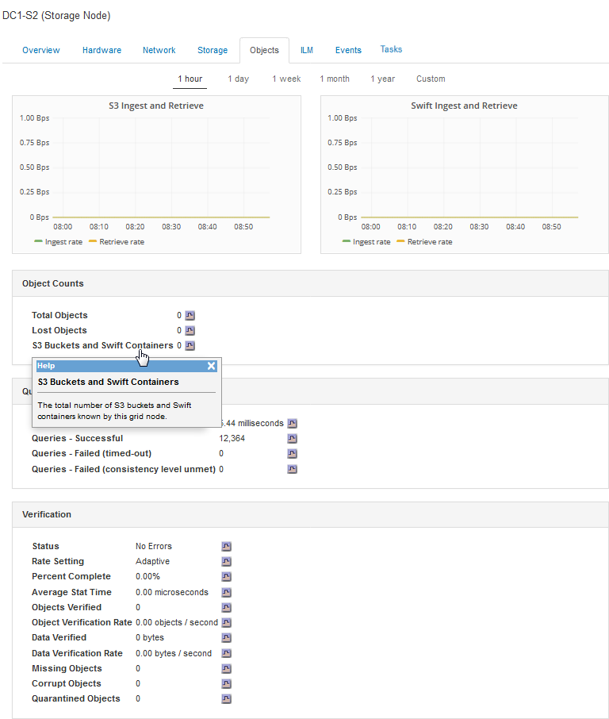

= 処理の監視と監査
:allow-uri-read: 
:icons: font
:imagesdir: ../media/

[role="lead"]
グリッド全体または特定のノードのトランザクションの傾向を確認することで、クライアント処理のワークロードと効率を監視できます。監査メッセージを使用して、クライアント処理とトランザクションを監視できます。

== オブジェクトの取り込み速度と読み出し速度を監視する

オブジェクトの取り込み速度と読み出し速度、およびオブジェクト数、クエリ、検証関連の指標を監視できます。StorageGRID システムのオブジェクトに対してクライアントアプリケーションが試みた読み取り、書き込み、変更の各処理について、成功した回数と失敗した回数を表示できます。

.手順
. サポートされているブラウザを使用してGrid Managerにサインインします。
. ダッシュボードで、プロトコル操作セクションを探します。
+
このセクションには、 StorageGRID システムによって実行されたクライアント処理の回数に関する概要が表示されます。プロトコル速度は過去 2 分間の平均値です。

. [*ノード（* Nodes）]を選択し
. ノードのホームページ（導入レベル）で、 * ロードバランサ * タブをクリックします。
+
このグラフには、グリッド内でロードバランサエンドポイントに送信されるすべてのクライアントトラフィックの傾向が表示されます。時間、日、週、月、年単位の間隔を選択できます。 または、カスタムの間隔を適用することもできます。

. ノードのホームページ（導入レベル）で、 * Objects * タブをクリックします。
+
グラフには、 StorageGRID システム全体の取り込み速度と読み出し速度が、 1 秒あたりのバイト数と合計バイト数で表示されます。時間、日、週、月、年単位の間隔を選択できます。 または、カスタムの間隔を適用することもできます。

. 特定のストレージノードに関する情報を表示するには、左側のリストからノードを選択し、 * Objects * タブをクリックします。
+
グラフには、このストレージノードのオブジェクトの取り込み速度と読み出し速度が表示されます。このタブには、オブジェクト数、クエリ、検証関連の指標も表示されます。ラベルをクリックすると、これらの指標の定義を確認できます。

+

. さらに詳細な情報が必要な場合は、次の手順に従います
+
.. Support *>* Tools *>* Grid Topology *を選択します。
.. [*_site *>] > [* Overview *] > [* Main*] を選択します。
+
API Operations セクションには、グリッド全体の概要情報が表示されます。

.. 「 * _ ストレージノード _ * > * LDR * > * _ クライアントアプリケーション _ * > * 概要 * > * Main * 」を選択します
+
Operations セクションには、選択したストレージノードに関する概要情報が表示されます。

== 監査ログへのアクセスと確認

監査メッセージは StorageGRID サービスによって生成され、テキスト形式のログファイルに保存されます。監査ログの API 固有の監査メッセージにより、セキュリティ、運用、およびパフォーマンスについて、システムの健全性の評価に役立つ重要な監視データが提供されます。

.必要なもの
* 特定のアクセス権限が必要です。
* を用意しておく必要があります `Passwords.txt` ファイル。
* 管理ノードの IP アドレスを確認しておく必要があります。

.このタスクについて
アクティブな監査ログファイルの名前はです `audit.log`をクリックし、を管理ノードに格納します。

1 日に 1 回、アクティブな audit.log ファイルが保存され、新しい audit.log ファイルが開始されます。保存されたファイルの名前は、保存された日時をの形式で示しています `yyyy-mm-dd.txt`。

1日後、保存されたファイルは圧縮され、という形式で名前が変更されます `yyyy-mm-dd.txt.gz`元の日付を保持します。

次の例は、アクティブなaudit.logファイル、前日のファイル（2018-04-15.txt）、および前日の圧縮されたファイルを示しています (`2018-04-14.txt.gz`）。

[listing]
----
audit.log
2018-04-15.txt
2018-04-14.txt.gz
----
.手順
. 管理ノードにログインします。
+
.. 次のコマンドを入力します。 `ssh _admin@primary_Admin_Node_IP_`
.. に記載されているパスワードを入力します `Passwords.txt` ファイル。

. 監査ログファイルが保存されているディレクトリに移動します。``cd /var/local/audit/export``
. 必要に応じて、現在の監査ログファイルまたは保存された監査ログファイルを表示します。

.関連情報
link:../audit/index.html["監査ログを確認します"]

=== 監査ログで追跡される Swift 処理

ストレージに対する成功した DELETE 、 GET 、 HEAD 、 POST 、 PUT の各処理は、 StorageGRID 監査ログで追跡されます。エラーはログに記録されず、情報、認証、オプションの要求も記録されません。

次の Swift 処理で追跡される情報の詳細については、「監査メッセージの概要」を参照してください。

==== アカウントの処理

* GET アカウント
* HEAD アカウント

==== コンテナの処理

* コンテナを削除します
* GET コンテナ
* HEAD コンテナ
* PUT コンテナ

==== オブジェクトの処理

* オブジェクトを削除します
* GET オブジェクト
* HEAD オブジェクト
* PUT オブジェクト

.関連情報
link:../audit/index.html["監査ログを確認します"]

link:account-operations.html["アカウントの処理"]

link:container-operations.html["コンテナの処理"]

link:object-operations.html["オブジェクトの処理"]
