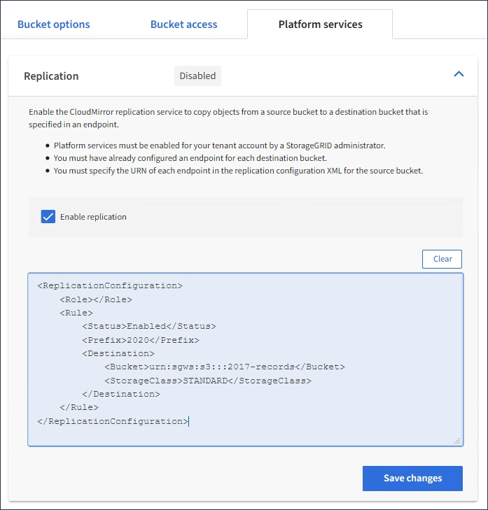

= CloudMirrorレプリケーションの設定
:allow-uri-read: 
:icons: font
:imagesdir: ../media/

[role="lead"]
CloudMirror レプリケーションサービスは、 3 つの StorageGRID プラットフォームサービスのいずれかです。CloudMirror レプリケーションを使用すると、外部の S3 バケットにオブジェクトを自動的にレプリケートできます。

.必要なもの
* テナントアカウントのプラットフォームサービスが StorageGRID 管理者によって有効化されている必要があります。
* レプリケーションのソースとして機能するバケットを作成しておく必要があります。
* CloudMirror レプリケーションのデスティネーションとして使用するエンドポイントを用意しておく必要があります。また、その URN が必要です。
* テナントアカウント内のすべての S3 バケットの設定を管理できるように、 Manage All Buckets 権限または Root Access 権限を持つユーザグループに属している必要があります。これらの権限は、 Tenant Manager を使用してバケットを設定する際にグループポリシーまたはバケットポリシーの権限設定よりも優先されます。

.このタスクについて
CloudMirror レプリケーションでは、ソースバケットからエンドポイントで指定されたデスティネーションバケットにオブジェクトがコピーされます。バケットの CloudMirror レプリケーションを有効にするには、有効なバケットレプリケーション設定 XML を作成して適用する必要があります。レプリケーション設定 XML では、各デスティネーションとして S3 バケットエンドポイントの URN を使用する必要があります。

NOTE: S3 オブジェクトロックが有効なソースバケットまたはデスティネーションバケットでは、レプリケーションはサポートされません。

バケットレプリケーションとその設定方法の一般的な情報については、Amazonのドキュメントのクロスリージョンレプリケーション（CRR）に関する説明を参照してください。StorageGRID がS3バケットのレプリケーション設定APIを実装する方法については、S3クライアントアプリケーションを実装する手順を参照してください。

オブジェクトを含むバケットで CloudMirror レプリケーションを有効にすると、バケットに追加された新しいオブジェクトがレプリケートされますが、バケット内の既存のオブジェクトはレプリケートされません。レプリケーションをトリガーするには、既存のオブジェクトを更新する必要があります。

レプリケーション設定 XML でストレージクラスを指定した場合は、デスティネーション S3 エンドポイントに対して処理を実行する際に StorageGRID でそのクラスが使用されます。指定したストレージクラスは、デスティネーションエンドポイントでもサポートされている必要があります。デスティネーションシステムのベンダーからの推奨事項がある場合は、それに準拠してください。

.手順
. ソースバケットのレプリケーションを有効にします。
+
S3 レプリケーション API で指定されているように、レプリケーションを有効にするために必要なレプリケーション設定 XML をテキストエディタで作成します。XML を設定する場合は、次の点に

+
** StorageGRID では、 V1 のレプリケーション設定のみがサポートされます。つまり、StorageGRID では、の使用はサポートされていません `Filter` ルールのエレメント。V1の規則に従ってオブジェクトバージョンを削除します。詳細については、レプリケーション設定に関する Amazon のドキュメントを参照してください。
** デスティネーションとして S3 バケットエンドポイントの URN を使用してください。
** 必要に応じてを追加します `<StorageClass>` エレメントを選択し、次のいずれかを指定します。
+
***  `STANDARD`：デフォルトのストレージクラス。オブジェクトをアップロードするときにストレージクラスを指定しない場合は、を参照してください `STANDARD` ストレージクラスが使用されている。
*** `STANDARD_IA`：（標準-アクセス頻度の低いアクセス）このストレージクラスは、アクセス頻度は低いが、必要に応じて高速アクセスが必要なデータに使用します。
*** `REDUCED_REDUNDANCY`：重大度が低く、再現可能で、かつ冗長性に劣る状態で保存可能なデータには、このストレージクラスを使用します `STANDARD` ストレージクラス。

** を指定する場合 `Role` 設定XMLでは無視されます。この値は StorageGRID では使用されません。

+
[listing]
----
<ReplicationConfiguration>
    <Role></Role>
    <Rule>
        <Status>Enabled</Status>
        <Prefix>2020</Prefix>
        <Destination>
           <Bucket>urn:sgws:s3:::2017-records</Bucket>
           <StorageClass>STANDARD</StorageClass>
         </Destination>
     </Rule>
</ReplicationConfiguration>
----
. Tenant Manager で、 * Storage （ S3 ） * > * Buckets * を選択します。
. ソースバケットの名前を選択します。
+
バケットの詳細ページが表示されます。

. プラットフォームサービス * > * レプリケーション * を選択します。
. [ レプリケーションを有効にする *] チェックボックスをオンにします。
. レプリケーション設定 XML をテキストボックスに貼り付け、 * 変更を保存 * を選択します。
+

+

NOTE: StorageGRID 管理者がグリッドマネージャまたはグリッド管理 API を使用して各テナントアカウントのプラットフォームサービスを有効にしておく必要があります。設定 XML の保存時にエラーが発生した場合は、 StorageGRID 管理者にお問い合わせください。

. レプリケーションが正しく設定されていることを確認します。
+
.. レプリケーション設定で指定されたレプリケーションの要件を満たすオブジェクトをソースバケットに追加します。
+
前述の例では、プレフィックス「 2020 」に一致するオブジェクトがレプリケートされます。

.. オブジェクトがデスティネーションバケットにレプリケートされたことを確認します。
+
サイズの小さいオブジェクトについては、レプリケーションの所要時間が短くなります。

.関連情報
link:understanding-cloudmirror-replication-service.html["CloudMirrorレプリケーションサービスの概要"]

link:../s3/index.html["S3 を使用する"]

link:creating-platform-services-endpoint.html["プラットフォームサービスエンドポイントの作成"]
