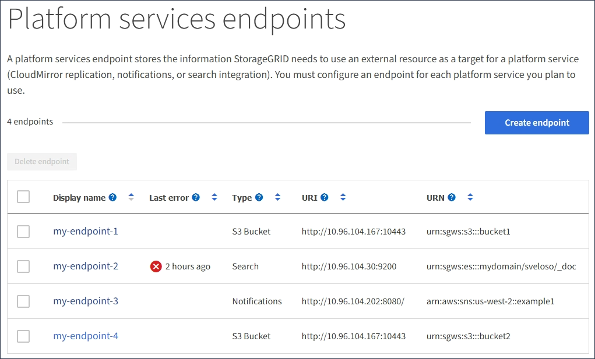

= プラットフォームサービスエンドポイントを削除しています
:allow-uri-read: 
:icons: font
:imagesdir: ../media/

[role="lead"]
関連するプラットフォームサービスが不要になった場合は、エンドポイントを削除できます。

.必要なもの
* Tenant Managerにはサポートされているブラウザを使用してサインインする必要があります。
* Manage Endpoints * 権限のあるユーザグループに属している必要があります。

.手順
. ストレージ（ S3 ） * > * プラットフォームサービスのエンドポイント * を選択します。
+
Platform services Endpoints ページが表示され、設定済みのプラットフォームサービスエンドポイントのリストが表示されます。

+

. 削除する各エンドポイントのチェックボックスを選択します。
+

IMPORTANT: 使用中のプラットフォームサービスエンドポイントを削除すると、エンドポイントを使用するすべてのバケットに対して、関連するプラットフォームサービスが無効になります。完了していない要求はすべて破棄されます。新しい要求は、削除された URN を参照しないようにバケット設定を変更するまで、引き続き生成されます。StorageGRID はこれらの要求を回復不能なエラーとして報告します。

. [ * アクション * > * エンドポイントの削除 * ] を選択します。
+
確認メッセージが表示されます。

+
image::../media/endpoint_delete_confirm.png[エンドポイントの削除を確認します]

. [ * エンドポイントの削除 * ] を選択します。

