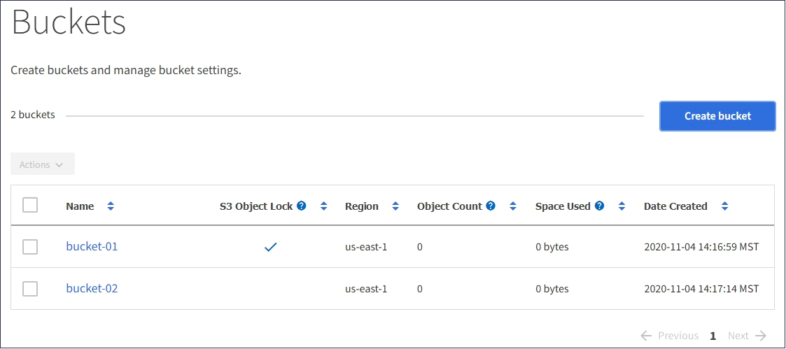

= S3バケットを削除しています
:allow-uri-read: 
:icons: font
:imagesdir: ../media/

[role="lead"]
Tenant Manager を使用して、空の S3 バケットを削除できます。

.必要なもの
* Tenant Managerにはサポートされているブラウザを使用してサインインする必要があります。
* Manage All Buckets 権限または Root Access 権限のあるユーザグループに属している必要があります。これらの権限は、グループまたはバケットポリシーの権限の設定よりも優先されます。

.このタスクについて
以下の手順では、 Tenant Manager を使用して S3 バケットを削除する方法について説明します。テナント管理APIまたはS3 REST APIを使用してS3バケットを削除することもできます。

オブジェクトまたは最新でないオブジェクトバージョンが含まれている S3 バケットは削除できません。S3バージョン管理オブジェクトの削除方法については、情報ライフサイクル管理を使用してオブジェクトを管理する手順を参照してください。

.手順
. ストレージ（ S3 ） * > * バケット * を選択します。
+
バケットページが表示され、既存の S3 バケットがすべて表示されます。

+

. 削除する空のバケットのチェックボックスを選択します。
+
[ アクション ] メニューが有効になります。

. アクションメニューから*空のバケットを削除*を選択します。
+
image::../media/delete_bucket_button.png[Delete Buckets （バケットの削除）ボタン]

+
確認メッセージが表示されます。

+
image::../media/delete_bucket_confirmation_dialog.png[バケットの削除の確認ダイアログ]

. バケットを削除してもよろしいですか？*バケットの削除*を選択します。
+
StorageGRID は、バケットが空であることを確認してから、バケットを削除します。この処理には数分かかることがあります。

+
バケットが空でない場合は、エラーメッセージが表示されます。バケットを削除する前に、すべてのオブジェクトを削除する必要があります。

+
image::../media/delete_bucket_not_empty_message.png[バケットを空にできませんメッセージ]

.関連情報
link:../ilm/index.html["ILM を使用してオブジェクトを管理する"]
