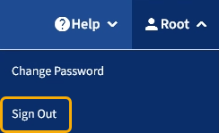

= Tenant Managerからサインアウトします
:allow-uri-read: 
:icons: font
:imagesdir: ../media/

[role="lead"]
Tenant Manager の使用が完了したら、サインアウトして、権限のないユーザが StorageGRID システムにアクセスできないようにする必要があります。ブラウザのクッキーの設定によっては、ブラウザを閉じてもシステムからサインアウトされない場合があります。

.手順
. ユーザインターフェイスの右上にあるユーザ名ドロップダウンを探します。
+

. ユーザー名を選択し、 * サインアウト * を選択します。
+
[cols="1a,2a"]
|===
| オプション | 説明 

 a| 
SSO は使用されていません
 a| 
管理ノードからサインアウトされます。Tenant Manager のサインインページが表示されます。

* 注： * 複数の管理ノードにサインインした場合、各ノードからサインアウトする必要があります。

 a| 
SSO が有効です
 a| 
アクセスしていたすべての管理ノードからサインアウトされます。StorageGRID のサインインページが表示されます。アクセスしたテナントアカウントの名前がデフォルトで「 Recent Accounts * 」ドロップダウンに表示され、テナントの * アカウント ID * が表示されます。

*注：SSOが有効でGrid Managerにもサインインしている場合は、SSOからサインアウトするためにGrid Managerからもサインアウトする必要があります。

|===

